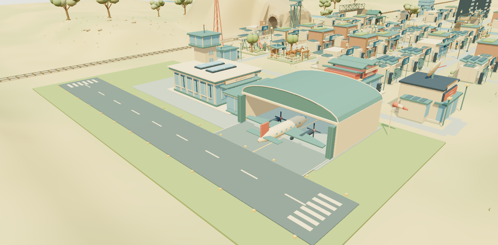
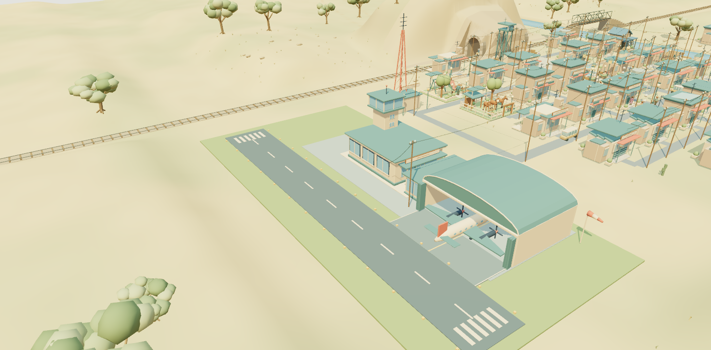
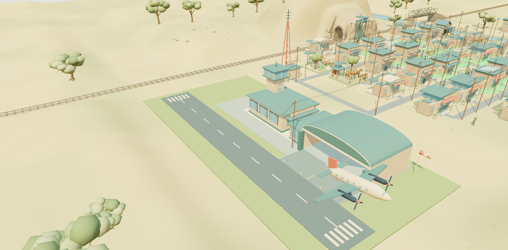
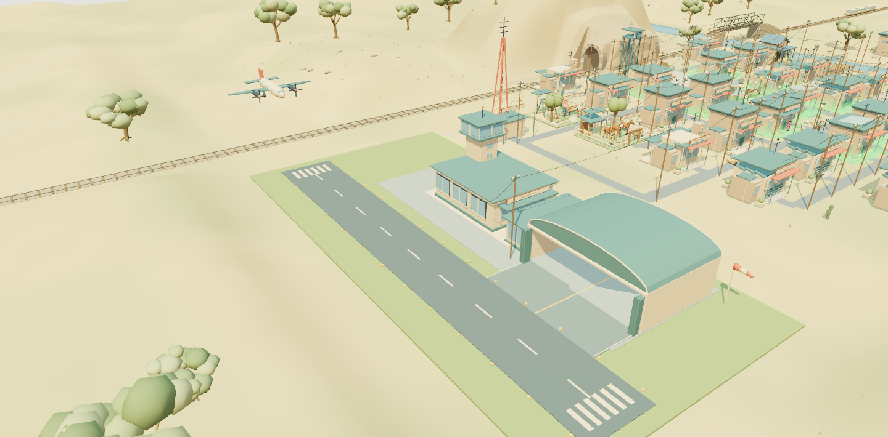

# Airport visual refresh

The airport retains the town's muted cream, teal, coral and blue-glass palette,
soft edges and compact architectural proportions. A faceted barrel roof with
flat end walls replaces the inflated elliptical hangar. Framed terminal windows,
an integrated control tower, a sheltered entrance, grass verges and a restrained
forecourt replace the disconnected blocks and continuous paved slab.

The airport's completed modernization era selects its architecture. The town
entering an era does not replace an airport that has not yet been modernized.
The hangar is rotated 90 degrees so its open end faces west toward the runway.
Separate side and rear walls, folded doors, a flush floor and a wide marked
taxiway leave room for the actual aircraft at every upgrade stage. The stage 2
passenger lounge stays north of that route. The apron and its markings stop at
the runway edge, preserving the full runway surface and centerline. `src/data/airportLayout.json` shares
the hangar orientation and parking position between Blender and flight activity.

Each style has three stages: the terminal/tower/hangar, passenger lounge, then
landscaping, apron lights and windsock. Later styles also gain a departures board.

| Era                      | Architecture                                                             | Triangles at stages 1 / 2 / 3 |
| ------------------------ | ------------------------------------------------------------------------ | ----------------------------- |
| Aviation & Radio, 1958   | Low cream terminal, teal roof, framed control cabin                      | 3,052 / 3,324 / 3,804         |
| Music & Television, 1986 | Stepped departure hall, dark roof, coral fascia and upper window ribbon  | 3,352 / 3,624 / 4,236         |
| Connected City, 2005     | Glass terminal, slim vertical fins, light roof cap and glazed rooflights | 3,512 / 3,784 / 4,396         |

These are indexed runtime mesh counts for the airport, including its site and
completed additions, excluding the separately animated aircraft and text sign.
They are not a frame-time performance claim. The site coordinates,
runway alignment, construction costs, rewards and unlimited puzzle moves are unchanged.

`airportStyle` in the era catalog selects a definition in
`src/data/airportStyles.json`. Blender authoring, Three.js and the SVG fallback
share that definition; unsupported styles fall back to the regional airport.
See [the era architecture guide](era-architecture.md) for extension rules.

Rebuild through Blender with
`--background --python scripts/create-future-assets.py -- /absolute/repository/path`.
The editable scene, GLB and actual source-mesh review sheet are in `art/future/`;
the game uses `src/assets/future-meshes.json`.

One aircraft runs a four-minute sequence: a parked interval, pushback and taxi,
a departure, a quiet interval, then an approach, landing, rollout and taxi back
to the hangar. Arrival and departure are phases of the same controller, so they
cannot run simultaneously. The normal reduced-motion setting still applies.
The plane crosses the railway only during its airborne approach, with clearance
checked against the landscape and train corridor.

The screenshots use the actual game renderer. Regression coverage checks the
exported hangar exit volume against the aircraft's wingspan and height through
all nine era/stage combinations, plus flight continuity, terrain clearance and
one-aircraft ownership throughout repeated cycles.

## 1958

## 1986

## 2005

## Aircraft activity

