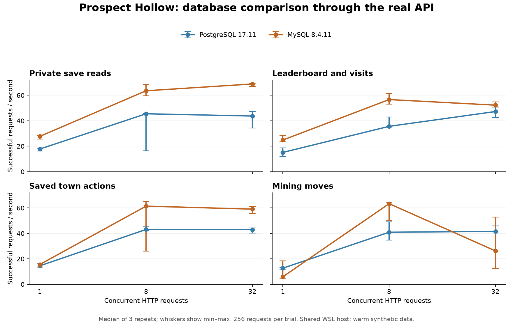

> Historical benchmark of the retired authoritative prototype. Its load harness and gameplay endpoints have been removed; these results do not measure the account-save replacement. See [current validation](validation.md).

# PostgreSQL versus MySQL: game API benchmark

Measured on 12 September 2026 against application commit `2647659`, using PostgreSQL
17.11, MySQL 8.4.11 and the same PHP 8.4 application. The benchmark does not change
the game's database selection or runtime code.

**Recommendation: retain PostgreSQL as the current default for now.** MySQL won
most read and town-action throughput comparisons, but PostgreSQL used much less
database memory and produced more consistent mining results at concurrency 1 and 32. Since mining latency is central to the game, these results do not justify a
switch solely for speed. This is an application-specific, shared-host result;
repeat on the intended hosting tier before making a production engine decision.

## Results

All **18,432 measured HTTP requests succeeded**, as did all 9,216 warm-up requests.
Ownership, revisions, mining move counts and persisted receipt/ledger counts passed.
No database or PHP container was killed for exceeding its memory limit.

Values below are medians across three trials. Parentheses show the full throughput
range, including slow runs. The p95 column is the median of each trial's 95th-percentile
response time, not a pooled percentile. Higher throughput and lower latency are better.

| Workload  | Concurrency | PostgreSQL req/s (range) | MySQL req/s (range) | PostgreSQL p95 ms | MySQL p95 ms |
| --------- | ----------: | -----------------------: | ------------------: | ----------------: | -----------: |
| profile   |           1 |         17.8 (16.1–18.0) |    27.7 (25.5–28.3) |              75.7 |         49.8 |
| profile   |           8 |         45.5 (16.3–45.7) |    63.5 (59.5–68.5) |             297.9 |        225.2 |
| profile   |          32 |         43.7 (34.3–47.2) |    68.9 (67.0–69.4) |            1300.3 |        706.2 |
| community |           1 |         15.1 (11.9–18.7) |    24.9 (23.5–28.3) |              87.9 |         60.1 |
| community |           8 |         35.6 (34.9–43.0) |    56.6 (52.9–61.4) |             373.5 |        248.1 |
| community |          32 |         47.2 (42.4–50.8) |    52.3 (50.7–54.8) |            1089.5 |        883.0 |
| save      |           1 |         14.5 (14.3–16.2) |    15.6 (13.5–16.0) |              94.1 |         93.8 |
| save      |           8 |         43.1 (42.2–45.2) |    61.4 (26.1–65.1) |             280.6 |        232.4 |
| save      |          32 |         43.0 (40.2–44.2) |    59.0 (55.5–61.3) |            1256.0 |        851.0 |
| mining    |           1 |         12.7 (11.7–13.2) |      5.9 (4.6–18.5) |             123.2 |        336.7 |
| mining    |           8 |         40.9 (34.7–49.2) |    63.3 (50.1–64.4) |             309.0 |        203.2 |
| mining    |          32 |         41.6 (41.1–45.8) |    26.3 (12.4–52.7) |            1195.0 |       3969.3 |



At eight concurrent requests, MySQL's median throughput was **39–59% higher** across
the four workloads. That advantage did not hold uniformly: PostgreSQL's mining
median was **12.7 versus 5.9 requests/s** at concurrency 1 and **41.6 versus 26.3** at
concurrency 32. MySQL's corresponding ranges were wide: 4.6–18.5 and 12.4–52.7.
At concurrency 32, median mining p95 was **1.20 s for PostgreSQL versus 3.97 s for
MySQL**. PostgreSQL also had an outlier in the profile workload. None of these slow
runs were discarded, and the test does not isolate whether all slowdowns came from
the engine, background I/O or shared-host contention.

## Resource efficiency and connection cost

| Database working memory           | PostgreSQL |     MySQL |
| --------------------------------- | ---------: | --------: |
| Median of per-trial sampled peaks |     93 MiB |   610 MiB |
| Largest sampled peak              |    116 MiB |   644 MiB |
| Configured memory limit           |  1,024 MiB | 1,024 MiB |

These are database-container working sets (usage minus inactive file cache), not
minimum memory requirements or total application RAM. PostgreSQL uses the OS cache
as well as its shared buffers; MySQL has a different allocation model. Both main
buffer caches were configured at 256 MiB. PHP memory and CPU are recorded separately
in the trial CSV.

MySQL generally used less CPU. At concurrency 8, the database CPU medians ranged
from **3.3–5.9 ms/request** for MySQL and **12.1–16.7 ms/request** for PostgreSQL across
the four workloads. These counters include database background activity over the
trial boundaries; they are not isolated SQL execution times.

A separate diagnostic used the same PHP drivers and authentication after the load
tests, with three repeats of 200 fresh connections and 1,000 queries on one reused
connection:

| Diagnostic                                        | PostgreSQL |    MySQL |
| ------------------------------------------------- | ---------: | -------: |
| Fresh connection + `SELECT 1`, median p50         |   20.83 ms |  1.44 ms |
| `SELECT 1` on an existing connection, median mean |   0.125 ms | 0.147 ms |

[Diagnostic results](benchmarks/2026-09-12-connections.json) suggest connection setup
is a material contributor to PostgreSQL's cost in this PHP application. This is an
inference, not proof that authentication alone explains the difference. PostgreSQL
uses its default SCRAM authentication here; MySQL uses its default caching SHA-2
plugin, which supports a fast cached authentication path. See
[PostgreSQL password authentication](https://www.postgresql.org/docs/17/auth-password.html)
and [MySQL caching SHA-2 authentication](https://dev.mysql.com/doc/refman/8.4/en/caching-sha2-pluggable-authentication.html).
Connection reuse/pooling would be a useful follow-up experiment; no pooling or
authentication change was introduced by this benchmark.

## Scope and method

The same generated dataset contains 10,000 players, 5,000 public village projections,
and 1,152 active mines/sessions. Each trial warms 128 separate players and measures
256 requests against distinct players, restoring starting profiles/revisions before
the next trial. Four workloads × three concurrency levels × three repeats × two
engines gives 72 trials and 18,432 measured requests. The 9,216 warm-up requests are
excluded from timing summaries. Preliminary harness/sizing runs are also excluded.

Each database has a 2-CPU quota, 1 GiB memory limit, 256 MiB main buffer cache and
100-connection limit. Each Apache/PHP container has a 2-CPU quota and 1.5 GiB limit.
The load generator has 2 CPUs and 256 MiB. Only one engine receives benchmark load
at a time; order alternates between paired trials. Database volumes use disk, with
durable commits enabled. PostgreSQL `fsync`, `synchronous_commit` and
`full_page_writes` are on; MySQL `innodb_flush_log_at_trx_commit=1`, `sync_binlog=1`
and binary logging are on. These preserve the databases' normal save guarantees:
[PostgreSQL WAL settings](https://www.postgresql.org/docs/17/runtime-config-wal.html)
and [MySQL InnoDB settings](https://dev.mysql.com/doc/refman/8.4/en/innodb-parameters.html).

Requests use real Apache HTTP and the application's existing per-request database
connections. Authentication, Origin/CSRF checks, rate-limit SQL, locks, durable
receipts and ledger writes stay enabled. Synthetic players have distinct loopback
source addresses so a single load-generator IP does not hit the shared NAT limit.
HTTP connections close after every response; TLS and external network latency are
not included.

- **Profile:** authenticated private save and active mine reads.
- **Community:** 50% read-only visits, 25% leaderboard page 1, 25% page 100.
- **Save:** validated `town.sync` commands, including profile, receipt and ledger persistence.
- **Mining:** real legal first moves on levels 1–4, including server-generated cascades,
  score, board persistence, receipt and ledger writes. Server refill randomness remains enabled.

Every successful response is checked for expected ownership/revision. Mining must
advance exactly one move and gain score; stored action/ledger counts must match
all warm-up and measured writes. Concurrency means requests in flight, not logged-in
players or a claimed production capacity.

## Reproduce and inspect

[Harness and setup instructions](../../backend/benchmarks/README.md) include resource
limits, fixture guards, request checks and cleanup. The measured command is:

```sh
python3 backend/benchmarks/run.py --count 256
python3 backend/benchmarks/diagnose.py
python3 backend/benchmarks/summarize.py
python3 backend/benchmarks/setup.py --cleanup
```

[Per-trial results](benchmarks/2026-09-12-trials.csv) retain all repeats, including
slow ones. [Metadata](benchmarks/2026-09-12-metadata.json) records image IDs, runtime
versions, resource limits, fixture SHA-256 and host CPU pressure. Session credentials
and full fake saves are excluded from published results.

## Limits

The host is an 8-vCPU WSL Linux environment on an Intel i7-10750H with about 12 GiB
RAM, shared with other active applications. CPU contention remains present throughout
these measurements; recorded latency is not a prediction for the hosted game.
Paired order and repeats reduce ordering bias but do not remove shared-host noise.

This is a small, warm, synthetic early-game dataset and a short closed-loop test.
It does not establish performance for large late-game saves, data larger than RAM,
long-term receipt/ledger growth, steady offered arrival rates, replication, failover,
cold starts, connection pooling, or a different hosting provider. Durable settings
are verified; the benchmark does not simulate a physical disk power failure.

## Cleanup

The disposable database/app containers, database volumes, benchmark network, fake
profiles/session files, detailed temporary logs and plotting dependencies were
removed after validation. The Python image downloaded for this test was also
removed. Existing development containers and database volumes were preserved.
The repository retains only the reusable harness and compact report, CSV, metadata,
connection diagnostic and figure.
