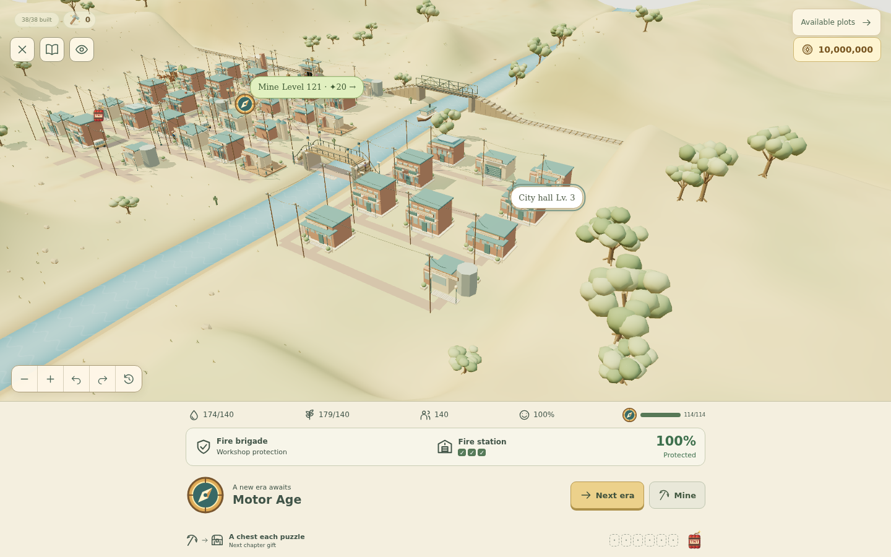
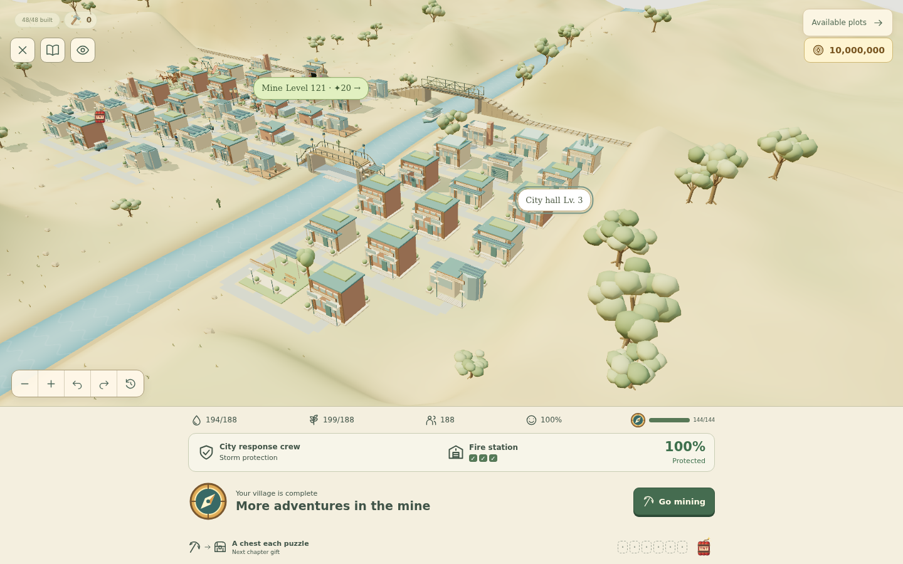

# Six-era settlement completion — issue #22

This is the historical six-era implementation report. The [issue #41 update](issue41-era-visuals.md) adds two intermediate eras, revises the 2005 identity, and fixes transport, construction timing, terrain, piers and event cameras.
The town now progresses through Frontier → River & Rail (1884) → Electric (1908) → Post-war Rebuilding (1920) → Motor Age (1932) → Contemporary Crystal City (2005). Rebuilding means the aftermath of World War I, placing it between electricity and cars as requested. Town progression retains the current town-only completion gate; the original issue's proposed mine-milestone gate was superseded by that design.

## Buildings and services

All 48 plots become available only in their introduction era. Existing plots retain their functional levels, services and completed facade on advancement; three paid modernization projects change each landmark's architecture in every subsequent era. Modernization never charges twice or grants the functional service again. Plot coordinates, purchases, construction receipts, records, Forge inventory and existing events remain compatible with v3 saves.

| Era          | New plot                    | Benefit per completed functional stage |
| ------------ | --------------------------- | -------------------------------------- |
| Rebuilding   | City hall                   | 2 happiness                            |
| Rebuilding   | Cedar court apartments      | 8 resident places + 1 happiness        |
| Rebuilding   | Valley food hall            | 18 food places + 1 happiness           |
| Rebuilding   | Water plant                 | 18 water places + 1 happiness          |
| Contemporary | Transit interchange         | 2 visitors + 1 happiness               |
| Contemporary | Public library              | 2 happiness                            |
| Contemporary | Crystal discovery institute | 1 happiness                            |
| Contemporary | Mixed-use courtyard         | 6 resident places + 1 happiness        |
| Contemporary | River promenade             | 2 happiness                            |

Each new plot has three functional stages. New buildings take 1/2/2 completed normal puzzles; modernization takes two per stage. Hammers retain their existing instant-completion behavior. Values above are bounded additions; happiness retains its 100% cap. Residents require food and water. A fully completed town provides 194 water places and 199 food places for 146 residents and 42 visitors. Existing well/farm service improvements carry forward through the inserted Rebuilding era and into Contemporary.

Rebuilding modernization costs 2,400 / 2,900 / 3,400 coins. New Rebuilding functional stages cost 4,500 / 6,000 / 7,500. Contemporary modernization costs 7,600 / 9,000 / 10,400; its new plots cost 12,000 / 15,000 / 18,000. These prices use the established purchase contract; modernization prices are already final, while new-building base prices use the shared purchase multiplier.

Existing Motor Age saves remain in Motor Age. Pending Industrial → Motor Age transition receipts remain valid. Those players can complete the newly available Rebuilding landmarks in Motor Age without losing paid projects or being sent backwards.

## Visuals and animation

`art/city/city.blend` is the editable Blender source, `city.glb` is the interchange export, and `src/assets/city-meshes.json` is the indexed runtime export. Reproduce them with Blender's background mode and `scripts/create-city-assets.py`, passing the repository directory after `--`. The actual source-mesh review render is `art/city/review.png`. Blender is not needed to run the game.

Rebuilding uses brick courtyards, masonry civic fronts, globe lamps and a steam passenger train. Contemporary adds planted roofs, timber facade screens, solar canopies, an electric train and a solar river ferry. Shared architectural families preserve service cues; clinic crosses, the sheriff's badge, bank columns, the forge anvil, the town-square fountain, horse field and park keep their identity. Three levels add substantial wings and finishing details. The four new Rebuilding landmarks also receive Motor Age architecture.

Road colors, mine entrances, utility details and transport follow era progress. Contemporary power service remains active with the overhead wires removed. Boats and trains update with the completed port/station facade. Touring cars and buses update with their completed transport building; motor garages stop spawning stable horses. Quiet electric transport omits the old steam ambience.

The WebGL renderer uses cached shared meshes/materials, static batching and animated instancing. The SVG map includes both new eras and all new plots. Road-following actors ease their heading through junctions without cutting across buildings or water. Bandit and sheriff poses blend into aiming, surrender and stopped movement. Patrol arrival uses a shared speed that preserves spacing and reaches the arrest line before capture. Existing saved events, skip behavior and once-only rewards remain unchanged.

Contemporary replaces workshop fires with bounded storm cleanup. The existing brigade responds to fallen branches on public plots. No buildings are destroyed; the established 30-coin loss cap, protected final 50 coins and defense reductions apply, with no bounty for cleanup.

## Campaign and balance evidence

Sixteen appended chapters add 96 authored puzzles, for 240 puzzles in 40 chapters. Existing IDs 1–144 retain their content. Each new chapter has a distinct mine palette, translated names and tips, and established chain/seal/relic mechanics with open routes, a breather and a delivery finale.

Five seeded hint-led playthroughs of all 240 levels completed 1,200 runs without an incomplete puzzle. Using those earnings in the sequential purchase/construction simulation, the full town finished at levels 219–225 with one chest per puzzle (median 221), or 186–190 with two (median 188). The longest isolated funding gap was one puzzle. These simulations exclude optional replay grinding and do not replace human balance testing under #9.

Reproduce the engine measurement with `node scripts/measure-campaign.mjs . 5 240`, save its JSON, then run `scripts/compare-town-economy.mjs` with the measurement and a prerequisite checkout. Raw results are ignored under `output/balance/`.

## Verification and limits

`npm run verify` passes all 1,030 tests and the production build. It covers formatting, unit/integration tests, deterministic authored-campaign playthroughs and production compilation. Added contracts exercise every applicable plot through all six eras, preserved services during all three modernization stages, save normalization and transitions, benefit previews, new plot routes and dry land, old Motor receipts, contemporary incident settlement, campaign continuation, adaptive resolution and continuous bandit movement/spacing.

`npm run demo:eras` creates disposable fixtures for opening and completing all six eras, plus cargo, fire and storm encounters. Fixtures and Playwright screenshots/logs remain under ignored `output/`. See [settlement-era testing](settlement-eras.md).

Real Chromium checks at `http://127.0.0.1:5186/` covered the persisted Electric → Rebuilding transition, city-hall purchase and construction finish (a normal completion receipt was supplied through the store), retained older facades, complete Rebuilding and Contemporary districts, and desktop/mobile framing. The French SVG fallback exposes all 48 plot controls; library selection and high contrast/reduced motion worked at 320×568, 390×844 and 844×390 with no page overflow or uncaught errors. The fallback map scrolls horizontally so plot controls remain usable. Contemporary storm crews and debris removal were inspected using its paused presentation clock. The same town scene survived a mine visit, motion stopped while hidden, and forced context loss recovered on a fresh canvas. Recovery exceeded the initial 10-second harness timeout under software WebGL; the subsequent check confirmed the new canvas and rendered scene.

The full-city profiling environment is headless Chromium with SwiftShader software WebGL. CPU actor updates and drawing submissions were small, but the software renderer sustained only about 12 frames per second. Adaptive resolution lowered the 3D buffer to 60% on sustained slow frames; this did not establish a higher measured frame rate in that environment. HTML controls and labels retain native resolution. Physical mobile/GPU frame rates and a full human playthrough are not verified; no 60-fps claim is made.
