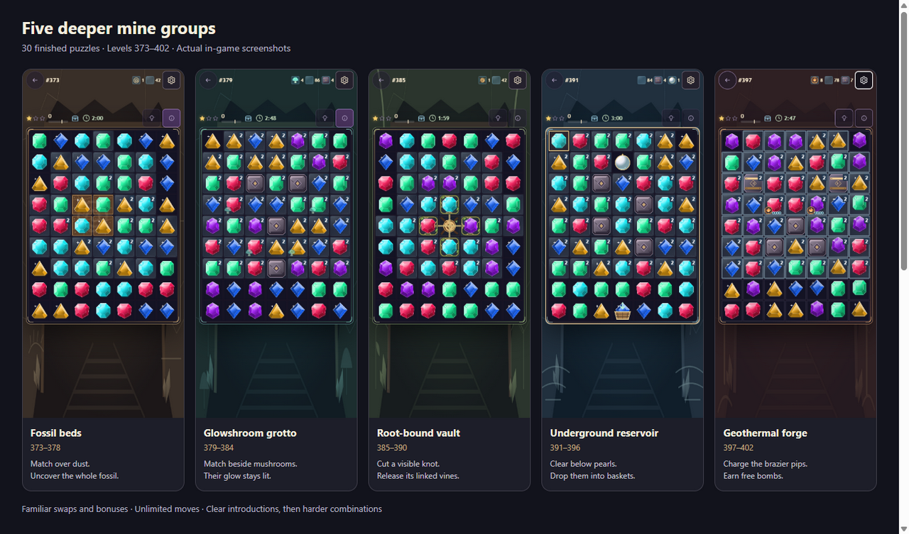

# Five deeper mine groups

Groups 63–67 contain thirty endgame puzzles, levels 373–402. The redesign uses
real missing cells, blast-only barriers and directed gravity. The 7 × 9 grid is
a bounding box: its missing corners, pockets and divided wells are not playable
sockets. Players still use the familiar swaps and earned bonus gems.

| Group | Levels  | Main challenge                                                                                                                                      |
| ----- | ------- | --------------------------------------------------------------------------------------------------------------------------------------------------- |
| 63    | 373–378 | **Geothermal forge:** learn to charge braziers and position earned bombs through constricted chutes and basalt gates.                               |
| 64    | 379–384 | **Fossil beds:** reuse a familiar brazier to blast solid fossil casings, then uncover discoveries in harder side alcoves.                           |
| 65    | 385–390 | **Glowshroom grotto:** ignite directional spore relays to blast along the marked row or column and chain through other mushrooms.                   |
| 66    | 391–396 | **Root-bound vault:** open linked root knots across divided wells; the two treasure puzzles drain through one funnel to a single basket.            |
| 67    | 397–402 | **Underground reservoir:** guide off-center pearls down a genuine V-shaped funnel, blast its narrow gate and deliver everything through one basket. |

The forge comes first so its familiar reward teaches the fossil introduction.
Level 379 places one four-charge brazier immediately above the first fossil.
The intact casing holds its earned bomb above the two upper pieces, putting the
blast in a useful position. Nearby matches charge the brazier; using its bomb
shows how solid fossil rock opens. Later fossil boards ask the player to craft
and position more bonuses independently. No forge board introduces fossils
before this lesson.

## Rules the player can see

An encased fossil is solid rock, not an ice layer under a gem. It blocks refill,
has no gem inside, and ordinary matches on adjacent cells cannot damage it.
A bomb symbol identifies each piece requiring a direct blast. Open all four
pieces and the fossil collects automatically. Marked two-layer pieces need two
hits, or a two-hit bonus fusion. Each bonus blast in a chain reaction is its own
hit, so a cross that fires a bomb hits a piece in range of both twice. The side
alcoves make the blast's position and reach matter; exposed pieces stay open.

A mushroom has a horizontal or vertical arrow. A match on or beside it fires
one spore burst in that direction. A burst can crack blast gates, activate other
mushrooms and trigger bonus gems it actually hits. Spent mushrooms stay dimmed
and checked. This makes mushrooms usable parts of a chain reaction, rather
than another lantern skin. Special blasts must directly hit a mushroom to ignite
it; ordinary matches retain the intuitive adjacent activation.

Pearls follow visible inward arrows at the funnel edges. The lower rows narrow
to one exit, with a bomb-marked gate above it. There are no hidden playable cells
in the corners and no refill underneath a closed gate. The wide upper chamber
provides space to make four-gem and T/L bonuses, then aim a blast down the throat.
Pearls cannot be destroyed or matched. Swapping a bomb, cross or rainbow gem with
a pearl trades their places and fires the bonus, as long as the pearl can still
fall to the basket from its new cell. Multiple incoming branches take turns so
outer pearls cannot remain stuck behind an endless central refill.

Root knots retain their familiar visible links: matching beside a knot or
blasting it releases its connected vines. Their harder layouts split access
between separate wells. The vault's treasure puzzles (393 and 396) use the same
funnel gravity as the reservoir: each relic waits above a gate and a knot, and
every playable cell drains to one basket. No relic can be left above a dead end,
and a bonus beside a relic can always swap with it. Forge braziers retain visible
charge pips and supply an earned bomb when filled; the new difficulty comes from
the chutes and gates.

Moves remain unlimited. There is no purchase or inventory-power requirement,
no move-exhaustion failure and no hard timer. The optional score and speed
thresholds only affect extra chests. A dead board still recovers for free.

## Shared implementation

`src/data/deepMineLevels.js` owns all thirty layouts, names and tips. Its parser
turns `_` into permanent void, `B`/`D` into one-/two-hit blast gates and `h`/`v`
into directional spores. Fossils use the shared `encased` flag, and pearl levels
request shared funnel gravity. Invalid fossil footprints and root links fail
during authoring.

`BoardTopology.js` supplies the same playable-cell and gravity routing contract
to matching, refill, hinting, recovery and input/presentation. Existing rectangular
levels keep their original gravity path. Shaped boards emit one final movement
receipt per gem, including its route; the renderer follows the bends instead of
moving gems through missing cells. Missing sockets cannot be targeted, swapped,
matched, refilled or highlighted. The drawn outline follows the actual cells.

`DeepMineMechanics.js` reuses tile health, blockers and chains. Spore waves resolve
through the existing bonus-chain lifecycle before gravity. Each mushroom fires
once, and each actual bonus is consumed once. Completion remains the shared
clear-layers/relic objective; counters add no separately saved state.

Published accounting thresholds for all 402 levels remain unchanged, including
the new thirty puzzles' score chest, optional speed and star thresholds. The
redesign pins the previously derived chest/time values so topology changes do
not invalidate a queued victory from an old or offline board. The first 372
level configurations remain byte-for-byte equivalent under the regression hash.
Town era definitions and mine surface profiles remain independent.

## Verification and calibration

`testing/deep-mine-levels.test.js` preserves the first 372 generated configs,
names, chapters and star targets through a captured hash. It checks all thirty
authored layouts, permanent voids, visible links and focused mechanic combinations.
Every board retains a broad upper crafting field and can form a four-match bomb
without inventory powers. All thirty require a board bonus even after every
one-shot spore relay fires. Every pearl route passes the throat gate and ends at
the same basket, and every playable cell of a treasure puzzle drains to an exit. Store-level playthroughs complete the new mechanics after more
than 100 recorded moves and after the optional speed target has elapsed.

All local checks run in Docker as required by `AGENTS.md`. The existing
`scripts/measure-campaign.mjs` measures normal, hint-led play without inventory
powers or score farming. It supports in-place activation, free dead-board
recovery and directed gravity, and records earned bonuses, special actions,
blast-only damage and diagonal pearl drops. The helper also checks that
resolutions conserve objectives and leave permanent voids empty.

The redesigned levels retain the exact published chest, star and optional speed
thresholds. A second captured hash verifies all thirty accounting tuples against
the immutable first-expansion source. The redesign changes geometry and strategy;
no star recalibration was performed. The existing calibration script still
supports an optional inclusive level range for a future separately reviewed change.

After the forge-first reorder, ten refill seeds per puzzle produced 300 complete
runs. The median was 31 actions and the 90th percentile was 73. Excluding the
introductory fossil/root lessons and chapter breathers, the median was 37.
Every run crafted at least two bonuses and used at least two board bonus actions.
Every reservoir run recorded at least two diagonal pearl drops. Eighteen free
reshuffles occurred across the sample; the longest run took 143 actions. Players
remain free to take as many moves as they need.

| Group                 | Median actions | 90th percentile | Rest median | Finale median |
| --------------------- | -------------: | --------------: | ----------: | ------------: |
| Geothermal forge      |             27 |              62 |          18 |            57 |
| Fossil beds           |             35 |              61 |          17 |            43 |
| Glowshroom grotto     |             28 |              83 |          21 |            67 |
| Root-bound vault      |             27 |              76 |          12 |            76 |
| Underground reservoir |             41 |              78 |          24 |            65 |

On 2026-10-03 the two vault treasure puzzles became funnels (the table above
predates this). On the ten held-out test seeds, level 393 took a median of 50
actions (90th percentile 88) and level 396, now with three treasures and a thick
throat gate, a median of 55 (90th percentile 76). Both stay above the chapter
breather; published chest, star and speed thresholds are unchanged.

The first fossil puzzle took a median of 19 actions and the first root puzzle 21.
A separate natural first-fossil replay verifies the teaching setup: swaps
16↔17, 9↔16, 21↔22 and 10↔11 charge the brazier; the third uses a cascade.
Its actual earned bomb remains at cell 23 above the solid casing. Activating it
opens the upper pieces 30/31 while lower pieces 37/38 remain. This regression
uses generated starting gems and real refills, without replacing the board or
supplying a bonus. The recipe is deterministic verification, not a required
player move sequence.

The independent regression samples ten held-out refill seeds (101–110) per
new puzzle and requires every sampled puzzle to finish with all blast-only
layers cleared. Chapter rests remain lighter than their finales, and ordinary
new puzzles have a higher median than the preceding twelve levels on those
same held-out seeds.

Reproduce the measurements with:

```sh
docker run --rm --user "$(id -u):$(id -g)" -e HOME=/tmp \
  -v "$PWD":/app -w /app node:24-bookworm-slim \
  node scripts/measure-campaign.mjs . 10 402 \
  373,374,375,376,377,378,379,380,381,382,383,384,385,386,387,388,389,390,391,392,393,394,395,396,397,398,399,400,401,402 \
  > /tmp/deep-mine-measurements.json
```

These repeatable simulations provide balancing evidence, not a prediction of
human completion times. Their finite diagnostic budgets never become gameplay
move or time limits.

## In-game visuals and browser checks



[Open the current review gallery](images/deep-mines/gallery.html),
[watch the new brazier-to-fossil lesson](images/deep-mines/mechanics/brazier-fossil-intro.mp4), or
[watch the earlier 72-second gameplay tour](images/deep-mines/deep-mine-tour.mp4).
The earlier tour and original screenshots below retain the level numbers from
before the forge-first reorder; the rules they demonstrate are unchanged.
The H.264 MP4 records the running game at 1280 × 800. It shows fossil casing
opened by an earned bonus, directional mushrooms firing, roots being cut,
pearls moving inward through the funnel and forge bonuses charging and firing.
Chapter labels are recording captions. Chapter selection uses the existing
local debug fixture; a script plays the hint engine's legal moves through the
normal game store and animations. No inventory powers are supplied or spent.

| Theme                 | Actual game views                                                                                                                                                                                                |
| --------------------- | ---------------------------------------------------------------------------------------------------------------------------------------------------------------------------------------------------------------- |
| Fossil beds           | [Desktop introduction](images/deep-mines/fossil-desktop.png), [casing partially opened by a bonus](images/deep-mines/fossil-uncover-desktop.png), [later alcoves on mobile](images/deep-mines/fossil-mobile.png) |
| Glowshroom grotto     | [Desktop](images/deep-mines/grotto-desktop.png), [directional spore chamber on mobile](images/deep-mines/grotto-mobile.png)                                                                                      |
| Root-bound vault      | [Two linked root wells](images/deep-mines/roots-mobile.png), [root released during play](images/deep-mines/roots-cut-mobile.png)                                                                                 |
| Underground reservoir | [V-shaped funnel and single basket](images/deep-mines/reservoir-mobile.png)                                                                                                                                      |
| Geothermal forge      | [French, high-contrast chute](images/deep-mines/forge-fr-mobile.png), [French illustrated guide](images/deep-mines/forge-guide-fr-mobile.png)                                                                    |

The T3 collaborative browser checked 1280 × 800 desktop and 390 × 844 mobile.
After its desktop connection closed, a Node 24 Docker Playwright browser
refreshed the final fossil layout, desktop grotto, French guide and gallery.
The gallery includes a WebM version for browsers without an H.264 decoder.
All five shaped boards fit the phone viewport without horizontal overflow;
mobile cells remain approximately 51 pixels wide. Mushroom arrows and bomb
marks distinguish rules by shape, not just color. The French guide scrolls
inside the viewport, and high contrast and reduced motion remain supported.

An actual keyboard swap on level391 made a bomb from four gems. Continuing
normal legal moves opened its throat and delivered a pearl. On level373 a
bonus opened fossil pieces that remained exposed after refill; ordinary nearby
matches left their casing intact. Root and mushroom state changes were visible
in the recording. No new application console errors or failed game assets were
observed. The tab retained older Electron-preview startup errors and a failed
request from an earlier stopped dev server; those predate the tested session.
The fixtures use a local test profile with no signed-in cloud account.

## Individual mechanic demos

[Open the mechanic video gallery](images/deep-mines/mechanics/index.html).

- [Fossil casings](images/deep-mines/mechanics/fossil-casings.mp4): ordinary matches leave the solid casing intact; positioned bombs uncover all four pieces and collect the fossil.
- [Mushroom relays](images/deep-mines/mechanics/mushroom-relays.mp4): a column beam wakes a row mushroom and both damage gates.
- [Linked roots](images/deep-mines/mechanics/linked-roots.mp4): cutting the knot releases its four connected vines.
- [Pearl funnel](images/deep-mines/mechanics/pearl-funnel.mp4): a cross opens the throat, pearls move diagonally inward, and both arrive at one basket.
- [Forge braziers](images/deep-mines/mechanics/forge-braziers.mp4): nearby matches add charge, a completed brazier releases a free bomb, and that earned bomb is activated.
- [Blast-only gates](images/deep-mines/mechanics/blast-only-gates.mp4): an ordinary match leaves reinforced gates intact, and two positioned bonus hits open them.

The six original clips retain their earlier chapter numbers. The new
[brazier-to-fossil introduction](images/deep-mines/mechanics/brazier-fossil-intro.mp4)
shows the current level 379.

The new introduction records all four charging moves continuously at 3× playback,
followed by activation of the earned bomb. It starts from a naturally generated board and
uses no supplied bonus. The fossil holds the brazier's bomb above its upper
pieces, making the placement useful and visible.

These annotated 1280 × 800 clips use the actual game renderer and resolution
engine. Each prepared position comes from deterministic legal, hint-led moves on
the published levels. Labeled transitions omit setup moves; the demonstrated
actions run through the normal game store with no inventory powers. Each action's
resulting tiles and gem types are checked against its legal simulation checkpoint.
The final forge action activates the actual bomb supplied by its brazier.
MP4 downloads and WebM browser playback are provided for all seven clips.
