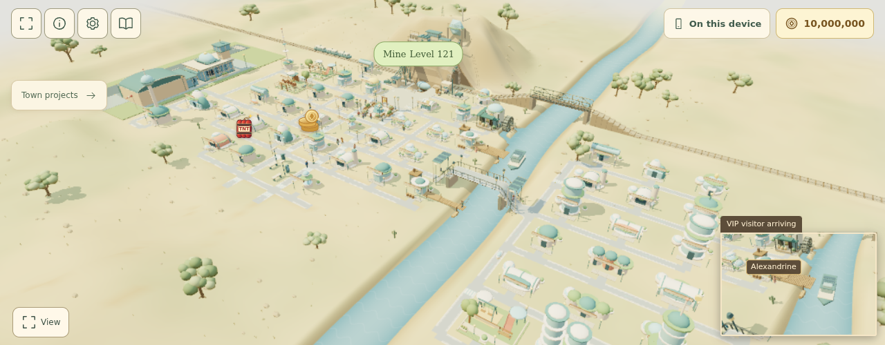
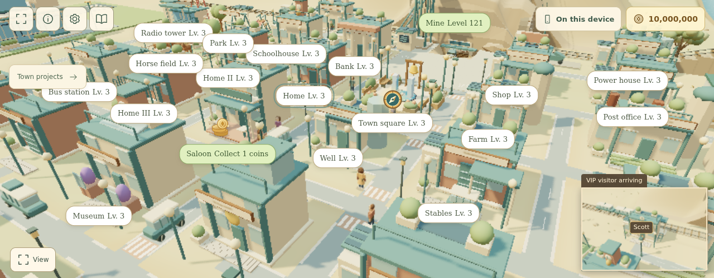
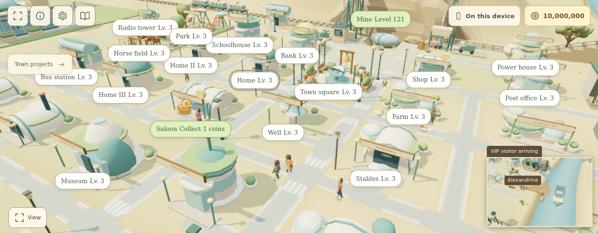

# Extending eras without repeating rules

`src/data/eras.js` is the authoritative ordered era catalog. Each entry's
`evolution` profile describes its shared building style, modernization prices,
capacity tiers, transport, electrical infrastructure, incident type and art
family. Gameplay, the Three.js town and the accessible Vue drawings read these
capabilities through `eraEvolution()` instead of maintaining separate era lists.
Unknown save identifiers fall back to the Frontier profile.

Road appearance uses the `roadStyle` capability and `data/roadStyles.js`.
The styles progress from worn dirt and gravel through brick, concrete and marked
asphalt to contemporary paved crossings. `roadColor` remains an optional tint
override. `RoadDetails` prepares flat surface strips once per topology/era change;
WebGL merges them into the existing static scenery batch. Junctions and short building approaches remain unmarked.
The bridge owns its raised surface: `roadBridge` enables a continuous road deck
with the era's paint, beginning with Motor Age modernization. Earlier bridge
styles retain timber boards. Both use `bridgeDeckHeight()` for the existing
pedestrian and vehicle grade; approach furniture remains outside the deck.
Treatments never change road width, navigation
obstacles, walking heights or traffic routes. `town-roads.test.js` covers all eras,
future/fallback styles, geometry budgets and pedestrian/animal clearance.

`defineEra()` in `src/data/eraDefinitions.js` applies shared style defaults,
validates required prices and assets, and freezes the resulting profile. This
happens once when the catalog loads, outside animation loops. Invalid authored
definitions fail early; they do not silently become a partially supported era.
The factory copies arrays so one era cannot mutate another's defaults.

## Reuse an existing visual style

Add an era entry with its identity, campaign metadata and evolution profile.
Choose `river-rail`, `industrial`, `motor-age` or `city` and supply the three
modernization prices. City profiles also declare their Blender asset family and
three new-building prices. Override capabilities, tier capacities, road color,
copy or detail assets where this era differs from the shared style.

The modernization offer factory in `src/game/town/TownModernization.js` combines
that profile with an appearance provider. It owns the common offer structure,
stage progression and capacity-benefit text. Eligibility remains in `TownEras.js`;
building-specific exceptions, including landmark construction duration, remain
explicit. Mining income and bonus formulas are outside this contract, with one
exception: the middle modernization price also sets the era's chest coin cap.
`chestCoinCap()` in `src/data/economy.js` pays half that price, rounded to 50 and
never below 4,000, so a new era's chests keep pace with its prices without another
table. Shallow levels keep their smaller chapter value.

### Water, food, comfort and happiness

`src/data/townNeeds.js` is the one definition of what buildings give the town:
water, food, homes, visitor places and comfort, plus the happiness settings.
City buildings declare the same values as per-level `effects`. `TownNeeds.js`
turns both into explicit terms, rebuilt when a plot is registered, and the save
export ships those terms so the server evaluates exactly the same model. Never
copy a capacity or happiness number into the backend or a component.

- Residents are limited by homes, water and food; visitors fill the visitor
  places that spare water and food allow, scaled by happiness (none at 30%, all
  from 90%).
- Happiness is how well water and food cover everyone the town can hold, times
  the comfort it offers for its size. Each happiness point raises saloon income.
- Each era's `waterworks` and `farmCapacity` tiers are the capacity of the main
  waterworks and farm once modernized to that tier. They must rise at every tier,
  and an era without its own tiers continues from the previous era's best tier.
- An era should grow its town (new homes or landmarks that draw visitors) and
  supply that growth through its tiers and water or food buildings, so a finished
  era houses everyone. `testing/town-needs.test.js` checks this for every era.

Guidance (`nextGoal`, `needsReport`) suggests the available building that adds the
missing water, food or comfort for the fewest coins per person. The village map
shows water, food and happiness, and the label of that building says what it fixes.

The rendering registry in `buildings/BuildingRenderer.js` selects the style's
landmark and modernization renderers. City asset aliases resolve the longest
matching era prefix, allowing names such as `aviation-next` without accidentally
selecting the `aviation` prefix. Existing style geometry remains shared; new era
identity can come from its configured asset family, detail asset and capabilities.

An era still needs its actual content: campaign placement, buildings, projects,
translated copy and any new art. A definition does not manufacture those assets.

River & Rail and Industrial final upgrades use `src/data/heritageUpgrades.js`
to map each building's original kind to a useful expansion. `HeritageDetails.js`
and `TownHeritageUpgrade.vue` render that shared choice: for example, a post office
gets dispatch rooms and telegraph fittings while a shop gets a trading awning,
even though their original building shells are aliases. Preserve the original kind
before resolving a shell alias. Unknown kinds get no speculative decoration.
Do not use a universal clock tower as a completion marker. Motor Age landmarks
inherit the complete city shell selected by `baseCityEra` (Post-war by default),
including its paid stage, then add period frontage. They never restore an older
industrial shell.

The gallery exporter records each building's introduction era. Its wiki packager
places new buildings first, then existing buildings and the mine, with links to
every entry. Regenerate captures after geometry changes; a changed mesh signature
alone does not establish that an upgrade is visible from the camera.

Airport architecture uses the optional `airportStyle` capability. The shared
`src/data/airportStyles.json` catalog drives Blender authoring, runtime asset
selection and the SVG building illustrations through `airportAppearance()`. Regional (1958),
metropolitan (1986) and connected (2005) definitions each export a base, lounge
and finishing stage. New eras can inherit a style without renderer changes;
missing or unsupported styles safely use the regional airport. The renderer
receives the building's completed era, so entering a new town era alone never
modernizes the airport. `testing/airport-art.test.js` checks extension/fallback,
stage selection, site bounds and wing clearance.

The town square centerpiece uses the `fountain` capability. Each building style has a
default design and eras may override it; `src/data/fountains.js` lists the registered
ids and resolves unknown ones to the frontier spring. `TownFountains.js` renders each id
from shared primitives inside the same 1.08-unit walk radius, and `TownFountain.vue`
draws its SVG counterpart. A new era can reuse a design by id; a new design needs both
drawings. `testing/town-fountains.test.js` checks registration, fallback, size and the
single translucent water material for every era and square stage.

`testing/town-clipping.test.js` guards shared scenery against clipping: the farm
windpump's swept wheel stays clear of every wing and hayloft, era street furniture keeps
off lots and sidewalks, and each overhead service drop is cut where it first meets its
finished building (`addServiceDrops`), so wires never pass through a wall or roof.

The square owns its corner lamps. `squareLampCorners()` in `src/data/townSquare.js`
reports which corners the square lights for its era and level, and `electricLamps()`
drops the First Lights street lamps beside those corners in the 3D town.
`testing/square-lighting.test.js` checks one lamp per corner in every
electrified era, including unfinished and unknown square eras.

## Introduce a genuinely new style

Extend the documented `BuildingStyle` / `EraEvolution` contract and defaults in
`eraDefinitions.js`, then register its appearance provider in `TownModernization.js`
and its rendering provider in `BuildingRenderer.js`. Implement the accessible
drawing and mine representation for the new style when their existing capabilities
cannot express it. These are JSDoc interfaces and small factories, appropriate to
this JavaScript project; a class hierarchy is unnecessary.

Keep era-specific artistic details inside their renderer. Share repeated rules
and capabilities rather than flattening distinctive buildings into one generic
design. A new capability used by several systems belongs in the era profile;
avoid adding the same era-name conditional independently to each consumer.

### City architecture: Tomorrow City's rounded forms

City eras choose their building forms with the `architecture` capability. `standard`
(the default) keeps the Blender period shells; `rounded` renders every city family as
procedural domes, drums, barrel vaults, pods and tubes. `defineEra()` rejects unknown
architectures and non-city styles that try to change it. Tomorrow City (2065) is the
first rounded era and keeps `cityAssets: 'contemporary'`, so shared pieces (vehicle
fallbacks, bridge approaches, garden finishes) still resolve through the Connected City
family.

- `data/roundedArchitecture.js` holds the shared palette and the family → form table
  (`residence: tower`, `civic: rotunda`, `retail: vault`, `depot: hangar`, `water: tanks`,
  `station: tube`, `culture`/`concert: shell`, `research: geodesic`, `farm: greenhouse`,
  `river: pavilion`, `park`/`field: garden`, `radio: mast`, `television: orb`,
  `skyline: spire`). Building identities from `cityBuildingStyles.json` (for example
  `pods`, `twin`, `columns`, `power`) pick the variation within a form.
- `buildings/rounded.js` draws the 3D forms. `renderCityBuilding()` looks the renderer up
  in its `ARCHITECTURES` registry; a renderer returning `false` (airport, square, bridge)
  leaves that kind to the shared shells. The airport's rooftop lounge becomes a glass dome
  via `addRoundedLounge`, the square uses the `orbital-rings` fountain and the watermill
  swaps its gable for a glazed dome.
- `TownRoundedBuilding.vue` draws the same forms and palette for the SVG building
  illustrations (building cards, tour and landing page), and
  `TownBuilding.vue` routes rounded eras to it before the standard city drawing.
- Vehicles follow the separate `transportStyle` capability (`standard` or `rounded`,
  registered in `TRANSPORT_STYLES`), not `architecture`, so a later era can change its
  buildings and keep its vehicles. `hasRoundedTransport()` selects wheel-less hover cars, a
  hover shuttle bus and rounded incident response pods that bob via `userData.hoverBody`
  (`TownVehicles.js`). The airport, station and port switch to a sky saucer, a solar express
  train on the rails and a hover ferry (`RoundedTransports.js`) once that building itself has
  been modernized into a rounded-transport era. Only city eras may change it, and unknown
  eras fall back to `standard`. Villagers wear the `tomorrow` wardrobe (`hat: 'visor'` and a
  `trim` collar ring) built from existing shapes.
- The mine gains a `rounded-arch` portal hood and a geodesic `sorting-dome`. A site entry
  may declare `replaces: [...]` to supersede features it encloses; the dome replaces the
  sorting plant and solar canopy, keeping the mine under its 6,000-triangle budget.
- Tomorrow City adds the Sky pods, Biodome and Maglev loop on a new x = 65 east-bank
  column; the east clearing now reaches x = 70 so those lots stay level.

The same old-town view in Connected City and Tomorrow City (WebGL, headless Chromium):

More captures, including phone sizes: [Tomorrow City gallery](tomorrow-city-gallery.md).

Frame-rate rules for rounded forms: only the shared `sphere`, `cylinder`, `rounded` box
and `rock` primitives are used (no new geometry is allocated per building), every part
uses the seven-color palette so each batched plot stays at eight materials or fewer, and
nothing is animated. A fully built Tomorrow town draws about 108,000 building triangles
against about 132,000 for Connected City. `testing/tomorrow-era.test.js` enforces the
per-building budget (under 4,000 triangles, at most eight materials), the whole-town
comparison, level-by-level visible changes, a synthetic rounded successor era, the new
plots, prices, benefit previews and the SVG forms.

### Future archetypes: Skysail, Stargazer and Moonward

The six established eastern garden landmarks retain their named forms and scales
from `COZY_LANDMARKS` in `FUTURE_LANDMARKS`. Their shared successor layouts live in
`buildings/future/gardenLandmarks.js` and use each era's building kit. The first
modernization preserves the mature campus, including the orchard's three homes
and the retreat's terraced pools; later tiers add gardens and rooftop details.
Do not route these landmarks back through ordinary city-family forms.
`testing/future-eras.test.js` compares every successor tier with mature Riverlight
dimensions and checks parcel frontage, art budgets and synthetic successors.
Skysail's sail corners have supports reaching the local ground; rooftop crowns
attach to the saddle centre rather than the height of its raised corners.

Later future modernizations use `futureBuildingStages()` in both the WebGL and
SVG renderers. The new finish tier controls decorations, while `structureLevel`
retains completed construction: annexes, homes, islands, dew towers, harbour
berths, airport wings/lounge and space-elevator equipment. Native construction
still reveals these in its original tiers. Synthetic successor definitions inherit
their architecture's stage rules; unknown definitions keep native behavior.
Rooftop kits receive both the roof peak and `baseY` (its eave), so offset masts,
dishes and arches extend into the roof instead of hovering over a slope. Airport
crowns are built on the lounge itself. Lunar lookout rails and the workshop beacon
also have structural mounts. Regression coverage checks retained structure counts,
roof intersections, lunar mounts, budgets and distinct upgrade illustrations.

The eras after Riverlight share one set of archetypes and swap a small kit per
architecture (`sail`, `observatory`, `homestead`): walls, roof, round body, cap,
door, a level-two wing, a level-three crown and a street prop. The renderer
registry in `buildings/city.js` maps each architecture to its building, airport
lounge, airport grounds and bridge hooks, so a new architecture registers once
instead of adding conditionals. Large parcels may declare an `access` road instead
of joining the garden lane; shadow coverage grows only with the clearings that
hold a visible parcel. See [the future eras guide](future-eras.md).

### Partial modernization: `modernizes`

An era may list the building ids it modernizes (`modernizes` in its evolution
profile; `null`, the default, modernizes every building). Every other building
keeps the finish of the latest era that did modernize it (`finishEra()`), offers
no modernization and counts as complete for the era gate. The save rules export
the list per era and the server's era-complete check reads it. Twin Hollows uses
it so that, on Earth, only a few homecoming landmarks change while the Moon
settlement is built. A building may also declare `settlement: 'moon'`: it shares
every lifecycle but stands on the Moon map instead of a valley lot.

## Regression evidence

`testing/era-definitions.test.js` covers invalid definitions, immutable shared
defaults, unsupported save identifiers, overlapping asset prefixes and a synthetic
future city era. Synthetic successors to all four later building styles produce
the same mesh signatures as their base style, including mine evolution.
`testing/building-era-contract.test.js` exercises the production rendering
registry across every existing building and era.

During this refactor, all 32 before/after town snapshots matched exactly: eight
eras at four construction states, covering every modernization offer, capacity,
transport choice, road surface, electricity rule, incident, city variant and gate.
The first 144 focused existing regression tests and the 12 new extension tests
passed. The release's full verification and browser checks supplement this
targeted evidence; simulated extension tests cannot guarantee all future content.

Future optional events and cinematic transitions have a separate framework design
in [issue #42](https://github.com/Starbugstone/Prospect-Hollow/issues/42). This release
does not implement that deferred event runtime.

### Building completion presentations

`data/townPresentations.js` defines completion scenes and their saved receipts.
The campaign store queues a receipt in the same transaction as first construction
or a builder hammer completion; upgrades and old completed saves do not queue it.
`normalizePresentations` validates supported receipts without inventing events.
Acknowledging or skipping a scene changes only its receipt, never its rewards.

`TownPresentationCinematic` owns the shared skippable timeline, pause behavior,
reduced-motion still, and accessible dialog. `TownPresentation` owns camera capture,
restoration and temporary renderer cleanup; content adapters supply scene visuals.
The railway opening lays track, excavates the bore under dust, assembles both stone
arches and sends the first train through. Until the station is completed, the hill
stays solid and there are no rails or portals. The saved station and its rail line
remain complete if the presentation is interrupted; its pending scene can resume
on the next village visit. This completion presentation is separate from the
optional-event framework deferred in issue #42.

Campaign milestones use the same presentation receipts and renderer lifecycle.
`campaignCompletion()` counts the authored normal levels only; the museum uses
that count and filters completed replays below three stars. Unplayed levels remain
part of the remaining total. `queueCampaignPresentations()` evaluates definition
predicates after victories and when loading older saves. The three-star milestone
queues once for a perfect collection, resumes while pending, and keeps its seen
receipt after acknowledgement. Continuous play never earns campaign stars.

`TownCompletionFireworks` provides the temporary square fireworks and three-star
finale. It restores the original sky, fog and light intensities on exit. Reduced
motion uses a still with no rockets or camera motion. Drawing-buffer quality changes
wait until the presentation closes, preserving the final image behind Continue.
`campaign-completion.test.js` and `completion-fireworks.test.js` cover qualification,
saved receipts, future milestone definitions, visual disposal and this final hold.
To reproduce a silent video, generate era demos and run
`scripts/capture-completion-fireworks.js` through Playwright CLI in a disposable
browser. Encode `output/playwright/completion-fireworks-frames/%05d.jpg` at 24 fps.

### Incident scripts

`townEvents.incidentScript(event)` turns a saved receipt into the facts every
incident cutscene stages: responders (sheriff, bank and fire-station levels),
thieves caught and escaped, bank-locked and stolen crates, fire intensity, arrival
and resolution beats, and the captions. `TownEraIncident`, `TownRaid` and the
banner all read this one script, so a caption can never describe something the
scene does not show. The rules it guarantees:

- Responders always reach the scene before anyone is caught or flees. Uncovered
  thieves bolt only as the patrol comes into sight, and escape through the back
  lot on the side away from the patrol, never back along its road.
- A loss always leaves with a visible thief; bank cover keeps crates padlocked.
  Protected receipts show every thief caught and led to the lock-up.
- No patrol means no "Hands up!". No fire station sends neighbours with buckets
  instead of a brigade. Weaker stations mean a bigger, longer fire, and soot
  stays on the façade only when the town paid for cleanup.
- Defenses finished or the bell rung mid-scene recast the script until the
  outcome is revealed; afterwards the staged facts are committed.

`testing/incident-story.test.js` checks every gang, sheriff and bank combination
against these rules, and plays full scenes to confirm arrival order, escape
direction, prisoner escort, stolen crates, fire damage and storm cleanup. New
incident kinds should add their beats and captions to `incidentScript` and their
strings to `fr.json`; `testing/i18n.test.js` enumerates every caption and story.

### Incident cameras

`TownEventCamera.INCIDENT_SHOTS` assigns two subjects to each incident kind.
Bandits and cargo thieves use the main tracking camera with the responding patrol
in an inset. Fires and storm cleanup follow the response squad while the inset
holds on the incident props. Era definitions continue to select the incident kind;
new eras that reuse a kind automatically receive both views.

The shared camera helper fits moving groups to the viewport, follows the leading
responders in the smaller window, and falls back to the incident site for unknown
kinds or absent patrols. Both views use the village clock and the same animated
instances. The inset renders scenery and actors with its own depth, restores the
renderer viewport/scissor afterward, and disappears on completion, skip, or
reduced motion. `TownScene` supplies its translated caption and border.

`testing/incident-cameras.test.js` covers subject separation, moving and staggered
groups, portrait framing, pause/skip cleanup, renderer-state restoration, and
unsupported receipts. The incident actor tests also check that dismounted crews
stand outside their vehicle and storm branches sit above the promenade pavement.

### Period architecture and mine construction

`cityStyles.json` drives the city Blender exporter, runtime landmark additions and
SVG building illustrations through `cityAppearance()`. Each city era names its own `cityAssets`
family. The 1958 family uses ribbon windows and broad cornices; the 1986 family
uses concrete blades and stepped parapets. `cityBuildingStyles.json` defines each
building kind’s family, footprint and identity. `cityAppearance(era, kind)` chooses
its own exported model and finishing stage; family models are fallbacks.
`scripts/city_identity.py` authors those models using the shared catalog.
Gardens, antennas, billboards and solar details are selected per building kind
and period. Housing never borrows the business-tower landmark. Future eras can
reuse an existing family; incomplete appearance lookups safely fall back.

`mineAppearance()` derives permanent surface equipment from the same era art
family. `addMineSite()` builds the permanent site and the cinematic model, so
finishing or skipping cannot leave different versions behind. Its cached scenery
batch is separate from the underground shaft and the chapter equipment.

The `era-mine` content adapter uses the common `TownPresentation` camera lifecycle.
`TownBuildSequence` stages named sections, arriving workers, carried supplies and
hammering; callers provide their assembly, timing and work positions. The era
receipt remains the persistence authority. The timeline waits for graphics,
pauses with the view, and resumes a pending receipt on the next village visit.
Reduced motion shows the complete result without camera animation. Without 3D
graphics the village shows a retry notice and the dialog uses its still mode.

`testing/building-era-contract.test.js` checks every available building and all
three later-era stages. `city-era-art.test.js` checks period families, exported
technology details and future/fallback definitions. `mine-era-construction.test.js`
covers all seven transitions, worker motion, completion, batch replacement,
skipping, camera restoration and reduced motion.

For reproducible snapshots, run `npm run dev`, open
`/scripts/era-art-review.html`, and export each era's PNG data to
`output/era-art-data/<era>.json`. Run `python3 scripts/package-era-art-review.py` to
write the individual PNGs, comparisons, wiki galleries and downloadable archive.
The review uses production renderers and real plot positions, including dock
lengths. See [the visual guide](wiki/Era-Visual-Guide.md).

### Villagers and passive VIP visits

`src/data/villagerNames.js` is the editable, commented beta-tester honor roll.
Add quoted names to `female` or `male`, keeping names unique. Rebuild/redeploy to
publish edits. `vipVisitor()` draws uniformly from the combined name pool first,
then reads the selected entry’s gender; an independent draw leaves most visits
ordinary. Residents and construction crews stay unnamed. Era wardrobe capability
and gender silhouettes are shared by ordinary villagers and visitors. VIPs retain a gold badge while `townWardrobes.js` selects one of three
coordinated period outfits per visit, including coat length, hat, skirt and accessory.
The outfit draw is independent of the name/gender draw and stable during the visit. Their names appear on tap/hover in the main view.

Only identities explicitly marked `vip: true` by the random VIP draw may make
occasional 5-coin purchases. `canVipSpend` excludes live visitors and legacy
share-link guests, even when named. The same check gates shopping stops, spending
notifications and wallet receipts, so ordinary visitors produce no coin animation.

`TownVipArrivals` owns transient visits, never campaign events or rewards.
Train, boat and airplane motion publish their actual arrival cycle and stopped
vehicle through `visitorTransports`; there is no independent arrival timer.
A successful VIP draw at that stop starts a six-second secondary-camera inset,
with a name tag above the guest. `TownInset` shares viewport/scissor rendering
with fixed incidents and always restores renderer state. Passive arrivals do not
move the main camera, disable controls, pause play, or intercept input. Fixed
presentations take precedence, and missed arrivals are discarded.
Main-view labels and collection badges that overlap an inset are temporarily
hidden, so they cannot paint over its secondary view; they return when it closes.

The visitor follows the street graph and returns to the same transport entrance.
Before passenger transport, foot visitors leave the stable, wander the village and
return through the same door; there is no vehicle-arrival inset for that foot visit.
Leaving the village (including mining) clears VIP state. Returning may start a
fresh visitor already partway through a walk, without replaying an arrival inset.
No VIP state is saved. With only a stable/visitor capacity, ordinary foot visits
can occasionally be VIPs; once passenger transport is built, named arrivals use
its vehicle cycle instead.

`testing/vip-visitors.test.js` checks the editable lists, uniform name selection,
gender, ordinary visits and reproducibility. `testing/vip-arrivals.test.js` checks
all three real transport cycles, return paths, the inset timeout, independent
camera state and fresh mine-return visits. `testing/town-visual-audit.test.js`
covers the building, traffic and cinematic regressions. The local
`/scripts/town-actor-review.html` uses production meshes to inspect gender variants,
VIP outfits and construction hammer grips.

The reproducible VIP gallery (`output/vip-review/index.html`) compares all eight eras,
three coordinated outfits per gender, normal-villager comparisons, arrivals,
wandering and departures with and without tags for every combination. The gallery is portable with its sibling PNG files. The
production arrival inset always includes the name; unnamed inset captures are
review comparisons only. Airport guests use the expanded lounge’s side exit
after stage two, keeping both outward and return paths clear of its footprint.

To reproduce the complete VIP image set, run Vite and use a fresh Playwright CLI
browser session with `scripts/capture-vip-review.js` as its `run-code` callback.
Then run `python3 scripts/package-vip-review.py`. Packaging checks all 468 required
images (96 character comparisons, 288 village scenes and 84 inset close-ups),
writes an offline gallery and image manifest, and creates `output/vip-review.zip`.
Additional overview captures already in the folder are preserved in the archive.

### NPC obstacle avoidance

`TownNavigation` supplies cached pedestrian detours for residents, VIPs, mounted
visitors, incident crews, construction workers and village animals. The existing
street graph still chooses cross-town routes; navigation adds local detours using
generated component rectangles and authored prop circles, with a body clearance margin. It does not
raycast meshes or create physics bodies.

When adding a solid street prop, call `walkObstacle(group, x, z, radius, height)`
where that prop is rendered. Coordinates are local to the group. Use the physical
base radius (or the half-diagonal for rectangular furniture), not the overhead
canopy. These markers survive geometry batching. Only mark props actually built in that era. Building owners use explicit activation
states; `replaceOwner` invalidates only intersecting prepared paths. Removed or
underground infrastructure leaves no invisible obstacles.

Prepare walking paths when actors or routes are created. Use `prepareActorWalk`
for ordinary people, `navigation.route` for prepared manual routes, or `localWalk`
for translated construction scenes. Sample with `walkPose`; don't apply another
sidewalk offset afterward. Facing eases at corners while positions stay on the
clear segments. Ambient movement samples prepared route distances once per rendered
frame, using elapsed time capped at 0.25 seconds after a long stall. Scenery
clearance is cached per route, obstacle set and animal-clearance provider; route
or scenery changes invalidate that result. Open routes turn back at endpoints.
Spatial buckets and narrow vehicle envelopes provide bounded crowd yielding.
Route distance and visitor lifecycle clocks advance only by accepted movement;
indoor rests advance normally. Visitors fade at the source after completing the
trip, and new transport arrivals reset their movement clock. Unreachable paths
hold their last position. Horse/car speeds are distance-based, independent of
any route shortening during preparation.
An era change recreates villagers, animals and visitor-arrival state against the
new layout, clearing old routes, work positions and crowd reservations. The
rendered era is recorded separately from the mutable campaign town. Ordinary
building upgrades and rebuilds within an era retain actor identity and position.

Outdoor task actors share `TownWorkRoutine`: approach a prepared work site,
perform the task, walk back and take a short break. Farmers, hosts, fishers,
chatting neighbors and bird feeders keep their task animations, but no longer
stand in one place indefinitely. Only accepted locomotion advances travel;
arrival starts the task timer. Task animation never overwrites the accepted
position. Routes are prepared on layout changes, not searched each frame.
The leashed park walk also uses distance-based speed and turns back on open paths.

`TownPedestrians.buildingWalk` prepares these activity routes beside their owning
building. It keeps both task and rest positions outside the carriageway, tests
the complete walk against scenery, and prefers a leg parallel to the road.
Authored entrances/services and a bounded search of the frontage or grounds
handle larger era models without projecting workers into traffic. Fishers stay
along the bank; the leashed park pair reserves room for both bodies and stays near
the park. Building replacement repeats this preparation only when its route is
obstructed. Crowd yielding remains a moving-crowd fallback, not task-site placement.

People, ground animals and road traffic yield to other actors for at most three
blocked attempts, then pass through the crowd until clear. A clear step resets
that budget. This exception never bypasses scenery clearance or an unreachable
route. Stationary workers retain their accepted placement instead of repeating
placement searches each frame; segment queries reject unrelated mesh bounds
before testing exact geometry.
`testing/town-navigation.test.js` covers continuous clearance, all era profiles,
manual actor routes, cache reuse and scenery removal.

### Village animals

`data/townAnimals.js` owns the bounded animal cast and completed-building outdoor
habitats. `TownAnimals` shares roaming, resting, feeding, flight and disturbance
handling; `TownAnimalModels` supplies articulated, instanced animal meshes. Dogs
and cats follow prepared street routes, hens forage around the farm entrance,
and occasional foxes and raccoons stay along the southern village outskirts.
Ground animals share pedestrian obstacle and traffic clearance. Wildlife turns
away from nearby people; pigeons take flight when people, pets or traffic approach.

Behavior reads era capabilities, not a separate chronology. Paved towns give
traffic more space and have less frequent wildlife visits. Feeders use the era's
villager wardrobe. Open-building landing spots come from completed habitats;
power-pole perches come from markers on the actual rendered grid. Underground
wiring therefore removes those perches automatically. Flights rise above the
built scenery before descending through a verified open landing column.

`TownAnimalSpace` adds geometry clearance to the authored navigation markers.
A cached, balanced triangle index includes each immutable scenery root and the
landscape, so fences, trees, planter boxes and merged Blender props are covered
without requiring additional hand-maintained footprints. It checks the animal's
full body envelope, repairs blocked route sections on a bounded local grid, and
rejects covered landing spots. Accepted animal steps use the same geometry check. Construction activates the
actual final component footprints only after occupants walk clear; moving
machinery reserves its swept volume. A crowded park can move the leashed dog walk to its open side.

Landing sites and grain targets sample their actual supporting floor from that
same index. Feeding reuses fourteen instanced grain meshes: each thrown grain
settles, disappears when a pigeon's beak reaches it, or expires after 2.4 seconds.
Consumed grains remain hidden until the next throw; the hidden effect does not
update its particle pool. Pigeon wing bars are faces of the wing mesh, and beaks
move rigidly with a head that pauses between pecks. Species-specific silhouettes
use cached geometry in `TownAnimalGeometries`, disposed with the diorama.

The cast, grain particles, route plans and habitat index are bounded. Unrelated
actors retain their accepted pose across plot replacement and full visual rebuilds. All routines use its clock, including pause and reduced motion;
they never change saves, earnings, objectives or puzzle moves. Add outdoor
habitats to the definition and mark new perch geometry with local
`userData.animalPerches` coordinates. `testing/town-animals.test.js` covers every
era, a synthetic successor, missing scenery, continuous routes, feeding and grain
consumption/expiry with bounded instance counts,
disturbances, frozen clocks and a long simulation without scene growth.
`testing/town-animal-clearance.test.js` builds the production scenery at initial
and final building tiers in every era and checks both prepared segments and
animated animal positions, plus thin unmarked fences, covered landings, solid
interiors, moving scenery reservations and traffic displacement.

### Loading and renderer ownership

`MeshCatalog.requiredFamilies(town)` combines the current era, completed building
eras, inherited architecture and heritage. Family promises are shared and retry
on failure; a presentation token cancels only its consumer. `predev`, `pretest`
and `prebuild` regenerate bounded lazy chunks from the authoring JSON exports.
A missing model resolves to a family or procedural substitute. Footprints are
used only with their matching visual; unsupported visuals get a provisional
reservation derived from their actual geometry.

The town paints terrain and plots before scheduling life. `AnimalSpaceBuilder`
uses packed triangles, a permutation and median partitioning, yielding between
bounded pieces. Immutable geometry snapshots are cached per root/revision.
Render tiers start at medium unless a measured tier was stored: DPR caps
1/1.25/1.5, shadow maps 1024/2048/2048, cache samples 0/2/4. Runtime adaptation
changes DPR and shadows outside presentations, with tier thresholds relative to
the device's maximum DPR; target sample counts are fixed
at allocation.

`loadBoard` owns the shared Phaser import. Generated PNG atlases use
`{key, frame}` references per texture manager, with SVG recovery on load failure.
Only the active gem finish and shared board art load initially. `requestIntro`
is the single session owner: renderer readiness, an intro rejection, detachment
or recovery cannot run queued input twice or finalize another puzzle.
`BoardHost` mounts only during a mine session and tears down its renderer on exit;
reset and import always replace the renderer. Mine ambience starts synchronously
in `startLevel`, preserving the entry gesture, and renderer recovery does not
restart it. Physical mobile and deployed cache-header checks require their actual
environments.

Hashed `/assets/*` get immutable hosting headers; the shell revalidates. CI fails
for JavaScript chunks above 2 MB or static mesh-catalog imports.

### Footprints and construction

Run `npm run assets:footprints` after changing building geometry or renderer
keys. `npm run check:footprints` rebuilds every key and detects geometric, missing
or orphaned data. Keys include plot/kind, completed render era, service and
modernization tiers, native/modernized path and construction state. Components
remain separate across merged exports; heights, road setbacks and authored door
anchors are shared with navigation. Generated power-house bounds reserve the
mine yard's future space without activating future roads or buildings.
Setbacks also reserve the railway's ballast and train clearance before it opens.
The station uses its full height, including canopies, when fitting between the
track and front street; `testing/station-clearance.test.js` covers its tiers and
construction states across eras.

`changeTown` uses `swapPlot` for one changed plot with unchanged infrastructure.
An accepted purchase is already persisted before presentation starts. A pooled
hammer draws before preparation. Occupied new solids wait for a swept-clear
walk out, with a visible work-site gate if no exit is available. The same gate
protects full-rebuild fallback. The 1.8-second reveal starts after its first
paint; reveal time advances by at most 50 ms per frame so stalls cannot skip its
stages, and stops while hidden or paused. Static batching and shadow refresh settle
afterward. Plot swaps recompute only the changed building's service drop.

Use `prospectDebug.showNavigation(true)` for active/provisional footprints,
owner metadata, authored anchors, prepared routes and accepted/preferred poses.

### Mine site and growth

`mineProfiles` owns the portal, works, machine, cart, site, motion and heritage
slots, with supported ancestor fallback and cycle validation. Site and motion
features accumulate through inheritance and are deduplicated; a new era never
drops an earlier mine facility. Permanent feature locations leave space for
future additions, while shared era colors, glazing and facade details modernize
existing workshops. `MineFeatures`
and `addMineSite` compose the same assembly in permanent and cinematic views;
`TownMine.vue` consumes the same profile and growth definitions for its SVG illustration.
Add new feature behavior once in the registry and compose it in definitions.

Each era has a full-scale portal, distinct works/machinery, rolling stock and
moving systems. Yard equipment respects the reserved sidewalk and generated
power-house union; hill foundations sample the rendered terrain. Railway
features require a real railway and a clear envelope. The shaft, tunnel bore,
forecourt and puzzle entry remain open. Construction switches logical owners
with its visible assembly and releases temporary owners on cleanup.

`mineGrowth` maps completed puzzle levels to a bounded cart load of 1–12 gems.
Cargo uses a fixed instanced mesh and updates its visible count without rebuilding
scenery, navigation or villagers. All buildings, hillside facilities, stockpiles
and equipment depend on the era, never on puzzle level. The SVG mine illustration
(landing page and tour) uses the same era profile and level-based cart cargo. The shared haul clock controls
load/travel/unload/return and freezes with the town. Display capacity never limits
puzzle moves, rewards or campaign progress.

### Canopy and Riverlight garden district

Canopy (2100) and Riverlight (2140) follow Tomorrow City using the existing city
construction, modernization and service lifecycle. Their `architecture: 'cozy'`
and `cozyStyle` select the shared procedural forms and palettes in
`cozyArchitecture.js`. The city asset family remains an explicit fallback;
wardrobes, wildlife and fountains use their registered capabilities. Both keep
Tomorrow's `transportStyle: 'rounded'`, so the airport's sky saucer, the solar
express, the hover ferry and hover traffic continue through the garden eras. A successor
can reuse either cozy style without adding chronological renderer branches.

Canopy introduces the Tea House, Blossom Atelier and Orchard Cottages; Riverlight
adds the Crystal Glassworks, Warm Springs Retreat and Riverlight Pavilion. The
shared `cozyArchitecture` appearance table drives both Three.js models and SVG
building illustrations, including the watermill, airport lounge and fountains.
Canopy uses layered leaf roofs, cream walls and sage planting; Riverlight adds
pearl and lavender glazing, scalloped roofs and amber accents. Modernization
remains a paid, staged action, so entering a new era does not replace completed
building appearances before their upgrades are finished.

`townWardrobes.residentOutfit()` selects deterministic linen, apron and scarf
variants with several hair colors. The new wardrobes remove Tomorrow's visors
and collar rings while retaining the shared articulated people, visitor identity
and movement system. `townFauna()` selects an additive cast and a shared companion
lifestyle from `TOWN_FAUNA`. Each era selects its profile in `eras.js`: Frontier
adds deer (`meadow`); River & Rail adds the otter (`riverside`); Motor Age adds the
hedgehog (`neighborhood`); Aviation adds two bluebirds alongside the three pigeons
(`songbirds`). Intermediate and later eras keep these additions. Ground visitors
have stable species seeds, and each bird group has its own seed and bounded count,
so new arrivals do not replace an existing animal or reset its identity. Deer,
otters and hedgehogs make intermittent visits once the town is inhabited; they
do not all have to be visible at once. Unsupported or missing profiles fall back
to the standard cast with no companions.

`TownAnimalRoaming` prepares small, bounded waypoint graphs while animal life is
built. Dogs and cats choose branches around the old town; wild visitors choose
outskirts branches, with a separate riverbank habitat for the otter. Cached finite
legs, including reverse directions, certify both building footprints and rendered
scenery for the animal's body size. The animation loop chooses among these legs;
it never searches for a new route or projects a visible animal onto a new point.
The normal crowd and traffic solver still accepts every movement step. Scenery
changes revalidate the prepared geometry before it can be reused.

`TownAnimalBehavior` builds only the permitted proximity pairs from
`ANIMAL_CHASES`: dog/cat, fox/deer and cat/grounded bird. It checks at most one pair
every 250 ms, without catch-up work after a stall. A nearby pair must have clear
line of sight before starting. One encounter runs at a time for 1.6–2.6 seconds,
then both animals have a 20–32-second cooldown. `TownAnimalChase` checks a bounded
set of escape corridors once at the start, capped at 32 mesh probes. These can cross roads and the
usual roaming boundary, but still clear buildings, scenery and the riverbank.
The prey runs at least 60% faster than the hunter. A bounded look-ahead over the
existing roaming graph reserves enough distance for the run plus three more
metres, ending at a different roaming waypoint. Encounters without enough escape
space wait for another opportunity. The hunter follows briefly, then turns away;
the prey continues ahead and eases down to walking speed. Through its cooldown
(and at least ten seconds after rejoining its graph), it chooses outward branches
or pauses rather than doubling back toward the encounter. Certified paths need no further geometry queries
while the scenery remains unchanged. Only the hunter returns to its departure
point. The existing moving
vehicle/crowd solver still applies. Birds use their normal safe flight lifecycle.
The cat aims at the bird's last ground position. Encounters
never remove wildlife, change save data or use timers outside the town clock.

Canopy's `garden` profile brings
three Willowkin saplings to the park, river garden and atelier (with a biodome
fallback before the atelier opens). Their pale wood bodies, sideways willow
canopies, twig arms and splayed roots evolve into taller, compact Riverlight
neighbors with linen scarves and satchels. Riverlight's `garden-town` profile
keeps all three neighborhood identities and sends them along local streets.
`townCompanions.js` owns their stable seeds, garden loops and street destinations;
successor eras inherit either lifestyle without era-name branches.

All companions share the existing animal model, route retention and crowd
locomotion lifecycle. Street neighbors use sidewalks and normal traffic yielding;
they do not flee pedestrians or eat bird seed. The whole model's height and radius
are checked during route planning, closure, retention and spawn adjustment.
Neighborhood routes stay on their own riverbank. Bluebirds reuse the bird flight
and feeding lifecycle; deer and hedgehogs visit the flat southern verge and the
otter visits the riverbank.

Cozy models use cached primitives plus two cached faceted roof surfaces. Ordinary
buildings stay below 4,000 triangles, larger landmarks below 6,000 and each plot
uses at most eight art materials. Decorations are static and add no light or
particle pools. Garden wildlife and companions add at most six ground actors; route planning
stays outside the animation loop and accepted routes survive unchanged scenery.
`testing/cozy-architecture.test.js` checks all building families, three visible
tiers, shared successor/fallback behavior, parcel access, geometry and material
budgets, and SVG coverage. `testing/garden-residents.test.js` checks visor removal,
stable variants, animal envelopes and allocation-free model animation. Actual
landscape clearance tests require every unlocked species to have a usable habitat
in every era, keep Canopy saplings outside roads and certify Riverlight street
loops. `testing/town-animals.test.js` checks the staggered unlocks, persistence into
later eras and animal retention as the cast grows. The flying cast stays bounded
at five birds, using the same flight and feeding lifecycle.

`townGardenDistrict.js` owns the six larger eastern parcels: position, reserved
width/depth, street offset, entrance anchor and pedestrian approach points. The
first approach point positions both the front paving and the resident door anchor;
the remaining points join the driveway while clearing trees, pools and signs.
These private approach segments are pedestrian-only. The historical lots and roads
remain fixed. `gardenTracks()` adds an eastern spine and connected front streets
only when those parcels unlock. `gardenConnections()` extends every unlocked
east-bank street row to that spine, deriving endpoints from the existing grid.
The same connections reserve a three-unit vegetation clearance. Landscaping reserves the full future
plot and sidewalk envelopes before construction, and the eastern clearing stays
level. Road setbacks fit the new buildings at every height to their parcel bounds,
so roofs and terraces cannot extend into the new streets. The camera frames the
larger parcels and permits a wider overview once the garden district is visible.

The Blossom Atelier collects rainwater as well as growing food. Its declared
capacity supports the extra Orchard Cottage residents without changing older
building services. Both eras retain three native and modernization tiers;
service benefits activate only when construction is finished. Saved Tomorrow
towns receive empty locked garden parcels and keep their coins, established
services, building appearances and progression. No campaign records, puzzle
objectives, earnings or unlimited-move rules depend on the new town eras.

`testing/garden-eras.test.js` covers transitions, migration, shared construction,
new service balance, future-profile reuse, dry level parcels and connected
approaches. The existing road, camera, navigation, station and construction suites
also cover the expanded era catalog. Regenerate footprints after changing cozy
geometry or parcel extents, using the repository's Docker check workflow.

For a small art correction, append `-- --era=canopy --era=riverlight` to the
Docker `npm run assets:footprints` command to update those existing families.
Scoped updates preserve the complete manifest, unrelated families and the
all-era mine clearance union. Run the unfiltered `npm run check:footprints`
command afterward to verify the complete catalog. A new era first requires a
complete generation so its lazy loaders and manifest are registered.
