# Skysail, Stargazer and Moonward eras

Three eras follow Riverlight. Together they tell one story: the town takes to the
sky, discovers the Moon, then sends its own prospectors to a new frontier, as the
founders did in 1865. The tone stays warm: neighbors, gardens and homecomings.
The Willowkin stay part of every chapter. They tend the floating orchards, know
every star by name and ride the ribbon as seedlings to plant the first Moon
gardens. The garden neighbor's street walks continue into the new Skyward quarter.

| Era         | Year | Saved id    | Architecture  | Story beat                                                            |
| ----------- | ---- | ----------- | ------------- | --------------------------------------------------------------------- |
| Skysail Age | 2185 | `skysail`   | `sail`        | Riverlight glass is light enough to fly; sails and floating orchards. |
| Stargazer   | 2230 | `stargazer` | `observatory` | Domes and a great telescope find crystal glints on the Moon.          |
| Moonward    | 2270 | `moonward`  | `homestead`   | A space elevator beside the mine supplies Moon homesteads.            |

A fourth era, Twin Hollows (2300), takes the town to the Moon; see
[Twin Hollows](#twin-hollows-2300) below.

## Looks that evolve

Each era keeps every building's purpose and massing but gives it a new silhouette:

- **Skysail** — stilted timber decks, sailcloth saddles stretched between masts,
  saffron pennants, kites and little garden islands floating on tethers. Cream,
  saffron and teal. Boardwalk streets and a wind-spiral fountain.
- **Stargazer** — night-blue ceramic walls, copper cornices, starlit arched
  windows and white observatory domes split by a viewing slit; telescopes and
  violet orbit rings crown the finished buildings. Star-path streets and an orrery.
- **Moonward** — the frontier gables return in moon-white ceramic with gold trim,
  navy solar shingles, barn-red porches and round airlock doors; landing beacons
  and dishes crown the finished buildings. Heritage brick streets and the very
  first well, restored under a moon-glass cap.

The renderer is shared. `src/data/futureArchitecture.js` holds the three palettes
(the cozy colour roles, so paint, watermill and SVG consumers read the same keys),
the family → archetype table and the nine landmark forms. `buildings/future.js`
composes the archetypes (homes, hall, shop, workshop, water, station, culture,
research, farm, landing, garden, mast, concert, studio, tower, square) from the
era's kit in `buildings/future/{sail,observatory,homestead}.js`. A kit supplies
`block`, `roof`, `round`, `cap`, `door`, `wing` (level 2), `crown` (level 3) and
`prop`. A later era can reuse a kit or add one without new archetype code. The
unit shapes (gable, tensile saddle, dome, octagon, peak, pennant) are created once
per diorama in `futureShapes.js`. `TownFutureBuilding.vue` draws the same pieces
for the SVG fallback. The city renderer registry dispatches the building, airport
lounge, airport grounds and bridge hooks by architecture.

## New buildings and the Skyward quarter

The garden lane (x = 72) now crosses the railway into the Skyward quarter, two
rows of large lots behind the tracks. The space elevator stands on its own lot
west of the mine hill, reached by a new road between the radio tower and the park
that crosses the railway beside the station.

| Era       | Building           | Effects                    |
| --------- | ------------------ | -------------------------- |
| Skysail   | Sky harbour        | 4 visitors, 2 comfort      |
| Skysail   | Cloud orchard      | 4 food, 4 water, 1 comfort |
| Skysail   | Windsong lofts     | 4 homes, 1 comfort         |
| Stargazer | Great telescope    | 4 visitors, 2 comfort      |
| Stargazer | Dewlight gardens   | 4 food, 4 water, 1 comfort |
| Stargazer | Starlight terraces | 4 homes, 1 comfort         |
| Moonward  | Space elevator     | 6 visitors, 3 comfort      |
| Moonward  | Moonpost           | 2 visitors, 2 comfort      |
| Moonward  | Mission homesteads | 4 homes, 1 comfort         |

Effects scale with each building's level, as for every city building. Prices
continue the Riverlight steps (modernization 13.6k–22k, new buildings 15.5k–24.5k),
and the space elevator carries the major-landmark premium and a two-puzzle first
stage. Town needs tests confirm every finished era houses everyone.

## Optional landmark plots

Each era also adds one optional landmark plot with three architectural choices,
like every earlier era. They are cosmetic, never gate progression and keep
upgrading through later eras.

| Era          | Plot             | Where                       | Choices                                                       |
| ------------ | ---------------- | --------------------------- | ------------------------------------------------------------- |
| Skysail      | Kite Meadow      | Beyond the Skyward quarter  | Kite-festival Tower, Sky-lantern Pavilion, Wind Organ         |
| Stargazer    | Stargazers’ Lawn | Beyond the Skyward quarter  | Orrery Garden, Comet Arch, Aurora Dome                        |
| Moonward     | Launch Green     | Behind the space elevator   | First-rocket Monument, Homestead Chapel, Lunar Sundial        |
| Twin Hollows | Homecoming Green | By the east-bank river walk | Twin-lantern Walk, Earth and Moon Garden, Family Welcome Arch |

Prices continue the ladder from 22,000 to 33,000. The server replays each plot's
purchases from the exported catalog like every other landmark.

## The Moon

The default camera looks down at the town, so a moon in the 3D sky would never be
on screen. New Hollow is therefore a small Moon chip beside water, food and
happiness. `moonSettlement(town)` in `src/data/moonSettlement.js` counts two
homesteads per elevator level plus one for every four modernization levels in a
supply era (the `moonSettlement` capability), up to 24. Each homestead is a gold
light that twinkles out of step; reduced motion keeps them still. Tapping the chip
opens the space elevator. In the 3D town the elevator's climbers ride the ribbon
up and down with supplies (a moving part like the watermill wheel, outside animal
collision). The settlement is presentation only: no coins, timers or failure.

## Rules kept

- No move limits, timers or puzzle changes; mine levels for these eras are a
  separate pass.
- Honours: the three eras join `NON_MILESTONE_ERAS`. A Through the Ages diamond
  rank ("Two Towns, One Sky") is reserved for the Twin Hollows era.
- The mine surface keeps Riverlight's lantern-lit works; each era adds its own portal
  crown (`sail-arch`, `dome-arch`, `homestead-arch` in `MineFutureArchitecture.js`),
  so every era transition visibly rebuilds the mine.

## Gallery

Completed towns from the `<era>-complete` demo fixtures (`npm run demo:eras`),
rendered in headless Chromium with SwiftShader at 1440 × 900.

The same old-town view, from Riverlight to Moonward:

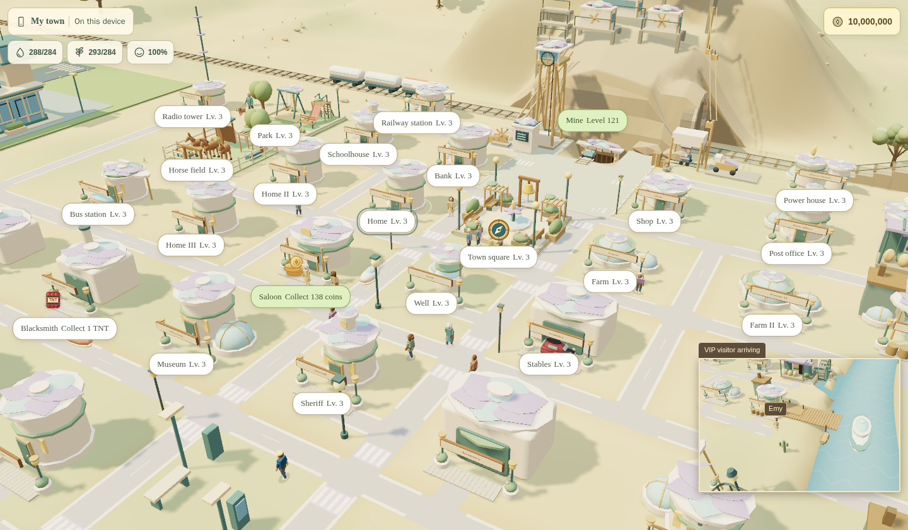
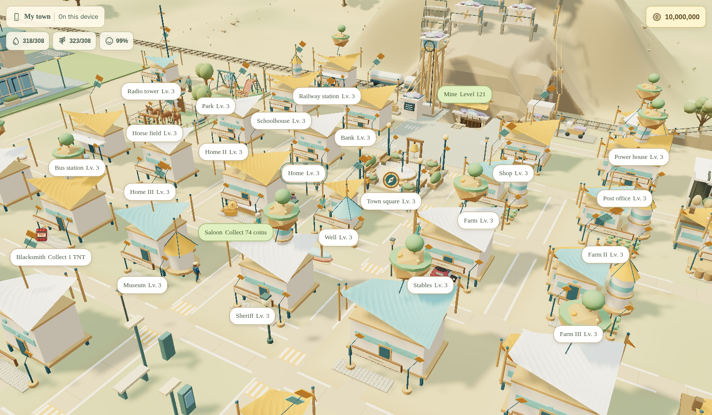
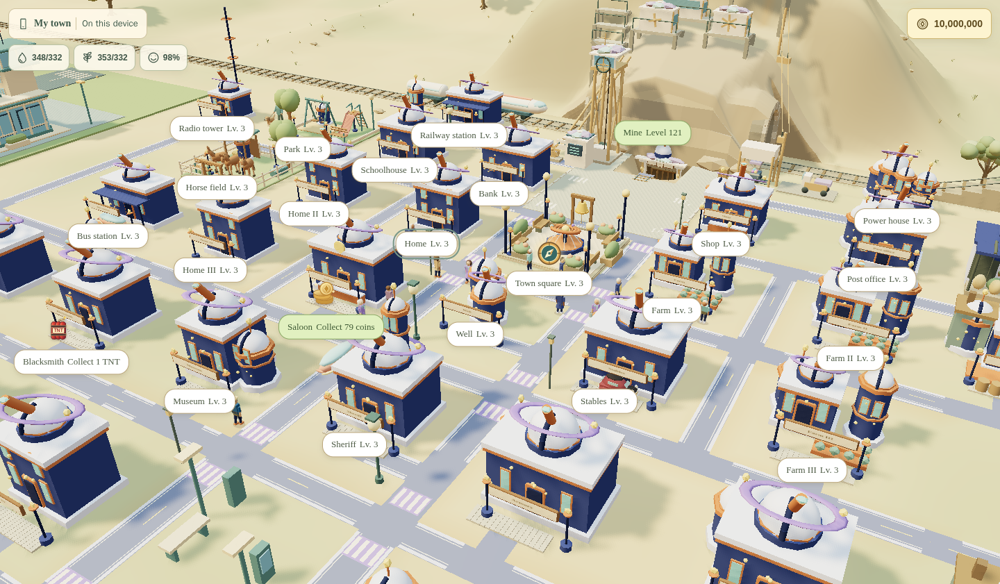
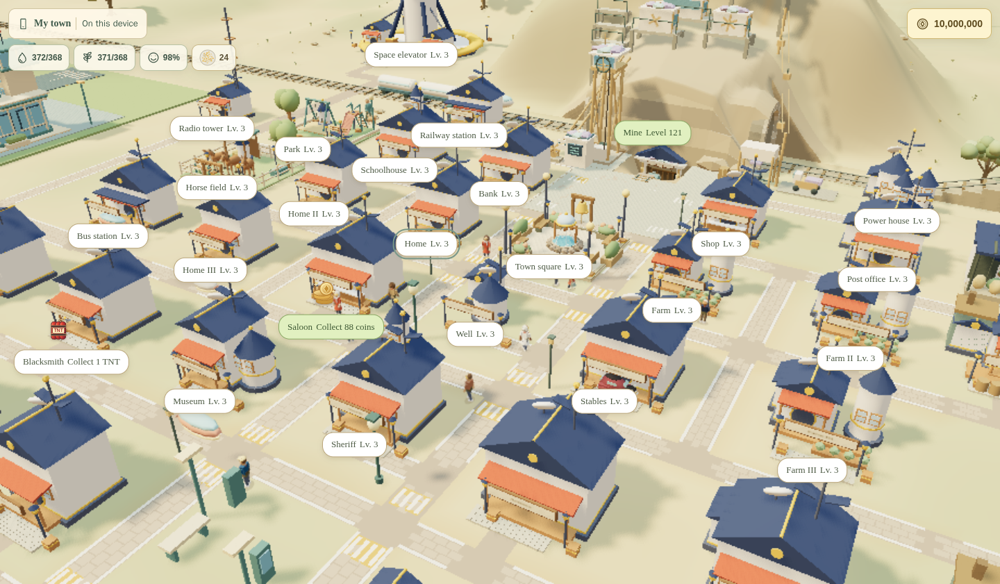

The Skyward quarter beyond the railway:

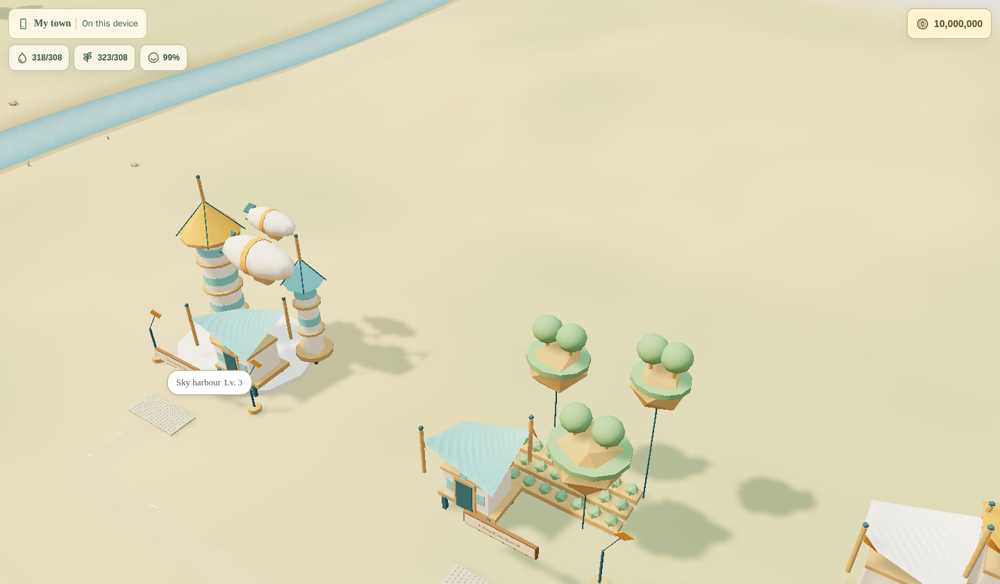
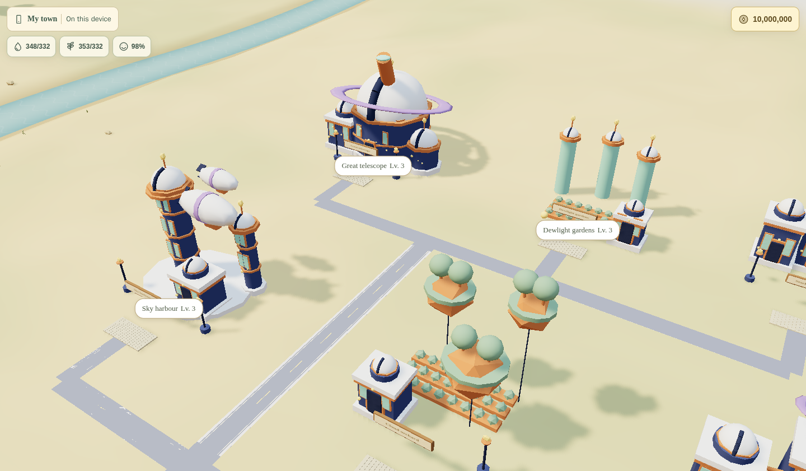
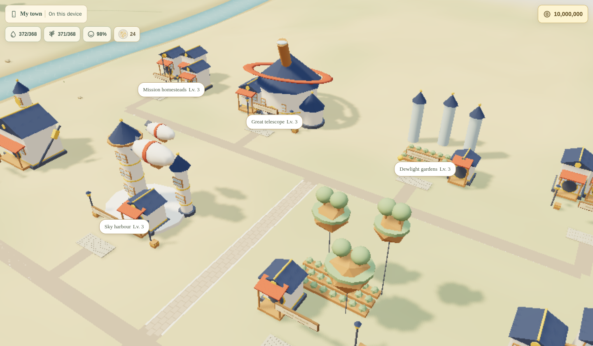

Each era crowns the mine portal in its own style:

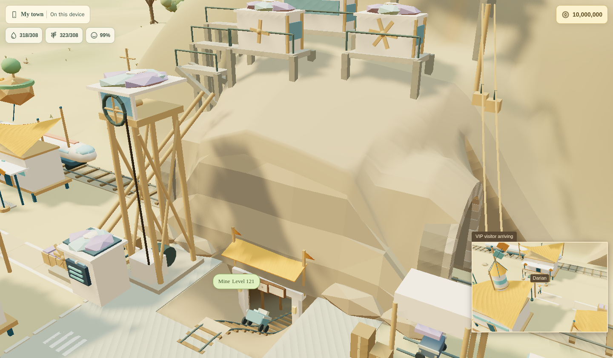
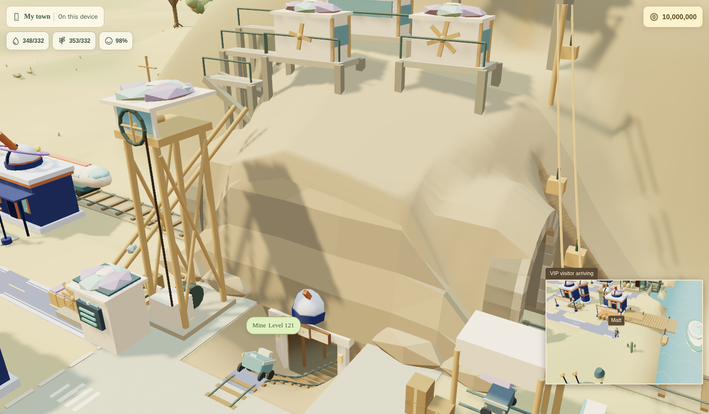
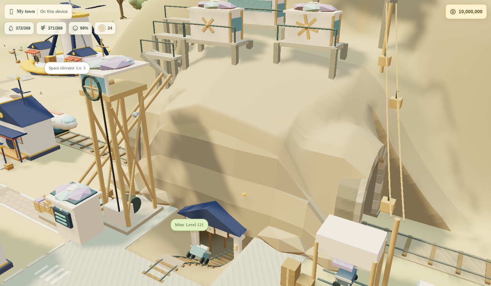

The space elevator beside the mine, and each finished town:

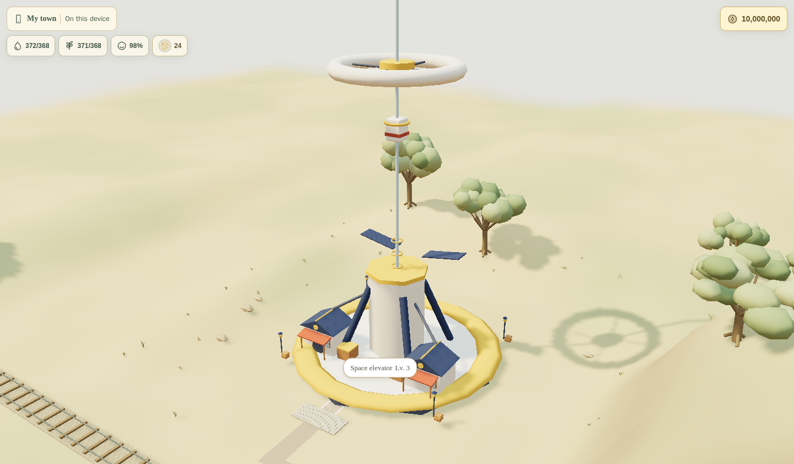
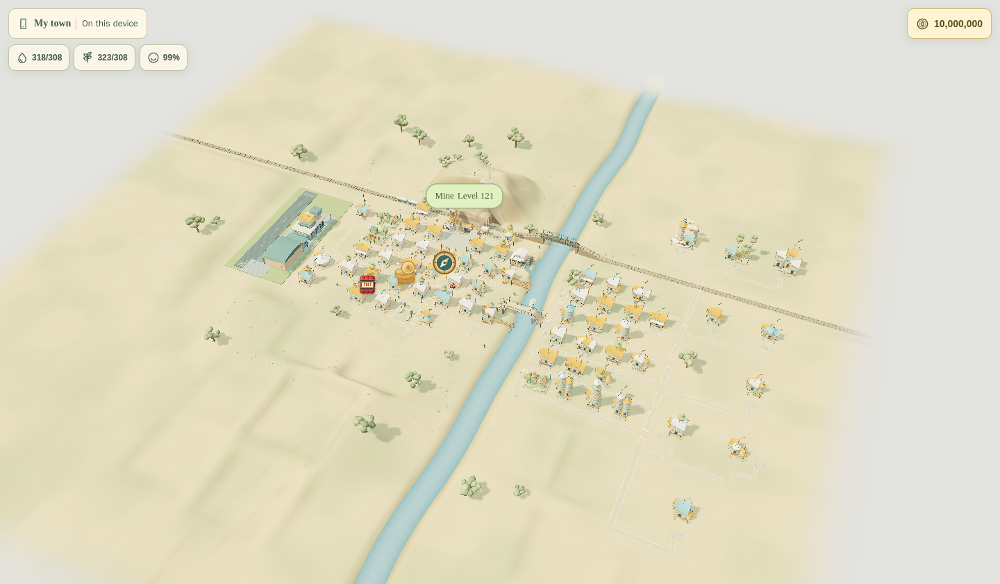
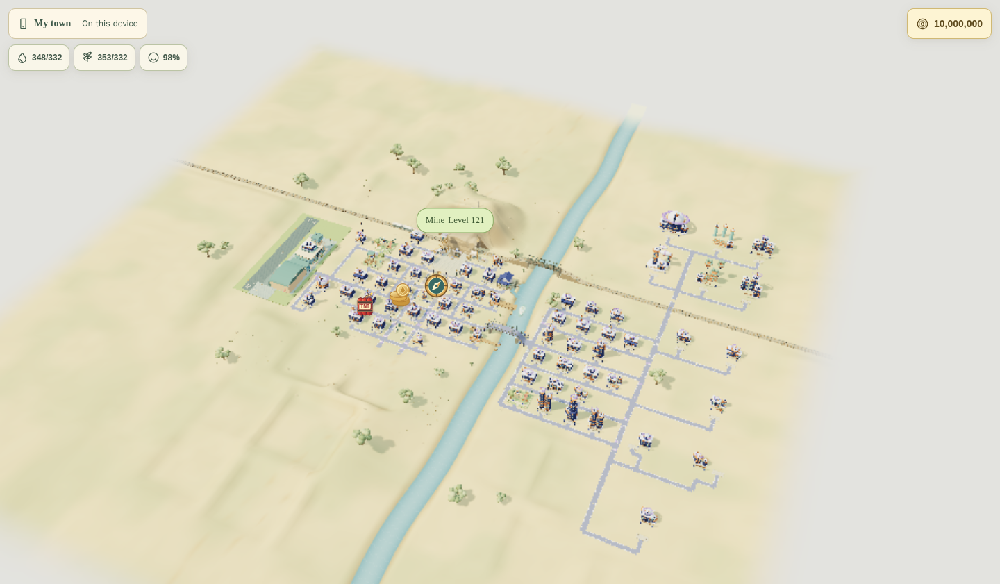
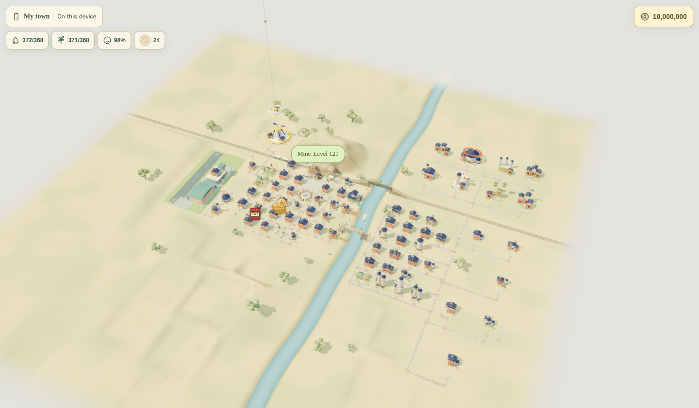

## Twin Hollows (2300)

The Moon is the new frontier. The town now looks after two places: Prospect
Hollow in the valley and **New Hollow** on the Moon. There is one wallet, no Moon
currency, and nothing on the Moon can fail, decay or run on a timer.

### Light homecoming on Earth

The era's `modernizes` capability lists the only valley buildings it modernizes:
the square, the main well and farm, the station, the space elevator and the
Moonpost. Every other building keeps its Moonward finish and counts as complete
(`modernizesInEra()` and `eraBuildingLevel()` in `TownEras.js`;
`SaveIntegrity::eraComplete()` reads the exported `modernizes` list). A new
homecoming hall stands in the garden district beside the blossom atelier. The
`twin` architecture reuses the homestead kit in softer silver-blue with teal and
gold twin lanterns and an arch carrying a little Earth and Moon; the square gets
the twin-globes fountain and the mine portal a homecoming gable.

### New Hollow

Ten Moon buildings are ordinary `BUILDINGS` entries flagged `settlement: 'moon'`,
so offers, construction (completed puzzles), needs, saves, server validation and
shared projections all use the existing lifecycle. They have no valley lot:
`EARTH_BUILDINGS`/`MOON_BUILDINGS` in `data/town.js` separate the two, and the
valley renderer, footprints and labels skip Moon buildings.

| Building              | Effects (per level)   |
| --------------------- | --------------------- |
| Ribbon landing        | 4 visitors, 1 comfort |
| Settler domes         | 6 homes, 1 comfort    |
| Crater ice well       | 12 water, 1 comfort   |
| Earthlight greenhouse | 12 food, 1 comfort    |
| Willowkin garden dome | 2 visitors, 2 comfort |
| New Hollow commons    | 2 visitors, 2 comfort |
| Crater homesteads     | 6 homes, 1 comfort    |
| Moonstone workshop    | 2 visitors, 1 comfort |
| Rover barn            | 2 comfort             |
| Earthrise lookout     | 2 visitors, 2 comfort |

Needs are shared: the valley's spare water and food go up the ribbon, so a
well-run valley lets the Moon grow. The era is complete when both are finished.

The Moon also hangs in the valley sky, a round image to the north-west above the
mine and the elevator that drifts across the sky as the camera turns. It shows
when sky is in view (a wide view, or tilted until the horizon shows) and carries
the homestead lights. Tapping it, or the Moon chip beside water, food and
happiness, opens the **Moon map** once Moon buildings are available (`TownMoonView.vue` inside `TownScene`, so shared-town
visitors see it too). `game/town/moon/MoonScene.js` is a small scene of its own:
a crater of lots (`MOON_LOTS`) on smooth rolling regolith with soft craters
(`moonHeight()`), a ring road, the ribbon arriving from the valley, a starfield,
settlers walking and rovers driving the ring, and an occasional meteor (still
under reduced motion). Earth is a painted, round image on a sprite (not a 3D
globe), half risen over the far hills; tapping it returns to the valley. The
valley pauses while the Moon is open, and the Moon view keeps its input from the
valley's camera. Lot buttons open the shared building details. Without WebGL
the map falls back to an SVG crater with the same buttons. `buildings/moon.js`
draws the ten buildings (glass domes on ceramic drums, airlocks, gold foil,
solar fins), and `TownMoonBuilding.vue` draws them for cards and the fallback.

Purely cosmetic gifts: one **moonstone keepsake** per finished Moon building level
and one **letter home** per finished Moon building, both derived from building
levels (`moonstoneKeepsakes()`, `moonLetters()`), so nothing new is saved. Moon
guests ride down the elevator: it is a visitor transport like the train, boat and
plane, publishing an arrival each time a climber reaches the docks.

The Willowkin stay in the story: the garden dome raises the first Willowkin born
on the Moon, and the valley's Willowkin neighbors keep their walks.

Honours: Through the Ages gains its diamond rank, **Two Towns, One Sky**
(complete Twin Hollows, goal 29, `HONOURS_VERSION` 3).

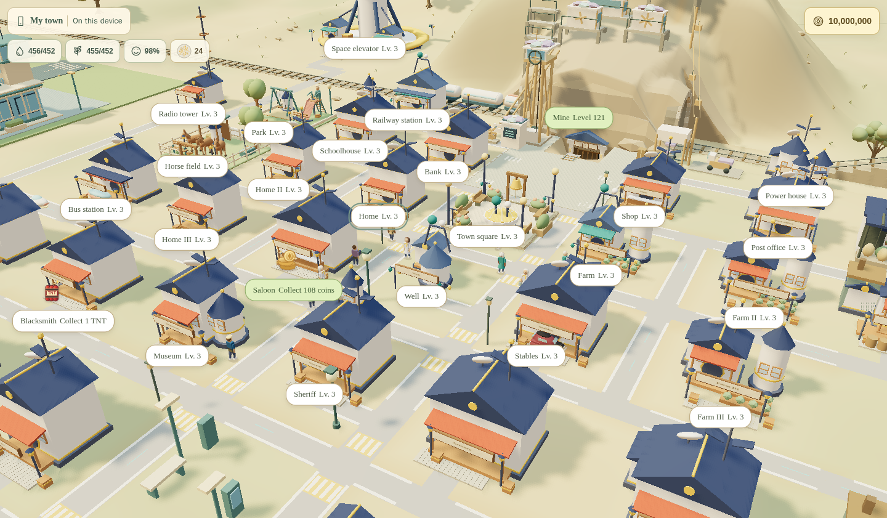
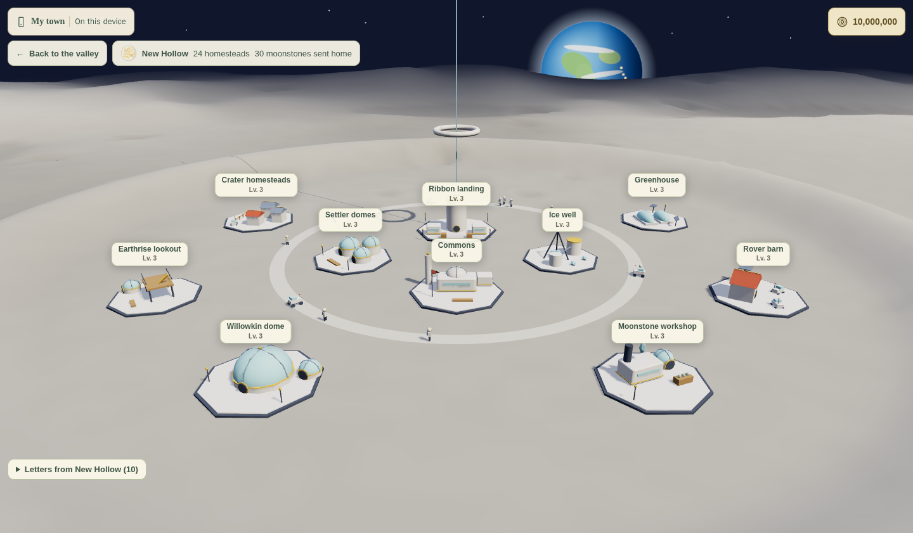
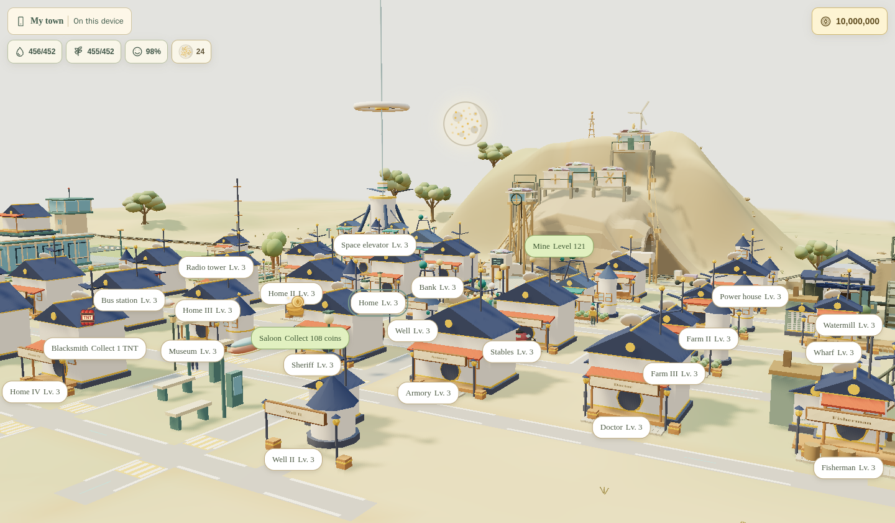

### Landmark choices in the town

Kite Meadow and Stargazers’ Lawn (each row shows one set of choices):

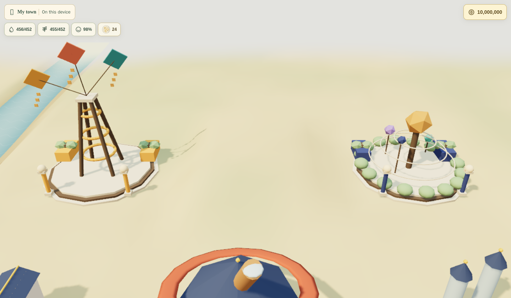
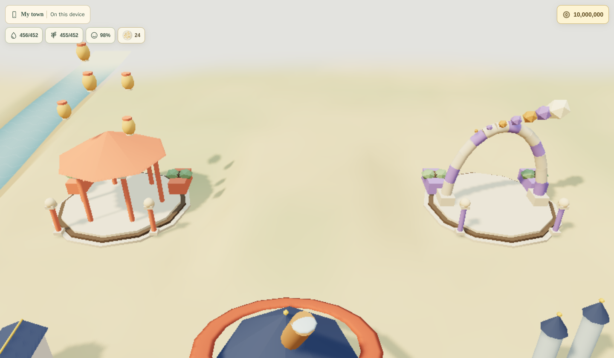
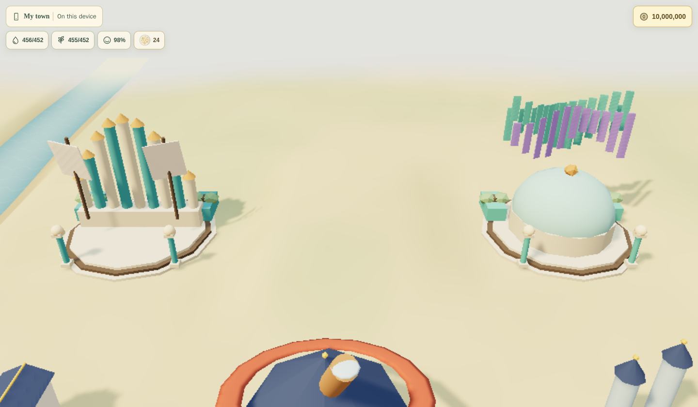

Launch Green:

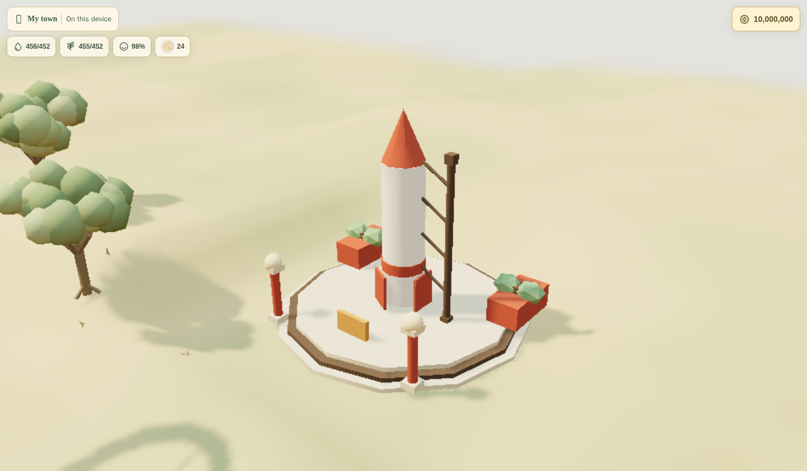
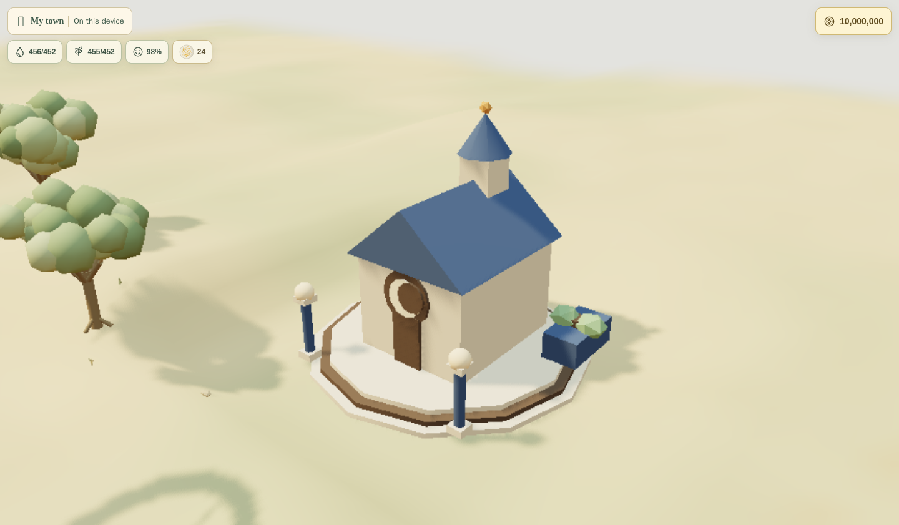
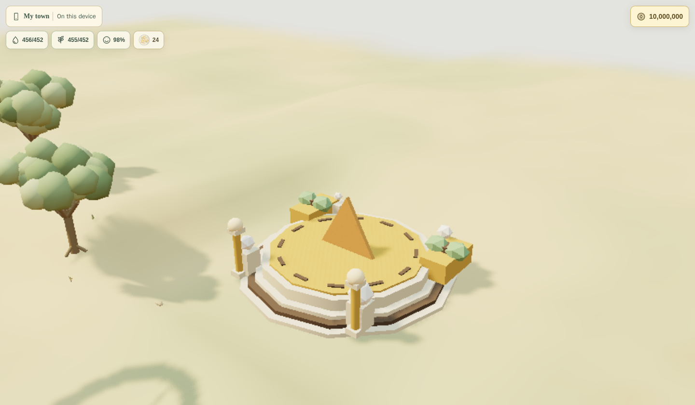

Homecoming Green:

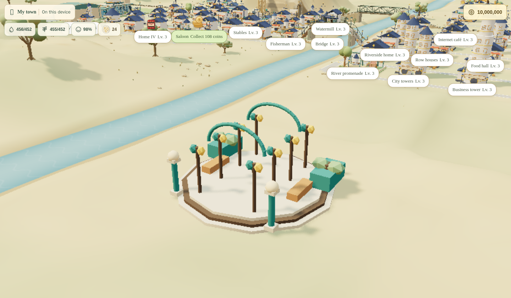
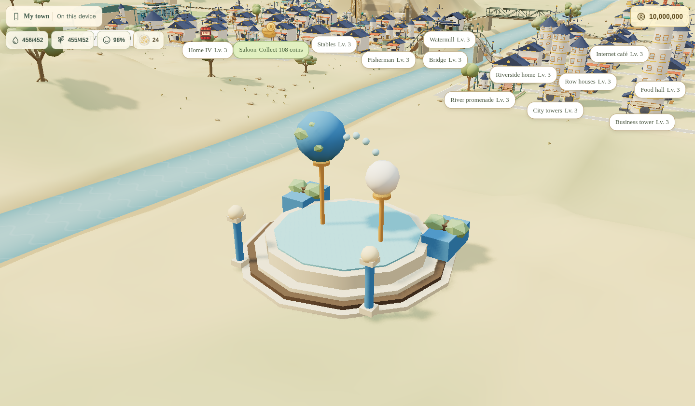
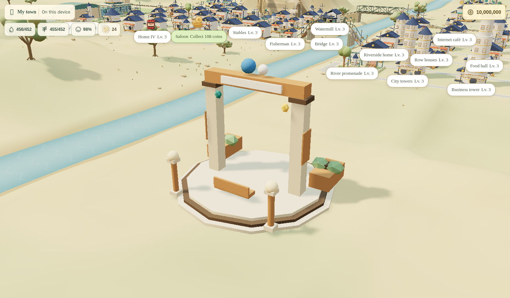
