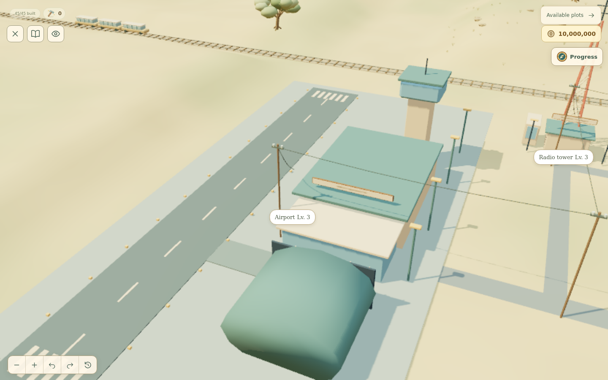
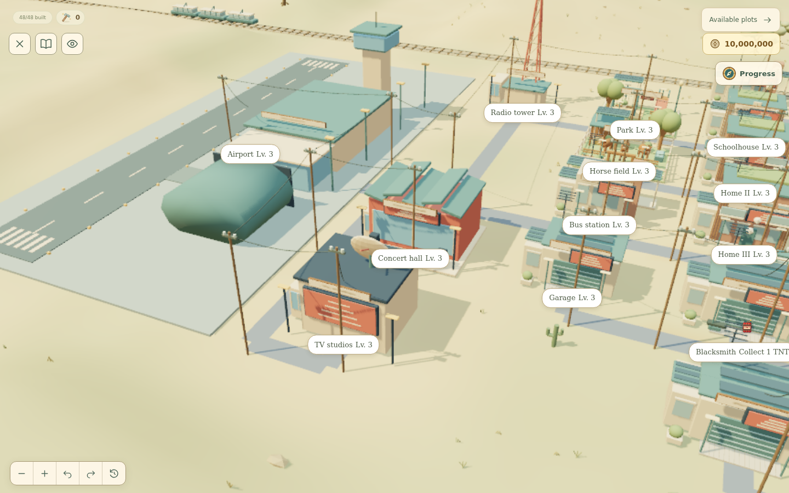
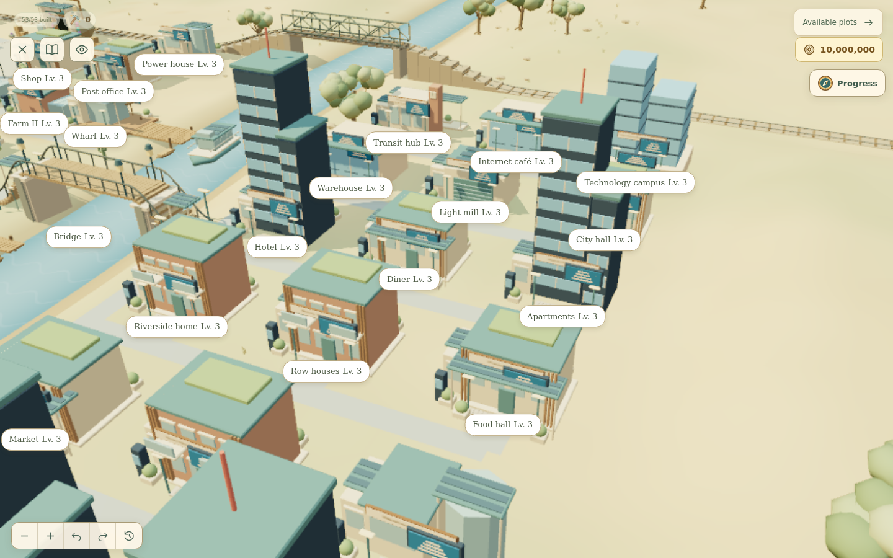
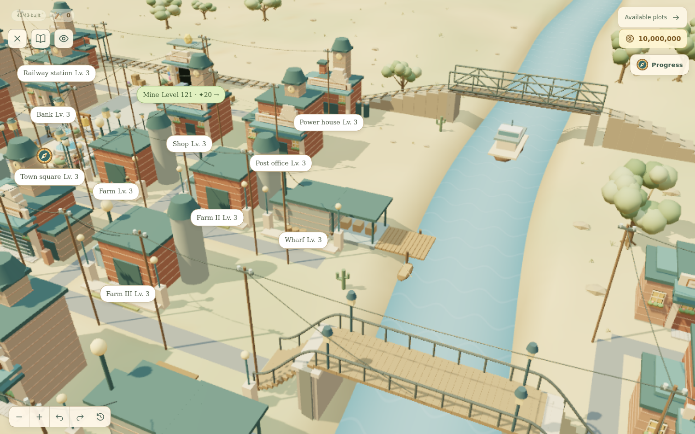
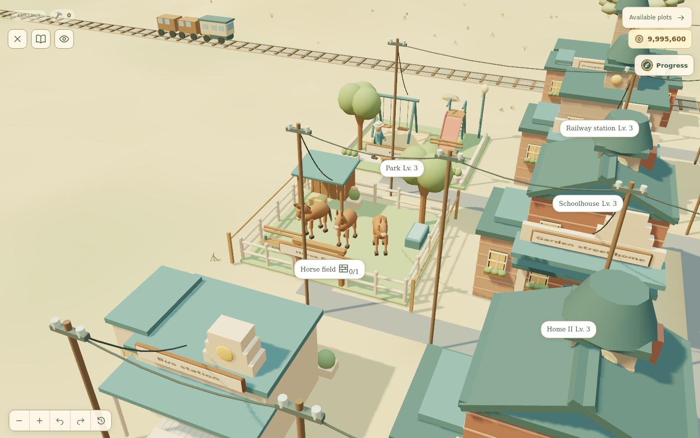

# Issue #41: village evolution and visual fixes

The village now progresses through eight dated eras. Aviation & Radio (1958) and Music & Television (1986) bridge the gap between Motor Age (1932) and Connected City (2005). The 2005 era keeps its persisted `contemporary` ID so existing saves and paid construction remain readable.

## World and progression

- Power poles stand outside active road surfaces, including junctions and the mine forecourt. The shared placement data also feeds the accessible map.
- The horse field uses perimeter construction barriers outside the fence. All three animated horses stay in the clear pasture, away from its shelter, trough and seats.
- Surrounding hills are reduced to 24% of their former height. The western airfield and north–south flight corridor are graded flat; the riverbed and railway cutting remain.
- Post-war modernization preserves motor traffic and uses passenger railcars. Steam sound cues follow the actual transport generation. Earlier façades remain until their own modernization completes.
- Modernization takes two puzzle wins to enter an era (0 → 1), then one win for each following upgrade. New city buildings take one puzzle per construction level. Normalization preserves paid work and clamps progress to the shorter requirement.
- The physical pier is retained by the industrial, automobile and later city waterfront renderers.

## New districts and Blender assets

The regional airport occupies a 20 × 40 world-unit site at the far west, alongside the existing village. Its north–south runway is perpendicular to the east–west railroad. A terminal, control tower, arched hangar, passenger lounge and apron lights grow across its three levels. The animated twin-turboprop passenger aircraft takes off southward through the cleared western corridor without crossing the railroad.

A radio station joins the airport in 1958. A concert hall, TV studio with satellite dish, and stepped business tower arrive in 1986; existing services gain broadcast signage and aerials. The 2005 city gains an internet café with visible computers, a technology campus with server displays, taller residential/office silhouettes, information kiosks and connected-service signs. Existing saved library, laboratory and residential plot IDs retain their services.

Authoring/export source: `scripts/create-future-assets.py`. Run it through Blender with the repository path after `--`. Editable sources, interchange export and a rendered model sheet are in `art/future/`; the game loads `src/assets/future-meshes.json`. The airport base is 1,232 triangles and the passenger aircraft is 2,356 triangles. The runtime reuses the existing shared geometry/material cache and batching. Native SVG representations cover the new landmarks when WebGL is unavailable. New public text is translated into French.

## Incidents and camera

Frontier raids take 24 seconds instead of 48; civic incidents take 16 instead of 26. Electric and later fire responses use a motor response vehicle. Crews dismount at the incident, while flames and water remain on the shared, pausable scene clock.

The camera eases from the player's view toward the incident, follows nearby responders, and returns to the saved pose. Phase notifications no longer reframe the entire town. Orbit controls remain locked during the shot; reduced motion restores them without waiting on a stopped animation clock.

## Verification

`npm run verify` passes formatting, **1,088 tests in 61 files**, and the production build. Automated coverage includes all eight eras and every building's visual evolution, paid construction and save normalization, road/pole clearance, connected parcels, water/food preservation, pier reach, horse bounds and scaffolding separation, aircraft terrain clearance, indexed Blender geometry, and camera interpolation/restoration.

Browser checks use disposable developer fixtures at `http://127.0.0.1:5174` in Chromium. Six completed eras (industrial through connected city) were inspected at 1440 × 900 and 390 × 844 with no application exceptions, failed requests or document overflow. The 1958, 1986 and 2005 transitions were exercised through the Next era button. The fire response and bandit encounter were run through village navigation; the bandit receipt settled once with its 40-coin bounty and camera control restored. The horse-field construction state and the French SVG fallback (53 plot controls, no document overflow) were checked separately. Fixture-based checks do not claim a manual playthrough of all 240 puzzles. Software WebGL is useful for correctness and screenshots; these checks are not a physical-device frame-rate benchmark.

The production build retains bundle-size warnings for the game's large JavaScript chunks. Detailed commands, fixtures and browser artifacts are under ignored `output/issue41/`.

