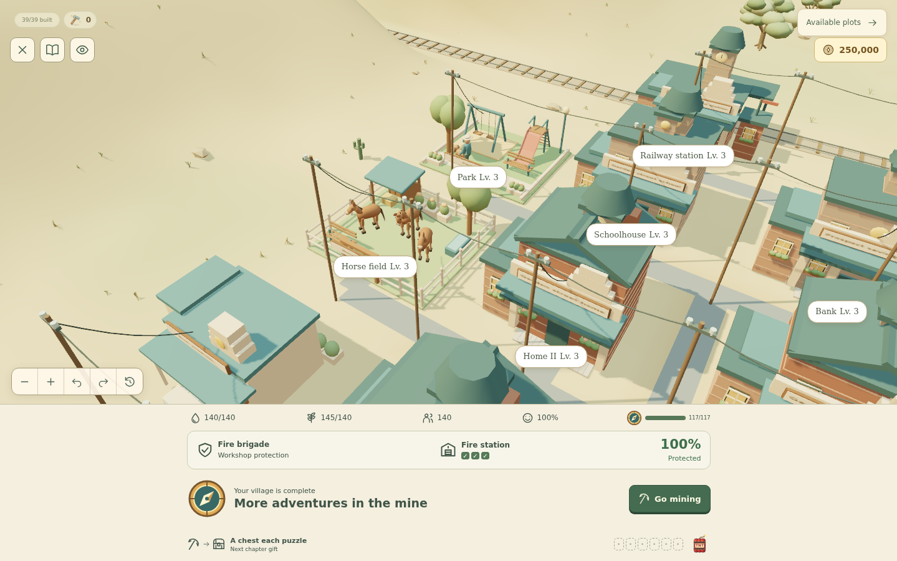
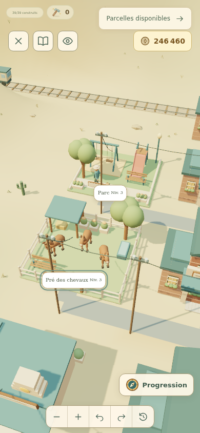
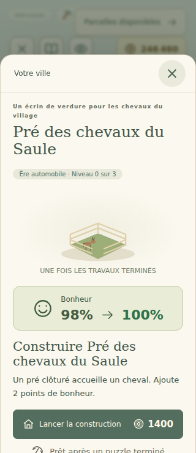

# Horse field, public park and later-game economy

This report records the four-era prerequisite in #36. See [six-era completion](complete-settlement-eras.md) for the subsequent 48-plot, 240-puzzle update.

Issues #34 and #35 are delivered together. The Electric era gains a horse field; Motor Age gains a public park. Both are real selectable plots with three construction stages, ordinary paid construction, hammer support, saved progress and English/French building cards. The village now has 39 plots. Existing saves gain the two empty plots without losing their current era, buildings, wallet or funded projects.

## Village life and happiness

The field opens in Electric once the original stable is built. Its completed stages bring one, two and three horses, with grazing and tail movement. Stage two adds a roofed shelter and hay; stage three adds shade, seating and a gate. The garage continues to supply touring cars. Motor modernization retains the finished field and adds successive flower planters.

The park opens in Motor Age. Its first stage already includes swings, a bench and occasional visits by a person walking a leashed dog. Stage two adds a slide and ladder; stage three adds shade, flowers and a lamp. The visit occupies 32 seconds of a 60-second scene-clock cycle, with no background timers or gameplay effects.

Completed field stages contribute **2 / 4 / 6 happiness**; park stages contribute **3 / 6 / 9**. These are totals per building, not cumulative grants. The existing 100-point cap applies. Construction in progress keeps the previous contribution, and finishing applies the new value once. Happiness continues to affect the existing saloon rate; there is no separate new income multiplier or upkeep.

## Building progression through eras

All 39 plots unlock no earlier than their introduction era. Every existing and new building has three paid modernization stages in each subsequent playable era, with its completed appearance stored independently from the current town era. Advancing the calendar keeps the previous facade until that building’s own project finishes. A regression builds the entire settlement through Frontier, River & Rail, Electric and Motor Age, verifies the gates and preserved facades, and compares rendered geometry/materials across each transition for every plot. The field therefore has Electric construction and Motor modernization; the park starts in Motor Age. Post-war and Contemporary are still disabled future content under #22.

## Blender source and runtime contract

The new 3D plot geometry, horse, dog and walker are authored with Blender 5.2. The editable [source](../art/leisure/leisure.blend), [GLB interchange export](../art/leisure/leisure.glb), [actual source render](../art/leisure/review.png), and [reproducible authoring/export script](../scripts/create-leisure-assets.py) are included.

Run the script in a separate background Blender process:

```sh
blender --background --python scripts/create-leisure-assets.py -- /absolute/path/to/repository
```

The game consumes `src/assets/leisure-meshes.json`, an indexed export of the evaluated Blender meshes with baked axes/transforms, normals, palette materials and named animation pivots. It loads through Vite with the game bundle, without a Blender runtime dependency, texture requests or asynchronous scene replacement. The GLB is an interchange artifact, not a second runtime download. Materials and geometry use the existing diorama caches; static plots use town batching and characters use the animated instance renderer. Disposal follows the existing scene lifecycle. The SVG fallback depicts the same plot stages and remains selectable.

| Model                        |             Triangles |
| ---------------------------- | --------------------: |
| Field stages 1 / 2 / 3       | 2,008 / 2,492 / 3,372 |
| Park stages 1 / 2 / 3        |   880 / 1,308 / 3,456 |
| Heritage additions 1 / 2 / 3 |       284 / 568 / 852 |
| Each horse                   |                 2,256 |
| Dog / walker                 |           1,596 / 996 |

These are mesh counts, not a claim about physical-device frame rates. All activity uses the existing scene clock, including pause, hidden-view and reduced-motion behavior.



## Prices and chest payouts

Frontier and River & Rail prices, mining earnings, construction durations, hammer behavior and chest odds remain unchanged. Later prices increase moderately:

| Purchase                      | Previous              | New                    |
| ----------------------------- | --------------------- | ---------------------- |
| Electric stage 1 / 2 / 3      | 1,200 / 1,600 / 2,000 | 1,400 / 1,850 / 2,300  |
| Motor modernization 1 / 2 / 3 | 3,000 / 3,800 / 4,600 | 3,500 / 4,400 / 5,300  |
| New Motor building stages     | 5,400 / 7,500 / 9,900 | 6,480 / 9,000 / 11,880 |

The new field uses Electric prices and the new park uses Motor building prices. Funded projects keep their already-paid cost and saved work.

For new chests, chapters 1–3 retain 500 / 1,000 / 1,500 coins. Each later chapter adds 250 coins, capped at **4,000** from chapter 13. Examples: level 31 pays 2,250 instead of 3,000; level 72 pays 3,750 instead of 6,000; level 144 pays 4,000 instead of 12,000. Every normal completion still guarantees a chest, with at most two for score/speed qualifications.

New receipts store economy version 2. Unversioned old receipts resolve against the bounded original chapter table, preserving their earned terms through tap, skip, reload and JSON import. Quantities are always calculated from the applicable catalog, never trusted from an imported number. Already-claimed coins are untouched.

## Progression comparison

Five refill seeds across all 144 levels produced **720 completed engine runs**. The same mining payouts were replayed against the previous `main` content (`6823bdf`) and this change, using automatically rolled chests, the hammer guarantee, immediate use of earned builder hammers, and chapter gifts. The model stores puzzle powers rather than spending them, so inventory eligibility affects the reward distribution. It excludes passive saloon income and capture bounties and uses the shortest saved raid interval.

| Chests per normal puzzle | Previous town completion | New town completion |
| ------------------------ | ------------------------ | ------------------- |
| One                      | 116–122, median 120      | 130–136, median 134 |
| Two                      | 101–103, median 102      | 114–118, median 116 |

Every reward-inclusive sample completes the town within the campaign. The longest interval without a purchase or active project was one puzzle. A deliberately mining-only model, excluding even the guaranteed chest, finishes by level 144 in only one of five samples; ordinary play includes those omitted rewards. These simulations measure relative pacing, not human enjoyment, calendar days or retention. Passive income and different power use can change the result.

Reproduce with an unchanged baseline checkout:

```sh
node scripts/measure-campaign.mjs . 5 144 > output/balance/mining.json
node scripts/compare-town-economy.mjs output/balance/mining.json /path/to/baseline > output/balance/comparison.json
```

## Verification

Regression coverage checks era/plot eligibility, connected paths, all stages, happiness previews and completion timing, duplicate actions, old saves and paid work, all chest settlement routes, legacy reward terms, bounded model geometry, actor movement and paused-clock stability. The complete verification runs formatting, 901 tests across 54 files and the production build. Browser checks at 1440×900, 390×844 and 320×740 cover the imported 3D assets, English/French cards, a real UI purchase and completion with happiness applied once, reload persistence, frozen reduced-motion animation, and keyboard selection in the deliberately forced SVG fallback. Puzzle completion in that flow is injected through the campaign action; the 720 engine runs separately exercise puzzle outcomes. Chromium uses software WebGL, so these checks do not establish physical-phone frame rates. The forced fallback emits the expected WebGL-creation diagnostic. The production preview also loads the complete 39-plot Motor village with no application errors or failed network requests; software-renderer ReadPixels warnings remain.




