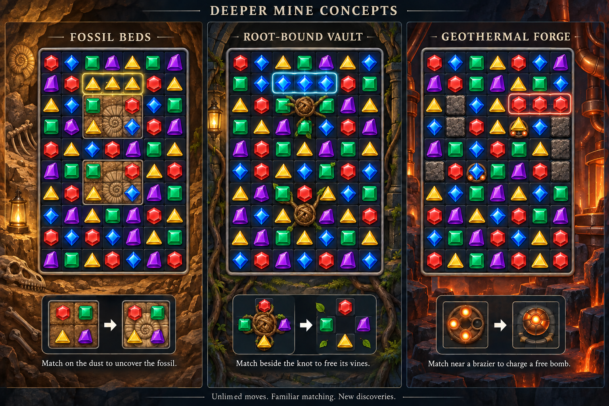

# Deeper mine: proposed next chapters

The approved implementation adds five groups, levels 373–402: Fossil beds,
Glowshroom grotto, Root-bound vault, Underground reservoir and Geothermal forge.
Crystal heart remains a future idea. See [the implemented chapters](deep-mine-levels.md).

This document preserves the initial brainstorming, which predates the endgame
redesign. Its dust fossils, lantern-style mushrooms and open pearl shafts were
superseded by blast-only encased fossils, directional spore relays and genuine
V-shaped pearl funnels. The current campaign has 402 levels. Treat the rules
and concept images below as historical proposals; the implementation document
above describes the current game.

The image is an illustrative concept sheet, not a verified playable layout.
Grid dimensions, fossil footprints and match highlights are schematic; actual
levels would retain the current 7 × 9 board and use the rules below.
Generated with the built-in imagegen tool using the
[initial prompt](images/mine-concepts/deeper-mine-prompt.txt) and
[board correction prompt](images/mine-concepts/deeper-mine-correction-prompt.txt).

## Six thematic directions

| Proposed chapter                     | Theme and payoff                                                    | Player-facing rule                                        | How later puzzles become harder                                                                        |
| ------------------------------------ | ------------------------------------------------------------------- | --------------------------------------------------------- | ------------------------------------------------------------------------------------------------------ |
| 63 · 373–378 · Fossil beds           | Ochre sandstone, ammonites and an ancient creature slowly uncovered | Match on dusty cells to uncover the complete fossil.      | Split fossils into separate reachable pockets; choose bonuses that uncover several cells.              |
| 64 · 379–384 · Glowshroom grotto     | An underground mushroom grove lights up as you progress             | Match on or beside a mushroom to light it.                | Reuse lantern targets in scattered clusters, with familiar stone between them.                         |
| 65 · 385–390 · Root-bound vault      | Roots have wrapped an abandoned chamber and its treasures           | Match beside a root knot to free its connected vines.     | Choose which knot opens the most useful space; later pair a cluster with familiar obstacles.           |
| 66 · 391–396 · Underground reservoir | Pearls and treasures above a still, blue subterranean lake          | Clear below each pearl to drop it into its marked basket. | Reuse relic delivery with two or three open shafts and offset, breakable stone shelves.                |
| 67 · 397–402 · Geothermal forge      | Basalt, copper pipes and warm light from deep below                 | Match on or beside a brazier to charge a free bomb.       | Reuse charge cores and reinforced stone; charge a useful bomb where its blast can open another pocket. |
| 68 · 403–408 · Crystal heart         | A huge buried crystal illuminates the cavern as objectives finish   | Finish the familiar goals to wake the crystal heart.      | Combine two previously taught mechanics per puzzle, rather than piling every obstacle onto one board.  |

## Three strongest concepts

### Fossil beds: easy first addition

Start with one outlined 2 × 2 fossil region. Each of its four floor cells has
one dust layer under a normal, freely swappable gem. A match on a cell clears its
dust; a direct bonus or power hit can clear it too. Once all four cells are
exposed, the fossil is collected automatically. No tapping to collect and no
new gesture. Reveal the fossil progressively, with an obvious four-cell outline
and an objective such as “Uncover 2 fossils.”

Later fossils can have one or two visible dust layers and occupy different
pockets. Dust uses the familiar clear-on-cell behavior of ice. Do not overlay
dust and ice on the same cell. This is mainly a new visual discovery and goal,
not a fundamentally new matching rule. Exposed floor never obstructs gravity.

### Root-bound vault: strongest new strategic interaction

One conspicuous braided knot occupies a cell and connects to three or four
vine-bound gem cells. The connection is always drawn, never hidden. An
orthogonally adjacent match cuts the knot; a direct bonus or power hit also
cuts it. Cutting the knot removes it and all of its connected bindings in one
satisfying animation. Start with a one-hit knot and one small cluster.

Vine-bound gems follow the familiar chain behavior: they stay matchable in
place, and gravity flows around anchored gems. Ordinary matching and direct
bonus hits can also free a binding. The level's explicit objective is to cut
all knots. Do not create crossing root connections, regenerating vines,
mandatory paid-power routes, blocked refill lanes or enclosed knots with no
reachable approach. Harder layouts ask which useful cluster to free first.

### Geothermal forge: familiar mechanic, stronger payoff

Braziers are the existing charge-core behavior with themed art. They are floor
markers under gems and never block swaps or gravity. Keep the same on-or-beside
matching, direct blast activation, visible charge pips and at-most-one-charge
per-move rule. A full brazier produces a free bomb, following the existing
fallback behavior if its own cell cannot hold a bonus.

Use four or five visible pips in later puzzles, as the current late campaign
already does. Build difficulty through the position of braziers and breakable
stone shelves, rather than increasing charge requirements indefinitely. Hot
rock and geothermal light are scenery; hazards do not spread or count down.

## Keep the learning instinctive

- Keep the current swap-to-match controls, five readable gem silhouettes and
  7 × 9 late-campaign board. Targets stay readable on a small phone.
- Teach one rule with one target on an open board; show one short demonstration
  and a sentence describing the action. Root knots are the only substantially
  new interaction in this proposal.
- Give each target a distinct shape and material as well as color. Preserve
  contrast, reduced-motion behavior and clear objective icons.
- Progress is permanent and visible: dust clears, mushrooms stay lit, vines
  disappear and charge pips fill. Decorative light must not hide playable gems.
- Keep the six-puzzle rhythm: introduction, practice, exploration, stretch,
  lighter fifth puzzle, finale. A new chapter starts gently after a finale.
- Increase choices and combinations, not repetitive cleanup. Prefer at most
  two featured mechanics per board, with optional familiar light obstacles.
- Moves remain unlimited. No hard puzzle timer, spreading failure hazard or
  move-exhaustion loss. Dead boards remain recoverable for free. Normal
  completion never depends on spending inventory powers.
- Before shipping, validate gravity and every objective through matches,
  bonuses, powers, cascades and reshuffles. Use headless measurements and human
  playtesting to tune the climb; proposed layouts are not measured difficulty.

## Suggested first prototype

Start with Fossil beds for a clear visual payoff using familiar floor-clearing
rules. Follow with the Root-bound vault as the new strategic mechanic, and
Geothermal forge as a harder chapter using established charge cores. The
Glowshroom grotto and reservoir provide variety between those chapters.

Reuse shared objective, hit-resolution, persistence and guide contracts where
behavior is the same. Content belongs in chapter definitions; these themes
should not each introduce a separate gameplay lifecycle. Appending the levels
must preserve existing IDs, rewards, seeds and star targets. When progression
is implemented, run and extend `testing/chapter-progression.test.js`, including
completion beyond 100 moves after the optional speed target has elapsed, and
cover any new objective route that could accidentally gate completion.
