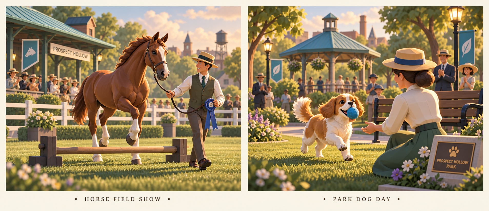
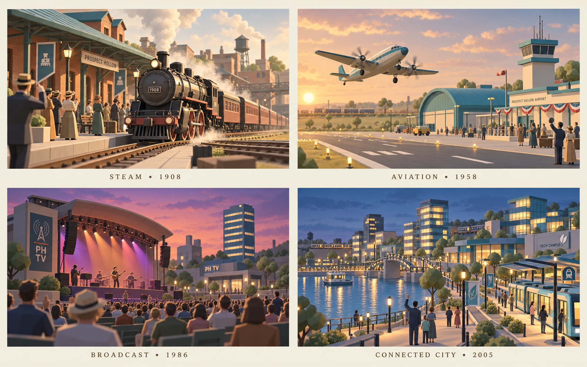

# Future release: optional town side quests and landmark cinematics

Status: design proposal for a future release, explicitly outside the current
release. Related context: [issue #41](https://github.com/Starbugstone/Prospect-Hollow/issues/41).
Source audit: `8aa015efc4bfd542dc1118a81713954ad0964d88`. This branch contains
documentation and concept art only; it must not be merged into the current release.

## Goal and boundaries

Give players enjoyable reasons to revisit completed buildings, with characterful,
high-quality cinematic rewards and permanent cosmetic mementos. Introduce the
interaction in the Frontier, then expand its ambition as the town grows.

These are optional side quests. Ignoring every quest must leave the complete main
campaign, era advancement, puzzle unlocks, construction, income, bonuses, incident
handling and existing rewards identical. Current-release town project guidance
(package A) is separate: it organizes existing construction without activating
these future quest counters, cosmetics or cinematics.

Confirmed user rules: each event and each stage cinematic is **one-off per
playthrough**. There are no event replay controls, repeat editions or later
encores. Starting a new game is the intended way to experience them again.
Permanent earned 3D changes remain on the town.

Accepted events have two preparation deadlines: a fixed number of completed
normal puzzles **or a persistent real elapsed-time deadline, whichever comes
first**. Real time continues while the player is away. Acceptance is explicit;
unlocking a building never starts a countdown. Exact budgets and the outcome of
insufficient preparation below are design proposals, not approved balance values.

No move/turn limits or hard timers **inside any puzzle**. Expiring an optional
event cannot interrupt/fail a puzzle, withhold its ordinary money/bonuses, or block
the campaign. No new currencies, paid boosters, purchases, advertisements, passes,
upkeep or event retries/resets are included.

## Concept art

These are aspirational art-direction boards generated with the built-in image
tool. They are not implemented assets, rendered gameplay or final approved art.
Their detailed characters and lighting exceed the current miniature renderer;
production must preserve the game's faceted silhouettes, cream/ochre buildings,
muted teal roofs and sage greenery. Concept architecture is reference material,
not authorization to replace the town layout or building footprints.

See [exact prompts and provenance](concepts/landmark-side-quests/README.md).

## Player flow and dual preparation deadline

1. After an eligible building finishes, its normal completion occurs as usual.
   A quiet **Town stories** badge offers the event; no modal or countdown starts.
2. The event card previews the three permanent 3D stages, building prerequisites,
   concrete preparation choices, optional mastery, exact puzzle budget and UTC
   deadline calculated from acceptance. **Later** leaves it unstarted indefinitely.
3. **Accept event** starts both countdowns for that event. Multiple events may be
   explicitly accepted concurrently; one can be pinned as the HUD focus.
   Show **N puzzles remaining · ends [local date/time]**, explaining that the first
   deadline closes preparation. Do not offer pause/switch tricks that stop a clock.
4. Normal construction and the event's cosmetic preparation choices advance its
   stages. There is no requirement to wait for a count of wins merely to claim a
   milestone. Each newly completed stage adds a permanent 3D state and its one-off
   2–4 second reveal, claimed from town when safe. The player may skip it once.
5. Every successfully settled normal-puzzle receipt after acceptance, including
   legitimate normal campaign replays, consumes exactly one preparation turn in
   each applicable accepted event. It does not split or multiply normal rewards.
   Retries of the same receipt, abandoned sessions, menus, offline time and
   continuous/arcade play consume none. Ordinary money, chests and construction
   settle exactly once through their existing pipeline; quest code cannot change
   those rewards. The real-time deadline keeps advancing independently.
6. If the puzzle budget reaches zero before the UTC deadline, first settle that
   last puzzle's normal rewards, hammer selection and construction progress. Give
   the player a visible final town preparation/finish-claim opportunity. Evaluate
   on **Hold event** or before starting another normal puzzle, whichever occurs
   first; starting a new puzzle never secretly consumes an extra preparation turn.
   The UTC deadline still wins if it arrives during this final settlement window.
7. If real time expires, close preparation at the saved UTC deadline. Never stop
   an active puzzle. Its completion, money, bonuses and construction still settle
   normally, but actions settled after that deadline do not count as event
   preparation. Keep the event outcome pending until a safe, explicit town claim;
   do not run a cinematic offscreen or mark it consumed while the player is away.
   Several outcomes can become ready and form the chained presentation queue below.
8. **Hold event** may launch early when the base finale is ready. Atomically lock
   one finale variant and its earned entitlement. Skip counts as the scene seen.
   No later upgrade, second performance or event restart is available in this
   playthrough. A new game starts a new event history.

Suggested initial budgets for playtesting: Frontier stable **6 puzzles or 72 h**;
horse field **8 or 96 h**; park dog **8 or 96 h**; railway **14 or 120 h**;
airport **16 or 168 h**; Broadcast **18 or 168 h**; Connected City **20 or 192 h**.
These are unmeasured proposals requiring simulation and user review, not approved
deadlines. Avoid claiming an event is ready to accept without showing the actual
remaining building costs, construction work and preparation choices.

**Proposed expiry outcome, still to decide:** preserve every already-earned tier
and completed building. If base preparation is complete, offer the standard
one-off finale; optional mastery changes its choreography only when earned before
the deadline. If base preparation is incomplete, offer a short, authored modest
gathering based on completed stages, rather than the grand-finale cosmetics.
Nothing is taken from the wallet, buildings or main campaign. This fallback and
its exact cosmetic entitlement require user approval before implementation; do
not invent loss, retry, pay-to-extend or consolation-money rules.

## Specific building progression

Use actual building IDs and unlock eras. `stable` exists in Frontier;
`horseField` first appears in Industrial (and already requires `stable` level 1);
`park` first appears in Motor Age. Do not move the latter two buildings into
Frontier to teach this mechanic.

For this specification, **L1/L2/L3** means the building's original functional
construction stage. **I1/I2/I3** means its Industrial modernization tier. Higher
stages satisfy lower stages. Record these achievements monotonically so later era
changes never remove eligibility. Migration may infer historical Industrial tiers
only when a later era's existing advancement rules prove they were completed;
otherwise require trustworthy saved building history. Never require a player to
downgrade or rebuild. Building work completed with a hammer qualifies normally;
the hammer does not create event turns or advance mastery. Money and bonuses
earned normally remain available; the event introduces no separate purchase bill.

| Story and earliest availability                                                               | Tier 1                                                                             | Tier 2                                                                                                                                      | Tier 3                                                                                                                                                                   |
| --------------------------------------------------------------------------------------------- | ---------------------------------------------------------------------------------- | ------------------------------------------------------------------------------------------------------------------------------------------- | ------------------------------------------------------------------------------------------------------------------------------------------------------------------------ |
| **A welcome at Dusty Spur** — Frontier; `stable`                                              | stable L1: Kit introduces the horse; stable welcome sign                           | stable L2: groom-and-lead scene; decorative grooming rail                                                                                   | stable L3: carriage-yard welcome; small horseshoe plaque                                                                                                                 |
| **Willow horse field show** — Industrial; `horseField`                                        | horseField L1: handler greets/grooms one horse; decorated grooming rail and ribbon | horseField L2: two horses complete a gentle walk/trot presentation; low practice pole and decorative rosette board                          | horseField L3: three-horse presentation and low-pole demonstration; champion-field ribbon on the sign and show rail dressing                                             |
| **Railway exhibition** — Industrial; `railDepot`, `warehouse`, `mill`                         | railDepot I1: arrival rehearsal; platform pennants                                 | railDepot I2 and warehouse I1: freight demonstration; decorative railway clock                                                              | railDepot I3, warehouse I2 and mill L1: exhibition opening; locomotive display plaque                                                                                    |
| **Park dog day** — Motor Age; `park`                                                          | park L1: dog meets owner by bench; flowerbed dressing and dog-day bench sign       | park L2: fetch practice along a clear park route; low training cones and decorative ball basket                                             | park L3: full fetch/run/low-jump/return celebration; commemorative paw-print plaque and dog-day garden dressing                                                          |
| **Prospect air festival** — Aviation; `airport`, `radioTower`                                 | airport L1: terminal welcome; terminal/apron bunting outside movement routes       | airport L2 and radioTower L1: taxi and radio-check presentation; vintage aircraft exhibition on a separate safe display pad and route board | airport L3 and radioTower L2: inaugural departure/flypast; selectable period aircraft livery and festival terminal dressing                                              |
| **Prospect live premiere** — Broadcast; `concertHall`, `television`, `skyline`                | concertHall L1: rehearsal; concert poster frame                                    | concertHall L2 and television L1: broadcast rehearsal; studio premiere plaque                                                               | concertHall L3, television L2 and skyline L1: full concert premiere with skyline reveal; coordinated marquee appearance                                                  |
| **Riverlight opening** — Connected City; `transitHub`, `riverPark`, `crystalLab`, `cityHomes` | transitHub L1 and riverPark L1: first promenade arrival; district banners          | transitHub L2, riverPark L2 and crystalLab L1: campus open house; decorative campus sculpture                                               | transitHub L3, riverPark L3, crystalLab L2 and cityHomes L1: tram/riverfront/tower evening celebration; selectable warm-window appearance and commemorative river plaque |

Existing building costs and construction durations remain unchanged. In
particular, the airport and towers keep their agreed two-puzzle initial
construction and one-puzzle upgrades. Side-quest readiness never occupies a
construction slot or withholds a building's service.

The short Frontier story teaches **choose → play → claim → keep a memento**.
The Industrial horse show introduces a richer animal performance. Motor Age dog
day gives a familiar, short story between larger projects. Later landmark stories
have larger preparation budgets and more substantial building/visual goals.
No story requires another story. An unaccepted story stays available after era
advance; an accepted story retains its original dual deadlines across era changes.

Every tier creates a distinct permanent 3D appearance on the actual plot, not
just a label, counter, menu illustration or journal icon. Tier 2 adds to tier 1;
tier 3 completes a coordinated event appearance. Decorations remain inside the
existing footprint and clear animal, pedestrian, vehicle and camera routes. A
cosmetic toggle restores the undecorated appearance without losing ownership.

### Concrete preparation choices and optional mastery

Each building tier also exposes one free, permanent preparation choice with an
accurate in-town 3D preview. These are authored safe alternatives, never a new
production economy: stable welcome-sign style → grooming-rail placement → carriage
welcome arrangement; horse ribbon palette → one of two safe low-pole routes →
show formation; park flowerbed palette → safe cone route → fetch presentation;
railway pennants → locomotive display arrangement → platform presentation;
airport bunting → display-aircraft placement → flight presentation; Broadcast
poster → stage lighting palette → performance arrangement; Connected City
banners → sculpture placement → warm-window pattern. The tier table's building
prerequisites and this explicit preparation choice define base readiness.

For committed players, offer **optional mastery preparation before the finale**.
Observe existing naturally created board bonuses on settled normal-puzzle
receipts while preparation remains open; never grant extra gameplay bonuses or
require inventory spending. Proposed targets: horse show 12 bonuses, dog day 16,
railway/airport 20, Broadcast/Connected City 24. These are cumulative playtest
targets within the event preparation window, not per-puzzle quotas. The Frontier
teaching event has no mastery goal.

A puzzle with no qualifying combination adds zero; it never fails or resets the
achievements already recorded. Puzzles always retain unlimited moves and normal
completion after optional score/speed thresholds. Mastery must never gate base
readiness, another event or main progression. The player can choose the standard
finale as soon as ready, without waiting for mastery or the deadline.

If mastery is earned before the chosen preparation close, it enables a **single
enhanced finale instead of the standard version**, with a distinct permanent 3D
rosette/plaque. Lock the choice atomically on claim; there is no second finale.
Examples: extended horse turn/pole-step/handler presentation, full dog agility and
fetch loop, three-aircraft formation, railway salute, coordinated concert finale
or tram/boat riverfront procession. Author 12–16 seconds of richer choreography,
not extended confetti or repeated camera orbits. Prototype after the base flow.

## Cinematic direction and shot lists

Tier 1 and 2 reveals target 2–4 seconds, focused on one readable action and the
new permanent 3D state appearing on the actual plot. Frontier finale targets 8
seconds; other standard finales 10–14 seconds (shot lists below use 10 or 12);
an earned mastery finale variant 12–16 seconds. Durations are direction targets, not
timers the player must endure.
Every scene is one-off, skippable immediately and silent when audio is muted.
Skip permanently consumes that scene just as watching it does.
Remember skip/reduced-motion preferences. Build anticipation with a brief audio
rise and held action, then deliver the main motion, resident reaction and reward
hold. Do not autoplay the reveal again after every puzzle or reward revisit.

Use authored camera curves with eased velocity and stable horizon. Anticipate the
action before it happens, show contact and reaction, then hold the reward clearly.
Avoid shaking, flashing, particle curtains, repeated orbit shots and reward noise
that hides the town. Foreground actors, a few responding residents and a clear
sound motif create the payoff. Respect current era dress and the real parcel paths.

| Finale                       | Shot-by-shot timing and action                                                                                                                                                                                                                                                                                                                                                                | Audio and final reward hold                                                                                         |
| ---------------------------- | --------------------------------------------------------------------------------------------------------------------------------------------------------------------------------------------------------------------------------------------------------------------------------------------------------------------------------------------------------------------------------------------- | ------------------------------------------------------------------------------------------------------------------- |
| **Dusty Spur welcome, 8 s**  | 0–2 s: eye-level stable-yard establishing shot, Kit opens a safe gate. 2–5 s: horse turns ears toward Kit, lowers its head for a brush stroke, then takes two weighted steps. 5–7 s: carriage guests acknowledge Kit and the horse; camera eases out. 7–8 s: readable plaque on stable sign.                                                                                                  | Soft hoof contacts, leather and a short warm acoustic phrase; no forced dialogue.                                   |
| **Horse field show, 10 s**   | 0–2 s: low three-quarter paddock reveal with handler and audience safely behind fence. 2–6 s: side tracking shot of a gentle trot slowing to a walk over a low pole; show all four legs and planted contacts. 6–8 s: handler stops, horse exhales/nuzzles; other horses remain calm behind. 8–10 s: handler raises ribbon, audience reacts, camera holds the decorated sign.                  | Hoof sounds aligned to contacts, quiet breath, restrained applause and a short fiddle flourish.                     |
| **Park dog day, 10 s**       | 0–2 s: owner kneels by bench, dog anticipates a soft throw. 2–5 s: ball arcs and bounces into an unobstructed patch; dog accelerates along a continuous route, makes one safe low hop and picks it up. 5–8 s: three-quarter tracking return, slowing to owner's hand; dog releases ball, owner pets head, tail wags. 8–10 s: gentle pullback reveals paw plaque and nearby smiling residents. | Cloth-ball bounce, light paws, one happy bark after release, gentle woodwind phrase.                                |
| **Railway exhibition, 12 s** | 0–3 s: wheel-height approach along the actual rail spline, backlit steam. 3–6 s: eased tracking alongside driving wheels and rods as train decelerates. 6–9 s: platform-height stop and a worker's welcoming signal, freight yard visible beyond. 9–12 s: modest crane reveal of depot, warehouse and mill; hold plaque beside platform.                                                      | Rail rhythm slows with wheel rotation; soft brake/steam, station bell and brief brass resolution.                   |
| **Air festival, 12 s**       | 0–3 s: apron-level terminal reveal, aircraft already aligned on clear runway. 3–7 s: side tracking takeoff roll with accelerating propellers and wheel contacts. 7–10 s: smooth rotation, climb and gentle bank toward open airspace. 10–12 s: terminal crowd looks up; wide hold reveals aircraft livery and recognizable tower.                                                             | Propeller pitch follows acceleration, restrained crowd reaction, radio chime and uplifting short orchestral phrase. |
| **Live premiere, 12 s**      | 0–3 s: audience-height approach toward stage; musicians anticipate the final phrase. 3–7 s: medium stage shot with coordinated instrument gestures and a broadcast camera operator. 7–10 s: musical resolution, performers bow and crowd responds in staggered groups. 10–12 s: eased crane reveals studios and business tower; marquee remains legible.                                      | Original/licensed short music phrase synchronized to performance, crowd below music, no rapid strobe lighting.      |
| **Riverlight opening, 12 s** | 0–3 s: promenade-height tram arrival at real transit stop. 3–6 s: doors open after full stop; residents step to the platform and wave. 6–9 s: camera follows a family a few steps toward the river, campus beyond. 9–12 s: slow crane reveals towers and river; windows brighten in one gentle wave, ending on plaque and warm skyline.                                                       | Tram bell, quiet doors/footsteps, river ambience, short musical resolution. No futuristic holograms.                |

Cinematic actor movement must use continuous positions and authored collision-free
routes. Never teleport a horse, dog, vehicle or resident into its final pose.
For an unstarted historical event first accepted in a much later era, use a
clearly marked one-off historical presentation with appropriate cached variants,
or a present-day heritage gathering. Select one approach during the first art prototype;
never temporarily downgrade the saved town or mix incompatible period geometry.

## Asset and animation production

- Build/refine actual meshes, rigs and clips in Blender. Deliver editable `.blend`
  sources, export scripts/settings and optimized runtime assets using the existing
  browser renderer pipeline. The concept PNGs are not runtime textures or assets.
- Horse rig: four distinct limbs with hoof contacts, shoulders/hips, neck/head,
  expressive ears and restrained tail. Author idle, walk, trot, decelerate, pole
  step, nuzzle and settle. Verify weight shifts and hoof placement from both sides;
  no sliding feet, intersecting poles or pavilion collisions.
- Dog rig: four limbs, flexible spine, jaw/muzzle, ears and tail. Author anticipate,
  run, brake/turn, pick up, carry, release, receive pet and sit. Ball attaches only
  at jaw contact and detaches at release; no floating through muzzle or owner.
- Vehicle animation follows current town paths. Rail wheels/rods follow distance;
  aircraft rotation follows credible forward movement and clear terrain; tram
  doors open only while stopped. Keep crowds off rails, runway and road lanes.
- Preserve readable low-poly silhouettes on mobile. Bake suitable lighting/AO,
  reuse materials and atlases, pool actors, cache route samples and animation
  bindings, and release scene-specific resources when no longer needed.
- Stage cinematics against actual final parcel geometry, all building levels and
  later-era variants. Decorations must not obscure paths, controls, animals or
  construction states. Cosmetic toggles must not change collisions or economy.

## Persistence, interruptions and accessibility

Keep versioned event state separate from main progression: accepted event IDs,
acceptance timestamp, immutable UTC deadline, puzzle budget/remaining turns,
deduplicated settled receipts, monotonic building/preparation achievements,
mastery progress, deadline-close reason/time, locked outcome/variant, claimed
cosmetics, and per-scene `unseen / presenting / consumed` receipts. The financial
receipt remains owned by normal gameplay. Claims and scene locks must be atomic.

Old saves get unaccepted events and current building eligibility, with no invented
historical preparation turns or mastery. Reload/import cannot reset the clock,
budget or consumed scene flags within the same playthrough. A new-game/reset
operation deliberately creates a fresh playthrough identity; it is the intended
way to experience events again. Ordinary puzzle replay rules are untouched.

Persist UTC deadline at acceptance and reconcile it on foreground/load. Do not
shift the deadline forward when offline, paused or reloaded. Keep an authoritative
last-observed timestamp to avoid accidental backwards-clock extension; explicit
save rollback/multi-device trust policy must be resolved with the game's save
architecture before claiming tamper resistance. Clock errors must never block
normal play or destroy existing rewards.

A pending presentation waits for a safe town claim while incidents, era scenes
or modals run. Resolve the outcome and atomically record the earned cosmetic and
single selected variant when preparation closes or the player holds the event
early. Later presentation does not grant again or change this choice. A finished
or skipped scene stays consumed forever in
this playthrough. On a genuine interruption while still `presenting`, resume from
a saved timeline checkpoint without granting again or restarting from the first
shot; if safe resume is impossible, finalize via the reward card and consume the
scene. Never offer a replay button. An event expiring while away remains pending,
not silently viewed or consumed.

Pause cinematic timeline/audio on focus loss, but never pause the event's real
deadline. Restore camera, input, audio state and existing event queues on every
exit path. Reduced motion provides its one-off composed alternative with the same
earned entitlement. Mute, load failure or WebGL context loss cannot prevent normal
play or lose claimed cosmetics. Captions, keyboard/touch controls, visible focus
and mobile-safe placement make claim/skip usable without sound or precise timing.

## Chained cinematics after returning to the game

Multiple explicitly accepted events can reach deadlines while the player is away.
On return, reconcile every due outcome and commit earned permanent results before
presentation. Create a persistent ordered queue of the unconsumed one-off scenes.
Never auto-accept an event merely because its building is eligible, and never play
or silently consume a scene while offline. Only the HUD focus is singular; event
preparations can overlap, with each qualifying receipt counted once per event.

Order due side-event outcomes by their preparation-close timestamp, then stable
event ID; within an event preserve unseen stage order before its locked finale.
An already-running main incident or era scene keeps priority and finishes first.
When the director is free, mandatory main-story/incident scenes have priority over
the side-event batch. A new incident during a side clip waits until that clip's
safe boundary, then yields through the same director; never allow competing
cameras. No cinematic priority may delay ordinary reward settlement or leave an
active puzzle without input.

At a safe town entry, offer the ready batch with one brief **While you were away**
introduction and its count. Claiming/watching the batch is optional; no sequence
of confirmation modals. Once started, chain clips without intermediate menus,
reward popups or resets to the default town camera. Rewards were already committed
and remain available even if the player leaves the batch pending.

The director receives each outgoing camera pose and the next event's action
anchor. Author a 1–2 second eased transition using a clear wide establishing view
or crane path. When distance or obstruction makes continuous travel unattractive,
use a restrained cross-dissolve between coherent compositions. Preserve horizon,
spatial readability and motion continuity; never fly through buildings, whip-pan
across town or instantly teleport the focus. Bridge audio with short crossfades
and environmental sound; reduce the previous applause before the next action.
Return to the user's original camera only after the batch exits.

Example: horse-show ribbon hold → crane over a clear town route → park owner
anticipating the throw → dog/paw-plaque hold → wide river establishing shot →
airport runway composition → takeoff finale. The transition itself is composed
animation, not an extra reward event or repeat of an already consumed scene.

Provide quiet **Event N / total**, **Next scene**, **Skip all** and **Return to town**
controls. Next consumes only the current scene and advances; Skip all consumes the
remaining queued scenes while preserving every earned permanent result. Return
to town ends the batch without forcing its remaining scenes; keep unconsumed
entries pending. If a clip is already playing, leaving stores its checkpoint and
later resumes from that point rather than restarting. Do not force an unbounded
chain merely because many outcomes are ready.

Persist queue entry ID, event/outcome ID, scene ID, `pending / playing / consumed`,
chosen variant, timeline checkpoint and transition phase. Mark a finished/skipped
outgoing clip consumed before its transition. Reload/disconnect at the boundary
must never replay that outgoing clip; start/resume the unconsumed next entry from
its persisted state. Exactly-once outcome and cosmetic grants are independent
from queue consumption. Queue state resets only with a deliberate new game.

Reduced motion uses composed still alternatives with restrained crossfades and
the same once-only consumption; mute persists through every bridge. A single
director owns camera/input/audio across main and side scenes and restores them on
skip, leave, asset failure and context loss. Runtime profiling includes transitions
and preload overlap, not just isolated clips.

## Quality and release acceptance

- [ ] Package B remains a future-release issue; current release contains no quest
      runtime, premium features or new cinematic dependencies from this branch.
- [ ] All seven stories use real building IDs, correct unlock eras and the exact
      building prerequisites and dual-deadline budgets agreed after playtesting.
- [ ] Skipping all stories leaves campaign, era completion, income, bonuses,
      construction and puzzle progression unchanged against a control save.
- [ ] Unlimited moves and continued play after optional speed/score targets are
      tested in normal chapters, event progress and normal puzzle replays. Event
      expiry is separate and cannot impose a hard timer or move cap on a puzzle.
- [ ] Early stable introduction teaches the flow without moving horseField or
      park earlier, adding mandatory Frontier costs or forcing a tutorial modal.
- [ ] Hammers, repeated receipts, late-era acceptance, old-save import, UTC
      deadline crossing while away/mid-puzzle, final-budget settlement, reload,
      skip and interrupted-scene resume preserve progress and exactly-once grants.
- [ ] Each stage scene and single finale plays once per playthrough. No replay,
      encore, repeat-edition or event reset controls. Skip consumes the scene;
      only a new game deliberately permits the experience again.
- [ ] Exact deadline budgets and incomplete-preparation outcome receive explicit
      design approval. Real elapsed time or completed-puzzle budget closes
      preparation, whichever occurs first; normal rewards/construction still settle.
- [ ] Two to five accepted events expiring offline produce a persistent ordered
      cinematic batch, with permanent outcomes already settled. Verify no duplicate
      grants, no offline consumption, no intermediate popups/camera resets and no
      conflicting main-story/incident camera control.
- [ ] Chained 1–2 second dynamic transitions have valid camera paths/poses, clear
      buildings and preserve readable action/audio continuity on phone and desktop.
      Test Next, Skip all, Return to town, mute/reduced motion and reload on every
      clip/transition boundary; consumed scenes never play again.
- [ ] Every tier has a distinct permanent 3D cosmetic state on the actual plot,
      an accurate preview and a short authored in-world reveal. Approved rendered
      storyboards/key poses match the art direction before final animation work.
      All final scenes have reviewed Blender source, animation playblasts and
      real-browser recordings; concept sheets, slideshows and placeholder motion
      do not satisfy visual acceptance.
- [ ] Optional pre-finale mastery is receipt-backed and selects one richer
      performance/3D memento before preparation closes. Standard finale remains
      available when base-ready; no spending or puzzle move/time limits, and no
      second performance. Skip/interruption/reload preserve the chosen outcome.
- [ ] Horse and dog clips pass four-limb/contact/path inspection, with no geometry
      intersections, foot sliding, teleporting, broken jaw/ball attachment or
      clipping against furniture and pavilions.
- [ ] Cinematic camera, action, audio, lighting and return-to-control satisfy the
      shot lists on desktop and narrow mobile viewports, including reduced motion.
- [ ] Target fluid 60 FPS on a named representative supported mobile device and
      desktop browser; record frame-time distribution, draw calls, triangles,
      peak memory and warm/cold asset loading. This is a future test target, not
      a claimed current measurement. Scope art/effects to actual device results.
- [ ] Inactive quests add no per-frame scanning or persistent cinematic actors.
      Verify idle-town frame time against baseline; preload without blocking input,
      dispose cleanly and test scene lifecycle repeatedly in isolated test saves
      for memory growth without exposing replay in the product.
- [ ] Full existing regression suite/build and actual browser workflows pass;
      inspect console/network errors and final-era transitions with unclaimed quests.

## Suggested implementation sequence for the future release

1. Prototype the independent journal/receipt/claim system plus Frontier stable
   story. Validate save migration and non-interference before broader content.
2. Produce one complete Industrial horse-field finale as the animation-quality
   benchmark; then park dog day with the same camera/claim lifecycle.
3. Add Steam railway exhibition and verify historical/later-era one-off presentation handling.
4. Add Aviation, then Broadcast, then Connected City stories, each with its own
   animation and mobile performance review. Do not ship placeholder celebrations.
5. Playtest cadence and optional participation before adjusting counts. Preserve
   money gains/bonuses and avoid making story completion a main-campaign metric.

Success observations: players voluntarily opt in, claim and equip the mementos,
experience their one-off scenes and return to their developed town; main-campaign completion
and responsiveness do not worsen. No retention or revenue uplift is claimed by
this specification, and monetization remains outside its scope.
