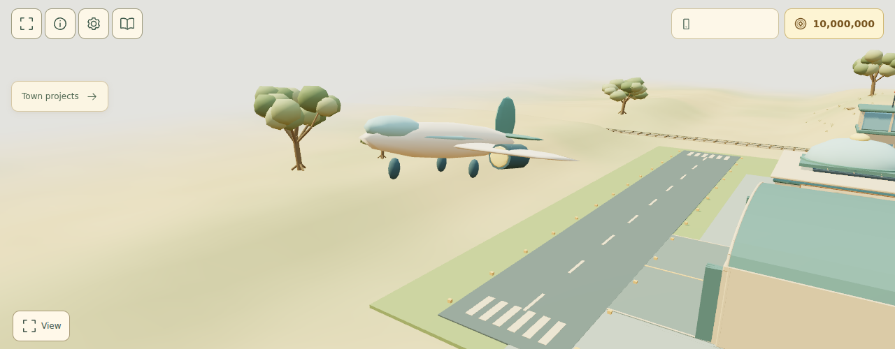
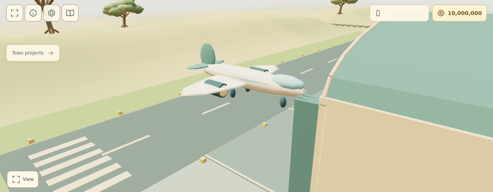
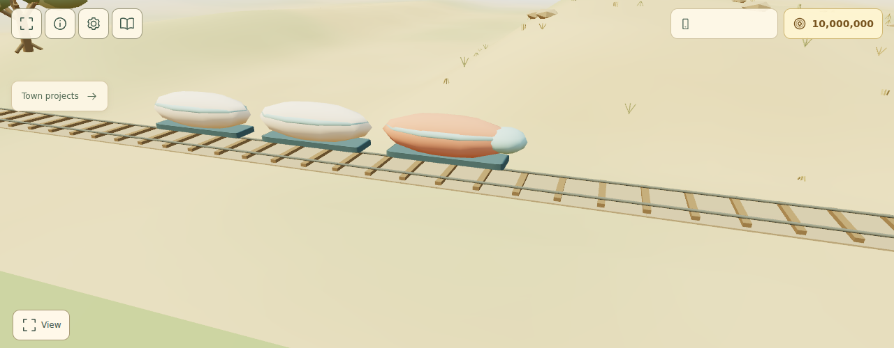

# Tomorrow City gallery

WebGL captures of a completed Tomorrow City town (`npm run demo:eras`, fixture
`tomorrow-complete`), rendered in headless Chromium with SwiftShader. Desktop shots
are cropped to the 3D scene; phone shots show the full 390 × 844 screen.

_Before: the same old-town view in Connected City (2005)._

_The whole town: old town, river, east bank and the new x = 65 column._

_The original frontier plots rebuilt as domes, cottages and rotundas._

_Sky pods (spiral homes), Biodome and the east bank._

_Business tower spire, City towers and the east-bank streets._

_Maglev loop, transit hub, city hall rotunda and the geodesic technology campus._

_TV orb tower, concert shells, radio mast and the airport's dome lounge._

_Airport with its glazed rooftop dome lounge._

_Domed watermill, wharf pavilion and greenhouse farms._

_Mine with the glazed portal hood and geodesic sorting dome._

_Town square with the orbital-rings fountain._

## Transport

The airport, station and port each switch to a rounded vehicle once that building is
modernized in Tomorrow City (`src/game/town/RoundedTransports.js`). Each is built from
the shared primitives with at most 16 meshes, so the moving vehicles stay cheap to draw.

_Electric sky liner: blended wings and ducted fans, on approach._

_The sky liner taxiing by the domed airport lounge._

_Maglev pod train, floating on guideway skids over the railway._

_Hover river ferry with a glazed dome cabin, passing the domed watermill._

## Phone

 
