# Tomorrow City gallery

WebGL captures of a completed Tomorrow City town (`npm run demo:eras`, fixture
`tomorrow-complete`), rendered in headless Chromium with SwiftShader. Desktop shots
are cropped to the 3D scene; phone shots show the full 390 × 844 screen.

_Before: the same old-town view in Connected City (2005)._

_The whole town: old town, river, east bank and the new x = 65 column._

_The original frontier plots rebuilt as domes, cottages and rotundas._

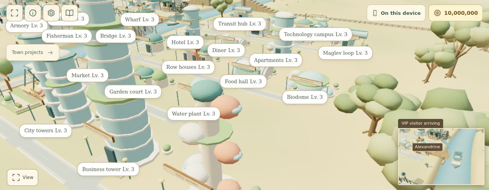

_Sky pods (spiral homes), Biodome and the east bank._

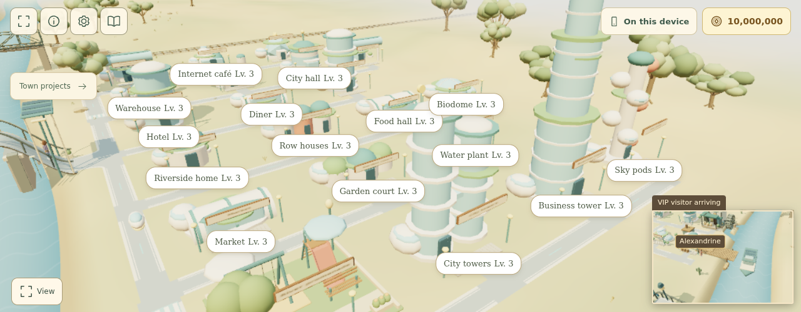

_Business tower spire, City towers and the east-bank streets._

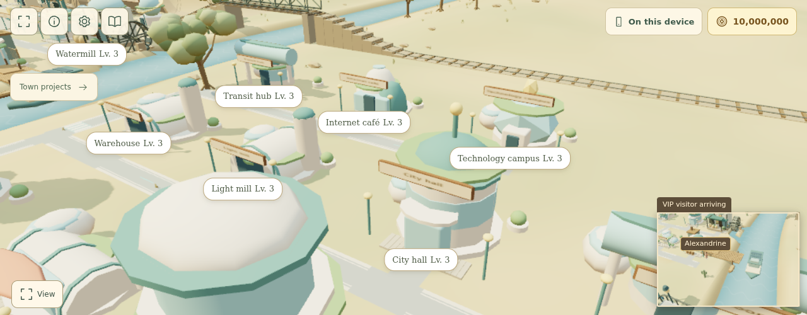

_Maglev loop, transit hub, city hall rotunda and the geodesic technology campus._

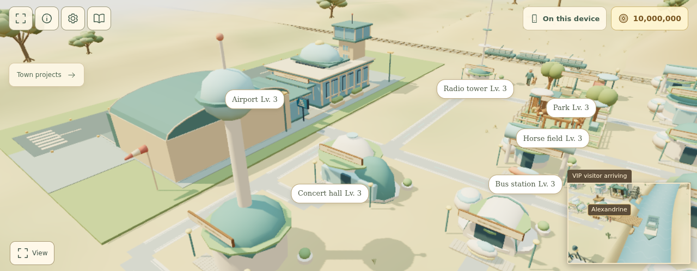

_TV orb tower, concert shells, radio mast and the airport's dome lounge._

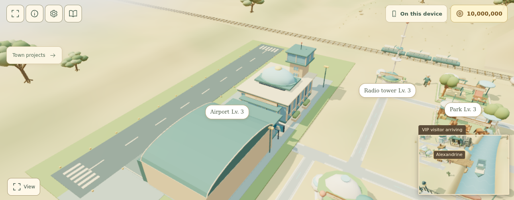

_Airport with its glazed rooftop dome lounge._

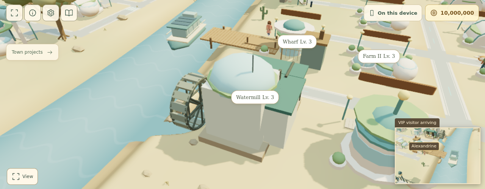

_Domed watermill, wharf pavilion and greenhouse farms._

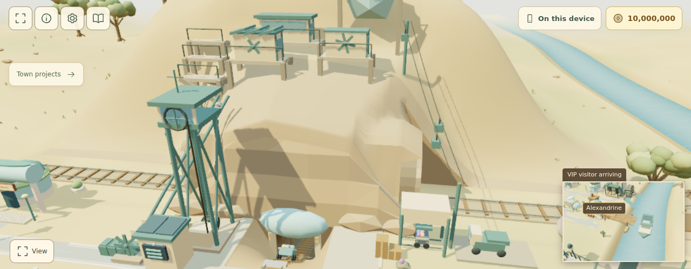

_Mine with the glazed portal hood and geodesic sorting dome._

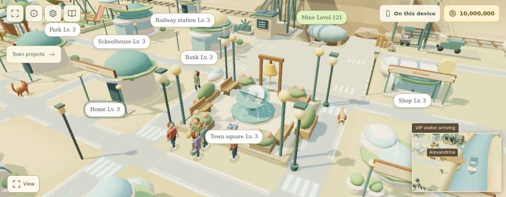

_Town square with the orbital-rings fountain._

## Transport

The airport, station and port each switch to a rounded vehicle once that building is
modernized in Tomorrow City (`src/game/town/RoundedTransports.js`). Each is built from
the shared primitives with at most 16 meshes (24 for the three-car train), so the moving
vehicles stay cheap to draw.

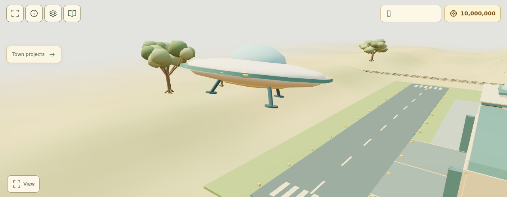

_Sky saucer on approach: a disc hull under a glass dome, with spinning rim lights._

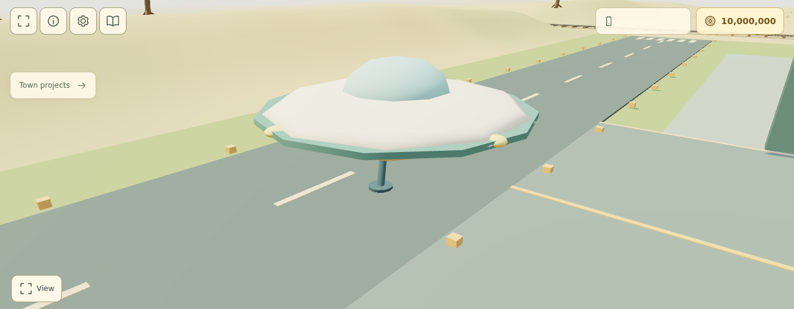

_Landed on its three legs, which reach from the hull down to foot pads on the runway._

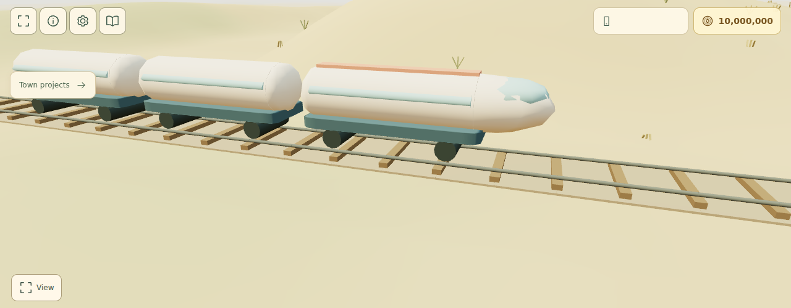

_Solar express: a streamlined lead car and two glazed carriages running on the rails._

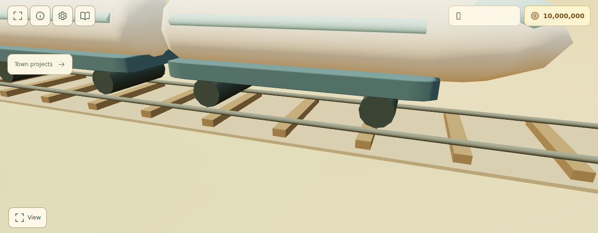

_Its skirted underframe, with rolling wheel axles on both rails._

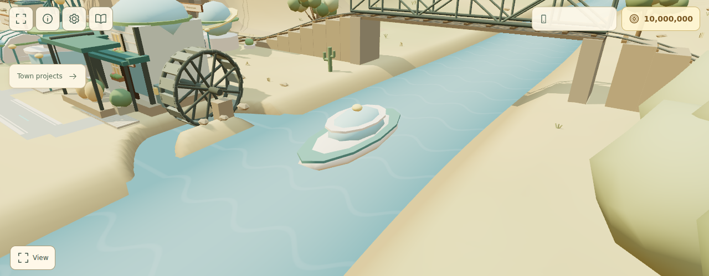

_Hover river ferry with a glazed dome cabin, passing the domed watermill._

## Cars and people

Traffic becomes hover cars and a hover shuttle bus that bob gently as they move, and
incident crews arrive in rounded response pods (`TownVehicles.js`). Villagers wear the
`tomorrow` wardrobe: a wrap-around visor and a glowing collar ring. Both new outfit parts
reuse existing shapes, so GPU instancing adds no draw calls.

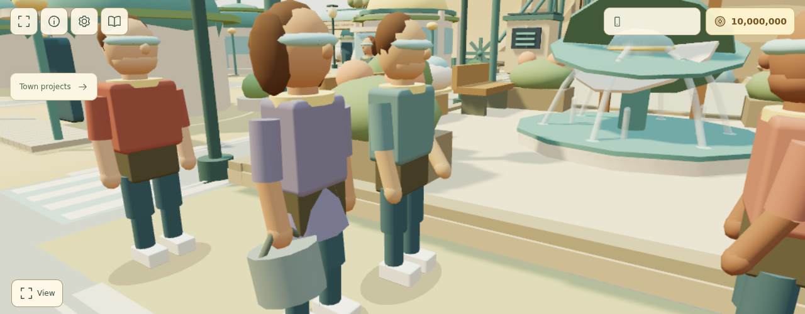

_Villagers at the square in visors and glowing collar rings._

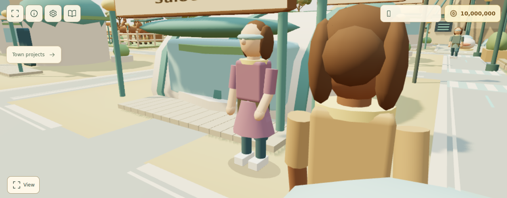

_A villager outside the vaulted saloon._

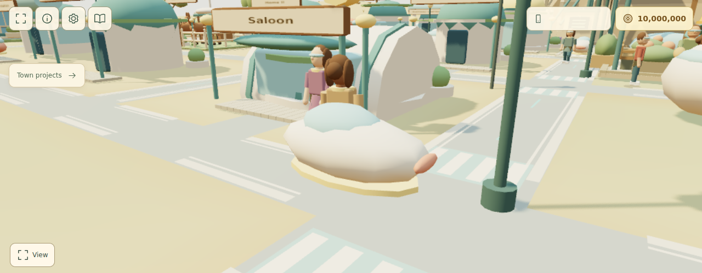

_A touring hover car with a glass canopy, glow skirt and tail light._

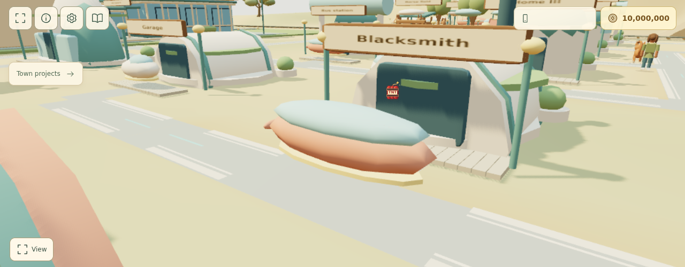

_The village hover shuttle bus by the blacksmith's hangar._

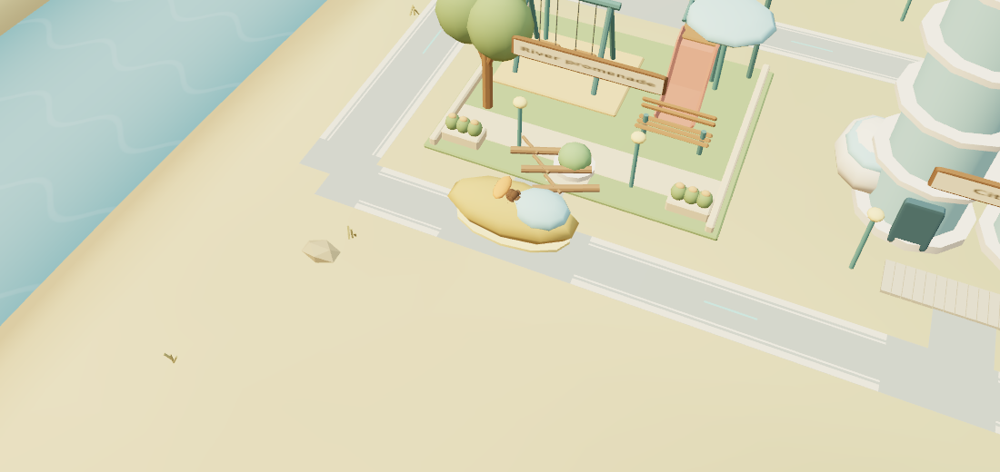

_The storm-cleanup crew's hovering response pod at the river promenade._

## The space dog

In Tomorrow City the village dog becomes a Cosmo-style space dog. The `tomorrow` wardrobe
declares `petCostume: 'space-helmet'`, so a later era can reuse the costume without an
era-name check. The dog wears a clear bubble helmet (the only extra material, and a
transparent one) on a white collar ring, a white suit with red star patches, and red boots.

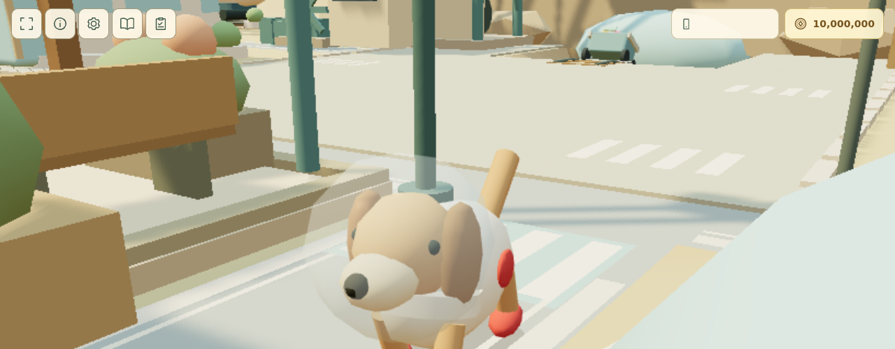

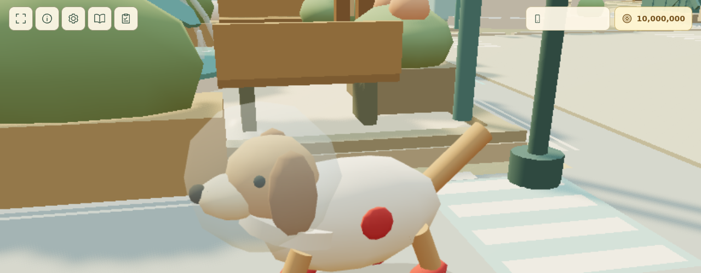

## Phone

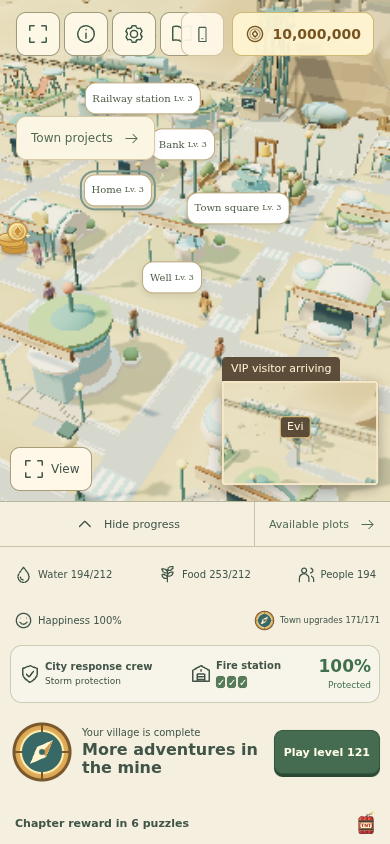 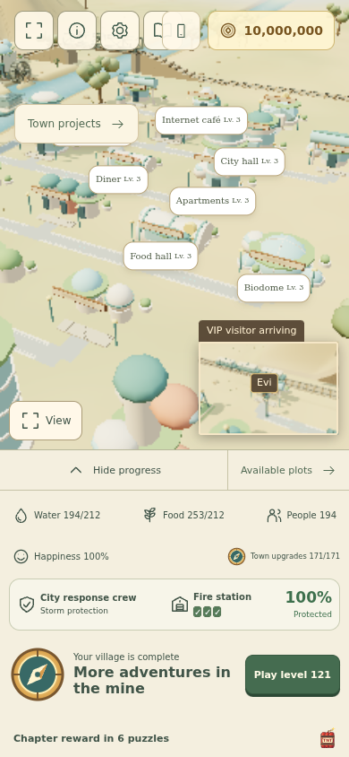
