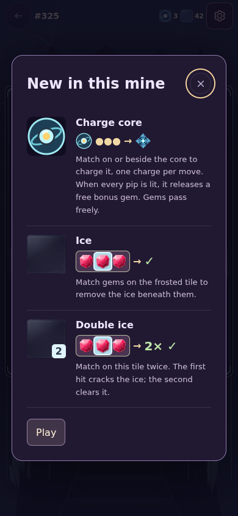
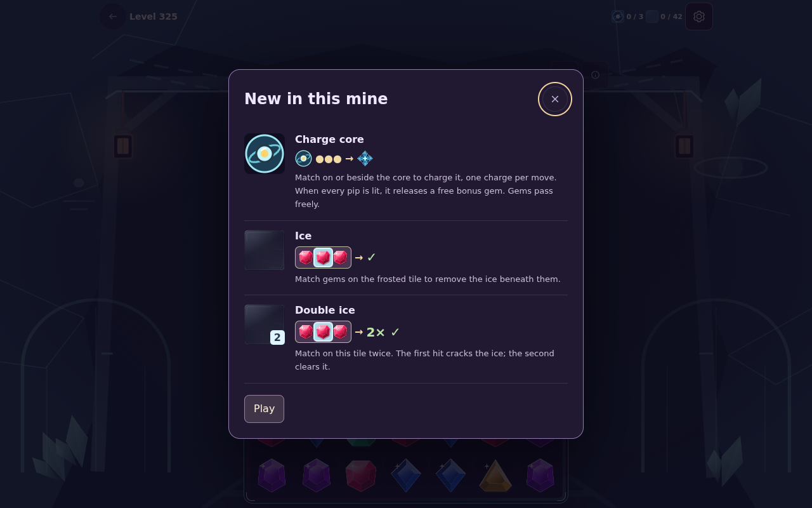
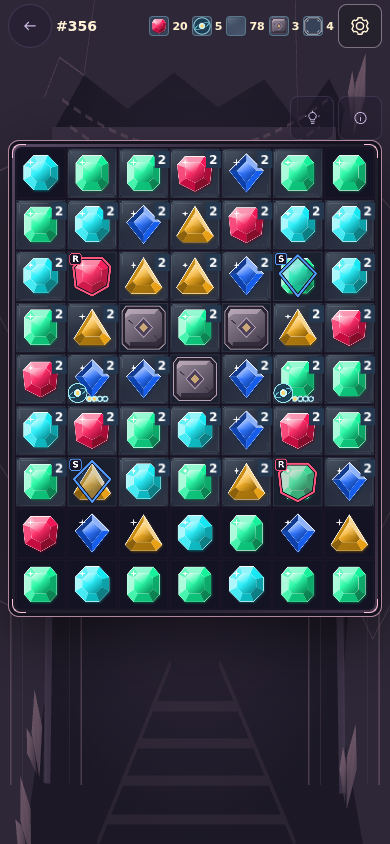
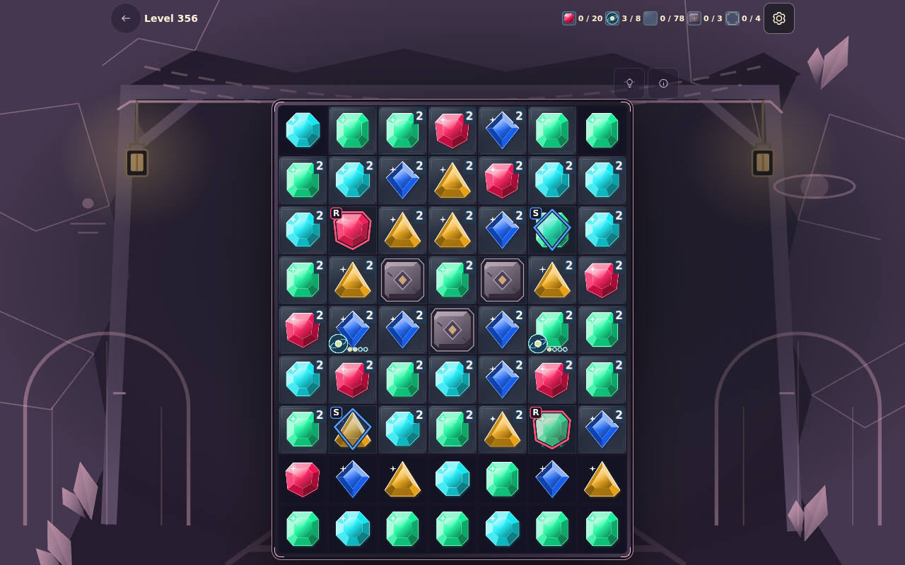
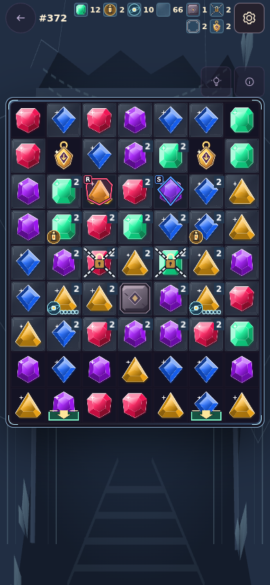
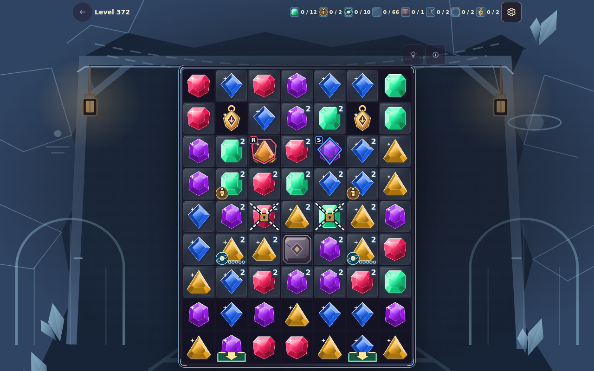

# Tomorrow City mine chapters (levels 325–372)

The Tomorrow City era (c. 2065) needs more puzzles so players can earn its
building coins. This pass appends eight six-level chapters after the 54
existing chapters. It is append-only: level IDs 1–324, their seeds, layouts,
rewards, names, chapters and star targets are unchanged. A regression test
hashes all of them. Moves stay unlimited, and a board with no legal match
still reshuffles for free.

| Chapter | Levels  | Name                | Theme                                    | Familiar mechanics mixed with charge cores         |
| ------- | ------- | ------------------- | ---------------------------------------- | -------------------------------------------------- |
| 55      | 325–330 | Dome gardens        | Glass domes, solar gardens and seed pods | Introduction, then stone, reinforced stone, relics |
| 56      | 331–336 | Maglev loops        | Silent maglev loops and express pods     | Chains, relics                                     |
| 57      | 337–342 | Solar terraces      | Stepped solar terraces                   | Ore orders, staggered shelves, relics              |
| 58      | 343–348 | Hover lanes         | Hover lanes with cargo pods and docks    | Relic delivery (one to three pods), chains         |
| 59      | 349–354 | Orbital observatory | Orbital ring and observatory             | Numbered survey trail and relics                   |
| 60      | 355–360 | Capsule commons     | Shared capsule commons                   | Colored seals, ore orders                          |
| 61      | 361–366 | Fusion sphere       | Fusion sphere inside a stone ring        | Reinforced rings, ore orders, relics               |
| 62      | 367–372 | Skyline of tomorrow | The finished skyline                     | Lanterns, seals, chains, orders and relics         |

Every chapter follows the established rhythm: introduction, practice,
delivery or exploration, stretch, a lighter fifth puzzle, then a finale. The
data lives in `src/data/tomorrowLevels.js`. Boards are authored as readable
7 × 9 grids and turned into the same expansion specs used by earlier chapters.
Two ice motifs, `dome` and `orbit`, are added for these chapters in
`earlyLevels.js`. The existing motifs are unchanged.

## New mechanic: charge cores

Inspiration:

- [Royal Match's light bulb](https://dreamgames.helpshift.com/hc/en/3-royal-match/faq/378-light-bulb/)
  reacts to nearby matches.
- [Gardenscapes' fireflies](https://playrix.helpshift.com/hc/en/5-gardenscapes/faq/964-fireflies/)
  show staged progress before they release help.
- Candy Crush and Toon Blast turn pieces into boosters in place.
- Bejeweled's special gems reward a good match with a stronger piece.

Rules:

- A charge core is a floor marker, like a lantern. It never anchors a gem or
  blocks gravity. Gems can be swapped on it and fall through it, so it cannot
  create an unfillable cell.
- A match on the core or next to it (not diagonally) adds one charge. A bonus
  or power blast that reaches it also adds one charge.
- A core gains **at most one charge per move**, however long the cascade. Each
  full charge counts toward the level's "Tiles and charge cores" objective.
  Chapter 55 teaches three-charge cores. Chapters 56–60 use four charges and
  chapters 61–62 use five. Each pip on the core shows one charge.
- At full charge, the gem on the core becomes a free bonus. Level 325 releases
  cross fire. The rest of chapter 55 and every later chapter release a bomb,
  a smaller area than a whole row and column. The gem is not cleared or collected. It uses
  the normal "bonus ready" reveal. If a relic, an anchored tile or another bonus
  occupies the core, the release moves to the first ordinary neighbor. If no
  neighbor can hold it, the charge still counts and completion is unaffected.
- A full core leaves the board once it has released its bonus (or, with no
  neighbor to hold it, once its charge counts). It does nothing else. Lit
  lanterns leave the board the same way.
- It never spreads, counts down, harms the board or fails a puzzle.

Guardrails (checked by `testing/tomorrow-levels.test.js`):

- Level 325 introduces the core by itself: one core, ice and no other obstacle
  type, with the smallest workload in the chapter. The shared obstacle guide
  introduces "Charge core" the first time. That introduction pauses the clock,
  like other new obstacles. Later levels combine cores with one or two familiar
  mechanics.
- Cores are never placed on stone, chains, relics or exits.
- Corners stay clear, side columns stay free of stone, and the two bottom rows
  have no ice. Ice has at most two layers. Every relic has an exit in its own
  column. Ore orders and seals use colors from the level's palette.
- No level defines `maxMoves`, `moveLimit` or a time limit. Speed targets use
  the existing late-campaign formula: 75 s + 1 s per layer + 20 s per relic.
  They are optional chest thresholds.
- Other regression tests cover:
  - completing levels 325, 330, 348, 354, 362 and 372 through the real store
    beyond 100 moves, after the speed target has elapsed
  - one release after exactly the authored number of charges (three to five)
  - reshuffling a dead board that contains a core without moving or spending it
  - one charge per move during cascades
  - all bonus and power routes
  - relic-occupied releases and releases with no usable target
  - gravity through cores

Rendering reuses the `board-core` atlas with a new `tile-core` frame. The core
art is `public/art/obstacles/core.svg`, and the SVG fallback covers failed
atlases. The overlay is one image and one static circle per charge. It is cached by
charge and rebuilt only when the charge changes. There are no tweens or
particles, and no work happens on each frame. The goal bar shows "Core
charges". The obstacle guide and all new text have French translations.

## Chapter scenery

The eight chambers use cool glass, solar gold and lilac palettes in
`src/styles/mine.css`. `MineBackdrop.vue` adds one static vector layer for all
Tomorrow themes: rounded domes with panel ribs, a dashed hover lane and a small
orbit ring. It uses the existing SVG, decoration ignores pointer events and
assistive technology, and high-contrast mode dims it like the other scenery.

## Measurements

These are simulations, not human completion rates:
`node scripts/measure-campaign.mjs . 30` ran hint-led legal swaps, used earned
board bonuses and free dead-board shuffles, used no inventory powers, and ran
30 refill seeds per level. All 1,440 new runs finished.

### Difficulty pass (after review)

The first version was noticeably lighter than the preceding late chapters, and
the review asked for a gentle climb toward them. Three changes do most of the
work, and they are combined rather than simply inflating counts:

- **Fewer free bonuses.** Later chapters use four- and five-charge cores that
  release a bomb instead of cross fire. Level 325 keeps its three-charge cross
  fire introduction.
- **More deliveries.** Relics are added to levels 350, 352, 361, 362, 367 and
  368, always with an open lane and an exit in the relic's own column.
- **Heavier structure.** There is more double ice, with 62–80 ice layers
  outside rest puzzles and never more than two layers per cell. There are also
  stone pairs, reinforced rings, flank chains and larger ore orders of 16–20.

The layout guardrails are unchanged. After tuning, chains no longer sit
directly in a relic lane where they produced long outliers. Rest puzzles stay
lighter than their finales.

| Chapter                        | Before: median / p90 / longest | After: median / p90 / longest | Shuffles after |
| ------------------------------ | -----------------------------: | ----------------------------: | -------------: |
| 49–54 (levels 289–324)         |             19–23 / 30–39 / 84 |                   (unchanged) |              1 |
| 55 Dome gardens                |                   14 / 21 / 42 |                  17 / 30 / 63 |              1 |
| 56 Maglev loops                |                   16 / 27 / 55 |                  19 / 27 / 55 |              0 |
| 57 Solar terraces              |                   16 / 31 / 45 |                  19 / 33 / 64 |              1 |
| 58 Hover lanes                 |                   17 / 30 / 69 |                  19 / 36 / 61 |              0 |
| 59 Orbital observatory         |                   16 / 25 / 62 |                  20 / 31 / 66 |              0 |
| 60 Capsule commons             |                   17 / 27 / 58 |                  21 / 35 / 65 |              0 |
| 61 Fusion sphere               |                   16 / 24 / 60 |                  21 / 33 / 63 |              0 |
| 62 Skyline of tomorrow         |                   16 / 28 / 61 |                  21 / 39 / 52 |              1 |
| All of 325–372                 |                   16 / 27 / 69 |                  19 / 33 / 66 |              3 |
| All of 241–324, for comparison |                   21 / 34 / 84 |                   (unchanged) |              — |

Chapter 55 remains the gentlest. Level 325 has a median of 12 moves. The
following chapters climb from 19 to 21, into the range of the preceding late
chapters (19–23). The finale chapters are at the top of the new set. Individual
levels vary more than chapters: the hardest non-rest boards have medians of
24–30, while rest puzzles have 13–18.

Star targets for levels 325–372 were recalibrated with the existing script: the
effective score's 55th percentile, rounded down to 200 points. Re-running it
reproduced all 324 existing targets exactly. On the calibration seeds, 51% of
the new runs earn three stars, mostly through the ×4 cascade route. The
held-out test keeps the 241–372 band within 30–65%.

Mining payouts scale with chapter depth, and longer puzzles collect more jewels.
Across the 48 new levels, the median simulated mining payout is **1.44 million
coins** (range 1.33–1.68 million over 30 seeds; about 30,000 per level). Before
the difficulty pass it was 1.29 million. Levels 277–324 pay a median of 1.27
million. This figure excludes these extra sources:

- chest coins: each chest pays 4,000 at this depth, and each puzzle earns one
  or two chests
- chapter gifts: 5,500–6,200 coins when the gift bag is full
- hammers
- passive income

Reproduce with:

```sh
node scripts/measure-campaign.mjs . 30 372 $(seq -s, 325 372) > /tmp/tomorrow.json
npx vitest run testing/tomorrow-levels.test.js testing/chapter-progression.test.js
```

## Screenshots

Captured in headless Chromium at phone (390 × 844) and desktop (1280 × 800) sizes.

Level 325 introduces the charge core with the first-time guide:





Level 356 with two cores partly charged (2 of 4 and 1 of 4 pips lit):





Level 372, the Skyline of tomorrow finale, mixing cores, relics, chains, seals and stone:




