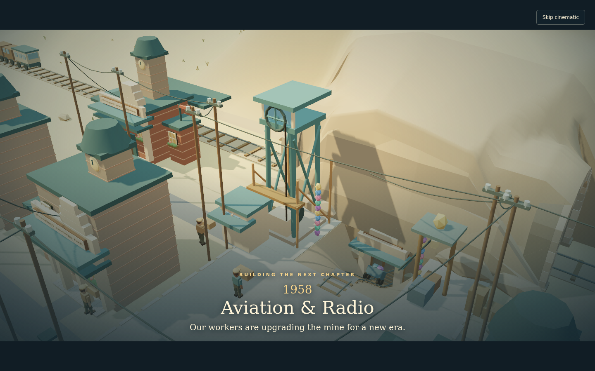
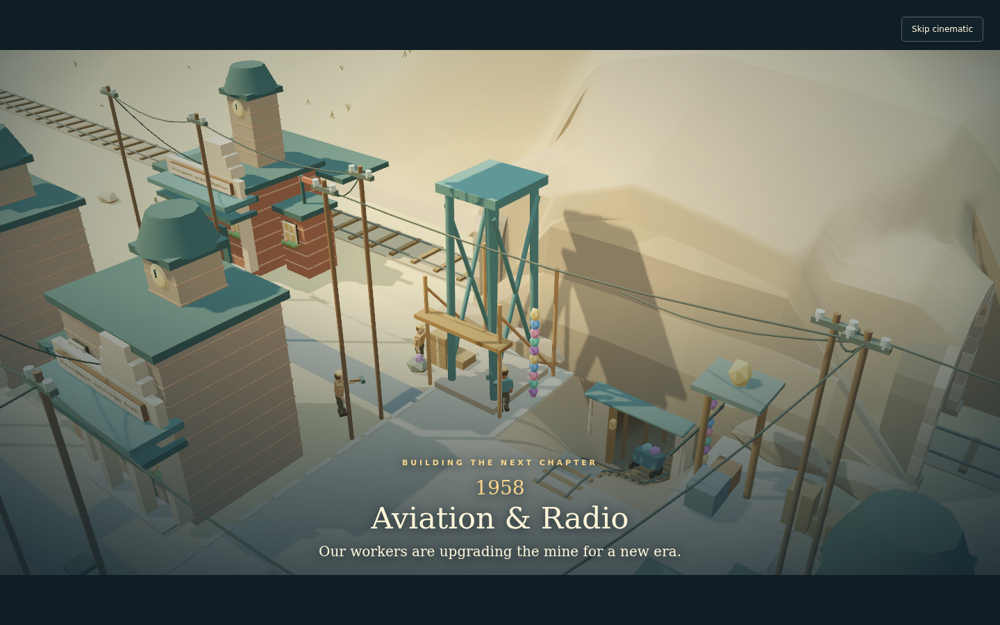
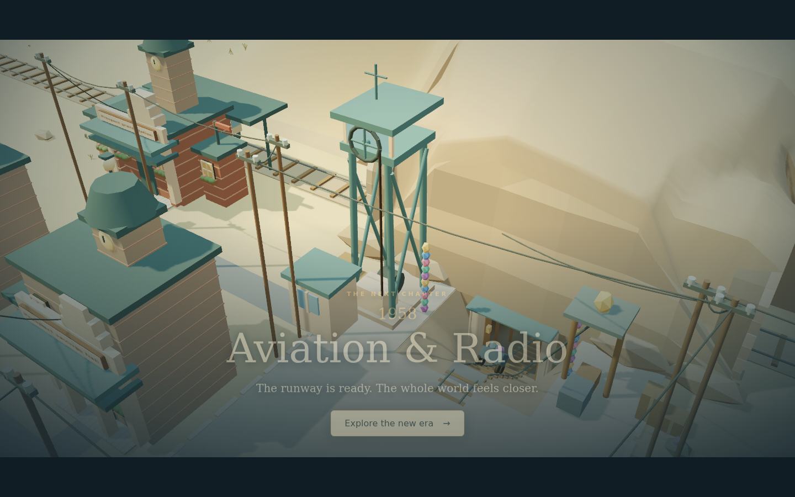

# Buildings and mine upgrades through the eras

Prospect Hollow grows from a timber settlement into a connected city while keeping its soft colors, compact proportions and low-poly style. This guide shows the actual building models and explains what changes as the town advances.

The galleries contain **975 individual stage images** and **327 comparison sheets** across eight eras. They cover every building available in each era, including separate plots that share an architectural family, plus the mine's permanent surface equipment.

## How the upgrades work

Entering a new era unlocks modernization. An existing building keeps its completed appearance until its upgrade finishes. The galleries show each completed stage; they do not imply that the whole town changes automatically at the era transition.

Later-era modernizations have three stages. Original building construction uses its actual stage count, including the five-stage Frontier landmarks and the three-stage supporting buildings. Within a building's comparison image, all stages use the same viewpoint and scale.

The mine is the visible centerpiece of the era transition. Its permanent equipment upgrades during the cutscene. The mine's separate chapter rewards and equipment still follow puzzle progress.

## Era galleries

| Era                                                    | Visual character                                                               | Building comparisons, including the mine | Stage images |
| ------------------------------------------------------ | ------------------------------------------------------------------------------ | ---------------------------------------: | -----------: |
| [Frontier Settlement · c. 1865–1880](Era-frontier.md)  | Timber, pitched roofs, porches and simple machinery                            |                                       23 |           77 |
| [River & Rail Boom · 1884](Era-river-rail.md)          | Masonry fronts, verandas, workshops, loading shelters, rail and steam          |                                       31 |           91 |
| [Industrial / Electric Town · 1908](Era-industrial.md) | Brick workshops, steelwork and electrical services                             |                                       36 |          106 |
| [Post-war Rebuilding · 1920](Era-post-war.md)          | First World War rebuilding, civic masonry and courtyard housing                |                                       40 |          118 |
| [Motor Age · 1932](Era-motor-age.md)                   | Cream walls, roadside canopies, garages, buses and gardens                     |                                       45 |          133 |
| [Aviation & Radio · 1958](Era-aviation.md)             | Broad cornices, ribbon windows and radio aerials                               |                                       47 |          139 |
| [Music & Television · 1986](Era-broadcast.md)          | Concrete blades, stepped parapets, dark roofs and television                   |                                       50 |          148 |
| [Connected City · 2005](Era-contemporary.md)           | Glass landmarks, digital services and selected green roofs and solar equipment |                                       55 |          163 |

These are period-inspired game buildings. Familiar structures and service identities remain visible as their materials and additions evolve. The 1920 “post-war” era refers to the First World War.

## What changed in the visual audit

The aviation era now has its own mid-century building family instead of reusing the 1920 architecture. The broadcast era now has its own late twentieth-century family instead of using contemporary roof gardens and solar details. Landmarks receive additions fitted to their footprints, with materials and equipment appropriate to their era. The SVG fallback follows the same appearance definitions.

The regional, metropolitan and connected airport terminals remain distinct. Neighborhood buildings, utilities, transport facilities and public spaces keep the game's established palette and proportions.

## The mine grows during the cutscene

Workers arrive carrying supplies, scaffolding goes up, and the mine assembles in visible sections: foundations, winding frame, machinery, power/control house and finishing equipment. Workers hammer while construction progresses and leave before the scene ends. The completed model remains in the town.

| Era          | Permanent mine change                                              |
| ------------ | ------------------------------------------------------------------ |
| Frontier     | Low timber frame and manual winding machinery                      |
| River & Rail | Taller braced timber frame, exposed winding wheel and steam boiler |
| Industrial   | Metal headframe, brick power house and electrical equipment        |
| Post-war     | Sheltered winding deck and rebuilt control house                   |
| Motor Age    | Taller frame and a projecting service canopy                       |
| Aviation     | Taller winding structure and radio aerial                          |
| Broadcast    | Instrumented control house and darker steelwork                    |
| Contemporary | Electronic controls and solar equipment on the control-house roof  |

Skipping keeps the upgraded mine. Reduced motion displays the complete result without camera animation. A pending transition can replay when the village is reopened. The upgrade adds no puzzle move limit, construction payment or change to puzzle rewards.

## Reviewing the snapshots

Each era page contains a comparison for every available building and links to every individual stage PNG. Click a comparison to view it at full resolution. Captures use the production game meshes in a neutral review scene; scenery, moving traffic and temporary construction scaffolds are omitted so the upgrades are easy to compare. Buildings retain their real plot coordinates during rendering so docks and bridge approaches have the correct dimensions.

The repository stores the originals under `docs/images/era-upgrades/`. The reproducible capture page is `scripts/era-art-review.html`; export instructions are in the [era architecture guide](../era-architecture.md).
