# 1958 · Aviation & Radio

[Back to the era visual guide](Era-Visual-Guide.md)

The 1958 architecture introduces broad horizontal cornices, ribbon glazing, light masonry and radio aerials. The airport uses its regional terminal design. Existing buildings receive the aviation-era facade only as their modernization is completed. The mine gains a taller winding frame and radio equipment.

Each comparison reads from left to right, from the first completed stage to the final upgrade. The camera and scale stay fixed within each building row. Click the comparison for full resolution, or open an individual stage below it. The mine has one permanent surface upgrade per era.

These are actual game meshes rendered in a neutral review scene. Name labels sit outside the model so the architecture remains clear. World scenery, traffic, construction scaffolds and unfinished plots are excluded from these building comparisons.

## Building index

**New buildings in this era**

[Prospect regional airport](#building-airport) · [Valley radio station](#building-radiotower)

**Existing buildings upgraded for this era**

[Old town well](#building-well) · [Clover farm](#building-farm) · [Juniper house](#building-home) · [The Golden Hour](#building-saloon) · [Dusty Spur stables](#building-stable) · [Sheriff’s office](#building-sheriff) · [The Frontier Museum](#building-museum) · [Frontier armory](#building-armory) · [Prospect bank](#building-bank) · [Prairie trading post](#building-shop) · [Prospect town square](#building-square) · [Prospect watermill](#building-watermill) · [Fisherman’s Hut](#building-fisherman) · [Prospect blacksmith](#building-blacksmith) · [Prospect schoolhouse](#building-school) · [Doctor’s Office](#building-doctor) · [Prospect bridge](#building-bridge) · [Steamboat landing](#building-riverport) · [Prospect railway station](#building-raildepot) · [Telegraph & Post Office](#building-post) · [Freight warehouse](#building-warehouse) · [Riverside boarding house](#building-hotel) · [Riverside house](#building-home5) · [East-bank market](#building-market) · [Prospect power house](#building-powerhouse) · [Prospect fire station](#building-firestation) · [Lantern row](#building-rowhouses) · [Riverside light mill](#building-mill) · [Prospect motor garage](#building-garage) · [Valley bus station](#building-busdepot) · [Maple garden court](#building-gardencourt) · [The Sunrise diner](#building-diner) · [Prospect city hall](#building-cityhall) · [Cedar court apartments](#building-apartments) · [Valley food hall](#building-supermarket) · [Prospect water plant](#building-waterplant) · [Willow horse field](#building-horsefield) · [Prospect public park](#building-park) · [Willow house](#building-home2) · [Sagebrush house](#building-home3) · [Cottonwood house](#building-home4) · [Prairie well](#building-well2) · [Sunrise farm](#building-farm2) · [Meadow farm](#building-farm3)

**Mine progression**

[Mine surface works](#building-mine)

## New buildings in this era

### Prospect regional airport

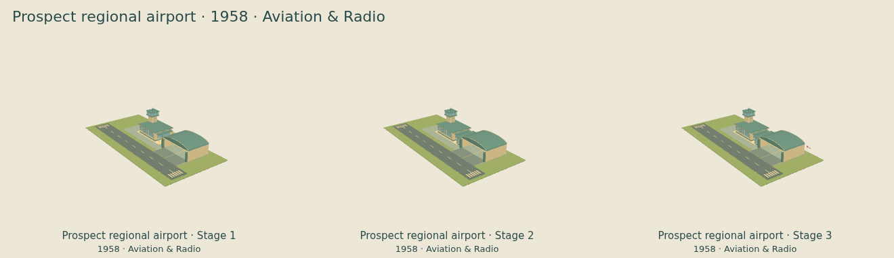

[Stage 1](../images/era-upgrades/aviation/airport/stage-1.png) · [Stage 2](../images/era-upgrades/aviation/airport/stage-2.png) · [Stage 3](../images/era-upgrades/aviation/airport/stage-3.png)

The hangar doors face the runway, with the apron and its markings ending at the runway edge. The open bay and marked taxiway stay clear of the lounge at all three stages. A single aircraft occasionally takes off or lands, taxis between the runway and hangar, and waits between flights; arrivals and departures never overlap.

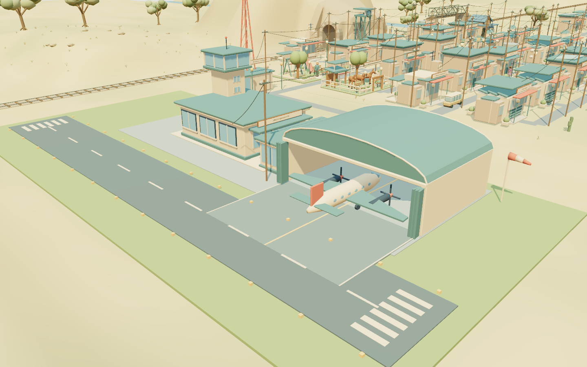

[Aircraft activity and layout details](../airport-art.md)

### Valley radio station

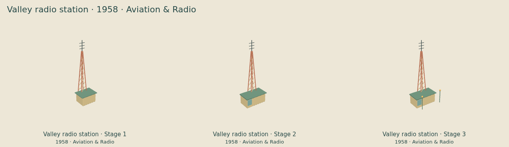

[Stage 1](../images/era-upgrades/aviation/radioTower/stage-1.png) · [Stage 2](../images/era-upgrades/aviation/radioTower/stage-2.png) · [Stage 3](../images/era-upgrades/aviation/radioTower/stage-3.png)

## Existing buildings upgraded for this era

### Old town well

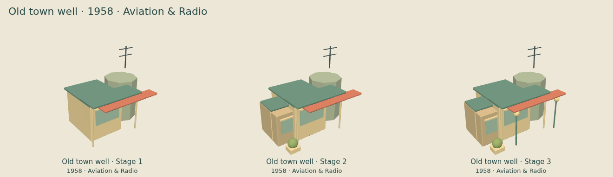

[Stage 1](../images/era-upgrades/aviation/well/stage-1.png) · [Stage 2](../images/era-upgrades/aviation/well/stage-2.png) · [Stage 3](../images/era-upgrades/aviation/well/stage-3.png)

### Clover farm

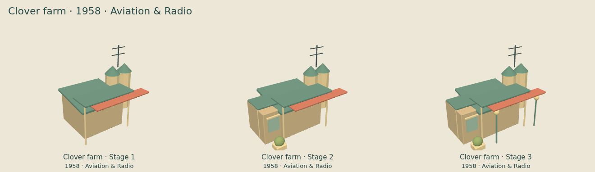

[Stage 1](../images/era-upgrades/aviation/farm/stage-1.png) · [Stage 2](../images/era-upgrades/aviation/farm/stage-2.png) · [Stage 3](../images/era-upgrades/aviation/farm/stage-3.png)

### Juniper house

[Stage 1](../images/era-upgrades/aviation/home/stage-1.png) · [Stage 2](../images/era-upgrades/aviation/home/stage-2.png) · [Stage 3](../images/era-upgrades/aviation/home/stage-3.png)

### The Golden Hour

[Stage 1](../images/era-upgrades/aviation/saloon/stage-1.png) · [Stage 2](../images/era-upgrades/aviation/saloon/stage-2.png) · [Stage 3](../images/era-upgrades/aviation/saloon/stage-3.png)

### Dusty Spur stables

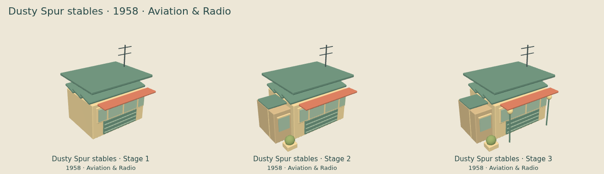

[Stage 1](../images/era-upgrades/aviation/stable/stage-1.png) · [Stage 2](../images/era-upgrades/aviation/stable/stage-2.png) · [Stage 3](../images/era-upgrades/aviation/stable/stage-3.png)

### Sheriff’s office

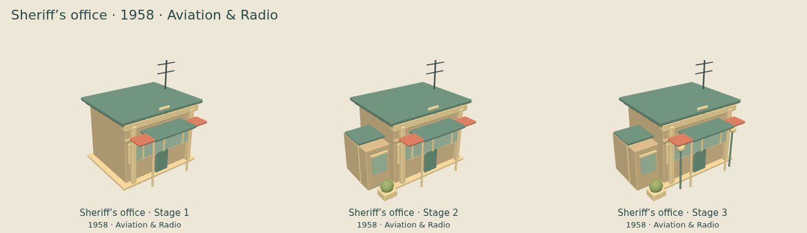

[Stage 1](../images/era-upgrades/aviation/sheriff/stage-1.png) · [Stage 2](../images/era-upgrades/aviation/sheriff/stage-2.png) · [Stage 3](../images/era-upgrades/aviation/sheriff/stage-3.png)

### The Frontier Museum

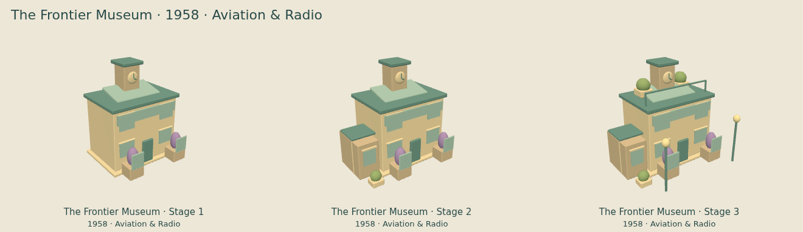

[Stage 1](../images/era-upgrades/aviation/museum/stage-1.png) · [Stage 2](../images/era-upgrades/aviation/museum/stage-2.png) · [Stage 3](../images/era-upgrades/aviation/museum/stage-3.png)

### Frontier armory

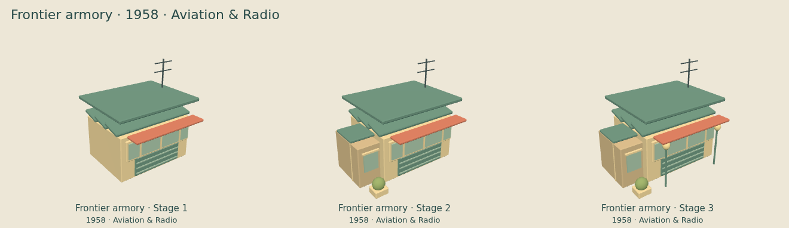

[Stage 1](../images/era-upgrades/aviation/armory/stage-1.png) · [Stage 2](../images/era-upgrades/aviation/armory/stage-2.png) · [Stage 3](../images/era-upgrades/aviation/armory/stage-3.png)

### Prospect bank

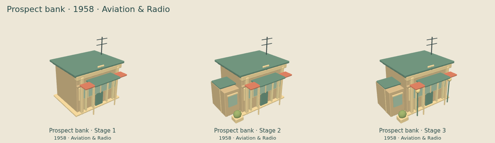

[Stage 1](../images/era-upgrades/aviation/bank/stage-1.png) · [Stage 2](../images/era-upgrades/aviation/bank/stage-2.png) · [Stage 3](../images/era-upgrades/aviation/bank/stage-3.png)

### Prairie trading post

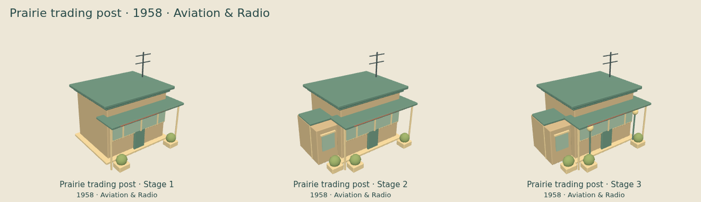

[Stage 1](../images/era-upgrades/aviation/shop/stage-1.png) · [Stage 2](../images/era-upgrades/aviation/shop/stage-2.png) · [Stage 3](../images/era-upgrades/aviation/shop/stage-3.png)

### Prospect town square

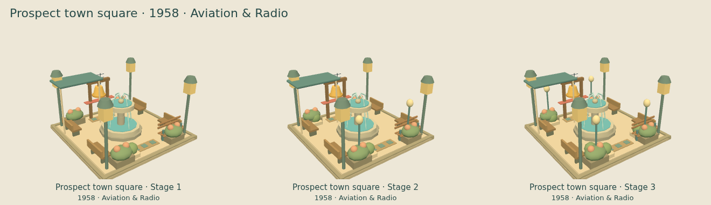

[Stage 1](../images/era-upgrades/aviation/square/stage-1.png) · [Stage 2](../images/era-upgrades/aviation/square/stage-2.png) · [Stage 3](../images/era-upgrades/aviation/square/stage-3.png)

### Prospect watermill

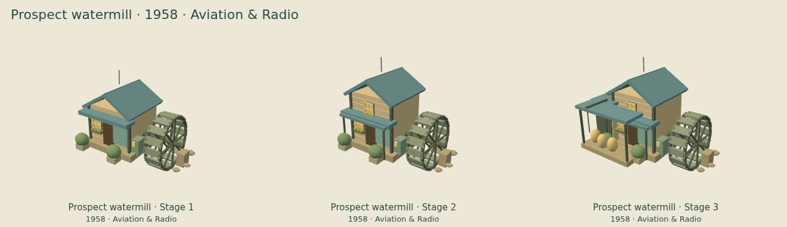

[Stage 1](../images/era-upgrades/aviation/watermill/stage-1.png) · [Stage 2](../images/era-upgrades/aviation/watermill/stage-2.png) · [Stage 3](../images/era-upgrades/aviation/watermill/stage-3.png)

### Fisherman’s Hut

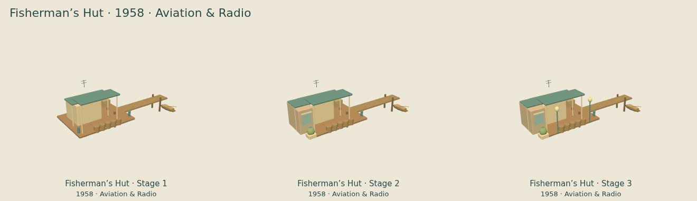

[Stage 1](../images/era-upgrades/aviation/fisherman/stage-1.png) · [Stage 2](../images/era-upgrades/aviation/fisherman/stage-2.png) · [Stage 3](../images/era-upgrades/aviation/fisherman/stage-3.png)

### Prospect blacksmith

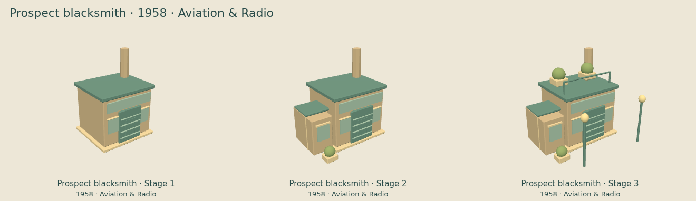

[Stage 1](../images/era-upgrades/aviation/blacksmith/stage-1.png) · [Stage 2](../images/era-upgrades/aviation/blacksmith/stage-2.png) · [Stage 3](../images/era-upgrades/aviation/blacksmith/stage-3.png)

### Prospect schoolhouse

[Stage 1](../images/era-upgrades/aviation/school/stage-1.png) · [Stage 2](../images/era-upgrades/aviation/school/stage-2.png) · [Stage 3](../images/era-upgrades/aviation/school/stage-3.png)

### Doctor’s Office

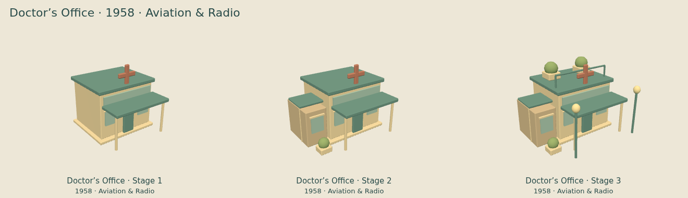

[Stage 1](../images/era-upgrades/aviation/doctor/stage-1.png) · [Stage 2](../images/era-upgrades/aviation/doctor/stage-2.png) · [Stage 3](../images/era-upgrades/aviation/doctor/stage-3.png)

### Prospect bridge

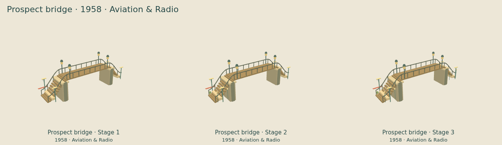

[Stage 1](../images/era-upgrades/aviation/bridge/stage-1.png) · [Stage 2](../images/era-upgrades/aviation/bridge/stage-2.png) · [Stage 3](../images/era-upgrades/aviation/bridge/stage-3.png)

### Steamboat landing

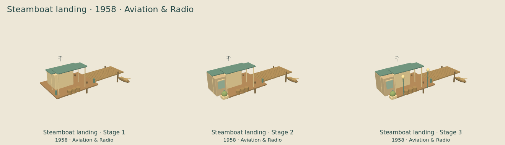

[Stage 1](../images/era-upgrades/aviation/riverPort/stage-1.png) · [Stage 2](../images/era-upgrades/aviation/riverPort/stage-2.png) · [Stage 3](../images/era-upgrades/aviation/riverPort/stage-3.png)

### Prospect railway station

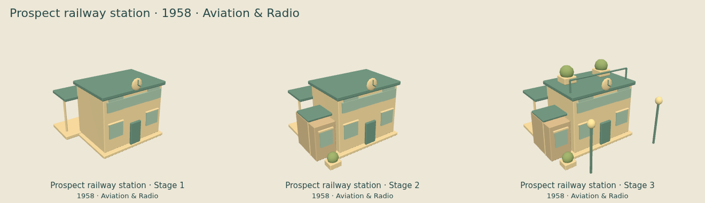

[Stage 1](../images/era-upgrades/aviation/railDepot/stage-1.png) · [Stage 2](../images/era-upgrades/aviation/railDepot/stage-2.png) · [Stage 3](../images/era-upgrades/aviation/railDepot/stage-3.png)

### Telegraph & Post Office

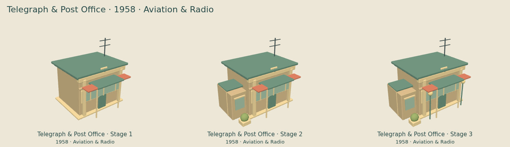

[Stage 1](../images/era-upgrades/aviation/post/stage-1.png) · [Stage 2](../images/era-upgrades/aviation/post/stage-2.png) · [Stage 3](../images/era-upgrades/aviation/post/stage-3.png)

### Freight warehouse

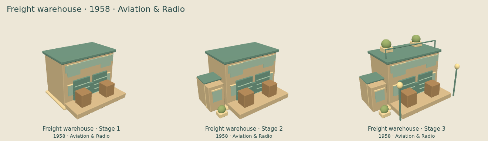

[Stage 1](../images/era-upgrades/aviation/warehouse/stage-1.png) · [Stage 2](../images/era-upgrades/aviation/warehouse/stage-2.png) · [Stage 3](../images/era-upgrades/aviation/warehouse/stage-3.png)

### Riverside boarding house

[Stage 1](../images/era-upgrades/aviation/hotel/stage-1.png) · [Stage 2](../images/era-upgrades/aviation/hotel/stage-2.png) · [Stage 3](../images/era-upgrades/aviation/hotel/stage-3.png)

### Riverside house

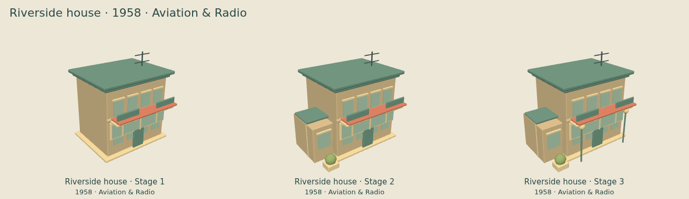

[Stage 1](../images/era-upgrades/aviation/home5/stage-1.png) · [Stage 2](../images/era-upgrades/aviation/home5/stage-2.png) · [Stage 3](../images/era-upgrades/aviation/home5/stage-3.png)

### East-bank market

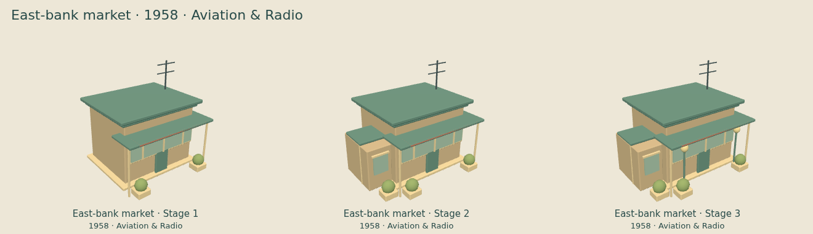

[Stage 1](../images/era-upgrades/aviation/market/stage-1.png) · [Stage 2](../images/era-upgrades/aviation/market/stage-2.png) · [Stage 3](../images/era-upgrades/aviation/market/stage-3.png)

### Prospect power house

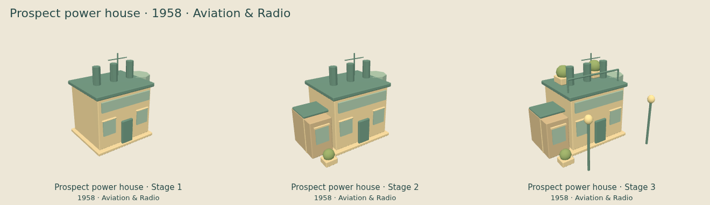

[Stage 1](../images/era-upgrades/aviation/powerHouse/stage-1.png) · [Stage 2](../images/era-upgrades/aviation/powerHouse/stage-2.png) · [Stage 3](../images/era-upgrades/aviation/powerHouse/stage-3.png)

### Prospect fire station

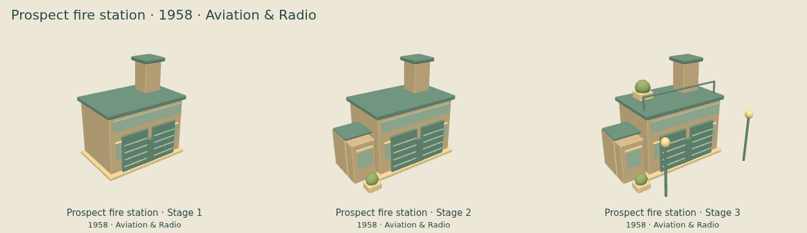

[Stage 1](../images/era-upgrades/aviation/fireStation/stage-1.png) · [Stage 2](../images/era-upgrades/aviation/fireStation/stage-2.png) · [Stage 3](../images/era-upgrades/aviation/fireStation/stage-3.png)

### Lantern row

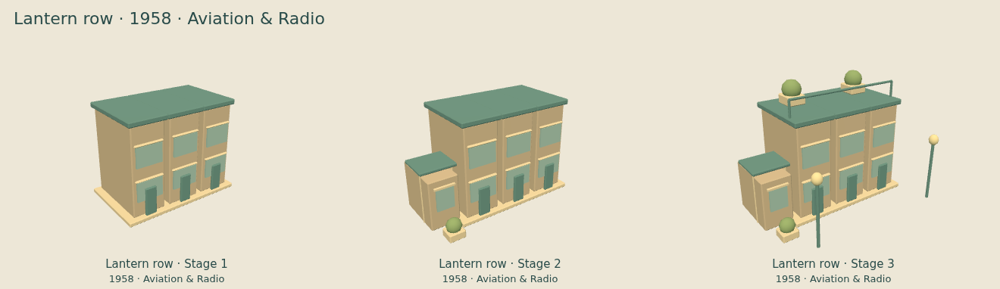

[Stage 1](../images/era-upgrades/aviation/rowHouses/stage-1.png) · [Stage 2](../images/era-upgrades/aviation/rowHouses/stage-2.png) · [Stage 3](../images/era-upgrades/aviation/rowHouses/stage-3.png)

### Riverside light mill

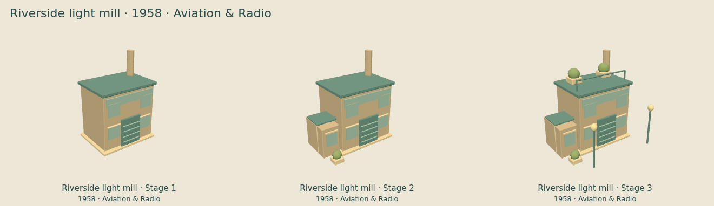

[Stage 1](../images/era-upgrades/aviation/mill/stage-1.png) · [Stage 2](../images/era-upgrades/aviation/mill/stage-2.png) · [Stage 3](../images/era-upgrades/aviation/mill/stage-3.png)

### Prospect motor garage

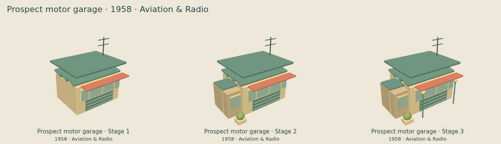

[Stage 1](../images/era-upgrades/aviation/garage/stage-1.png) · [Stage 2](../images/era-upgrades/aviation/garage/stage-2.png) · [Stage 3](../images/era-upgrades/aviation/garage/stage-3.png)

### Valley bus station

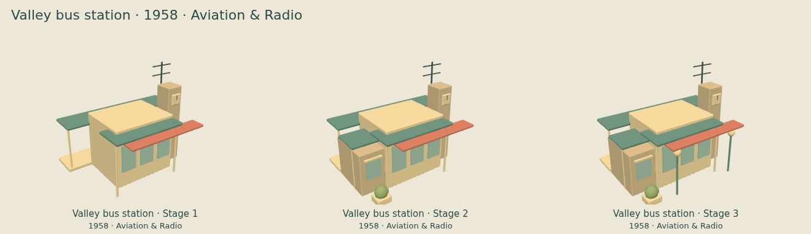

[Stage 1](../images/era-upgrades/aviation/busDepot/stage-1.png) · [Stage 2](../images/era-upgrades/aviation/busDepot/stage-2.png) · [Stage 3](../images/era-upgrades/aviation/busDepot/stage-3.png)

### Maple garden court

[Stage 1](../images/era-upgrades/aviation/gardenCourt/stage-1.png) · [Stage 2](../images/era-upgrades/aviation/gardenCourt/stage-2.png) · [Stage 3](../images/era-upgrades/aviation/gardenCourt/stage-3.png)

### The Sunrise diner

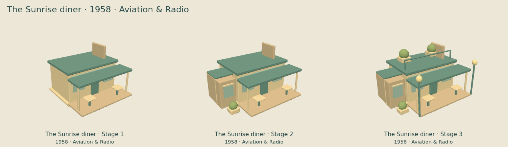

[Stage 1](../images/era-upgrades/aviation/diner/stage-1.png) · [Stage 2](../images/era-upgrades/aviation/diner/stage-2.png) · [Stage 3](../images/era-upgrades/aviation/diner/stage-3.png)

### Prospect city hall

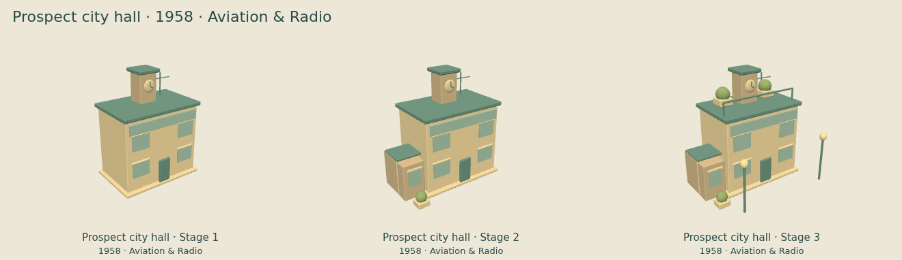

[Stage 1](../images/era-upgrades/aviation/cityHall/stage-1.png) · [Stage 2](../images/era-upgrades/aviation/cityHall/stage-2.png) · [Stage 3](../images/era-upgrades/aviation/cityHall/stage-3.png)

### Cedar court apartments

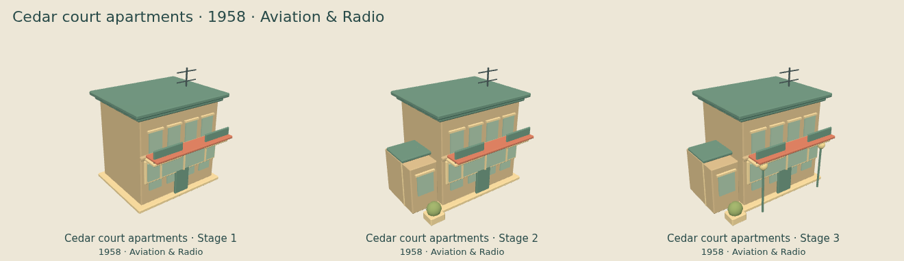

[Stage 1](../images/era-upgrades/aviation/apartments/stage-1.png) · [Stage 2](../images/era-upgrades/aviation/apartments/stage-2.png) · [Stage 3](../images/era-upgrades/aviation/apartments/stage-3.png)

### Valley food hall

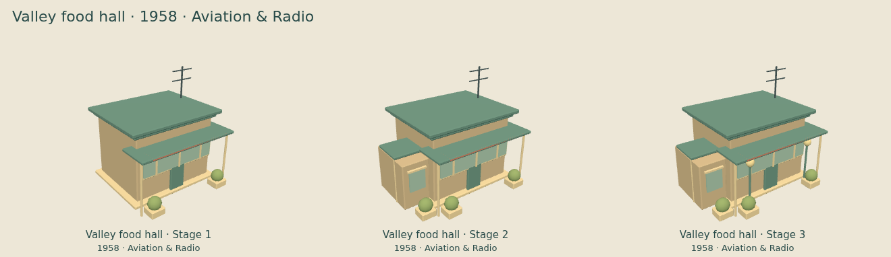

[Stage 1](../images/era-upgrades/aviation/supermarket/stage-1.png) · [Stage 2](../images/era-upgrades/aviation/supermarket/stage-2.png) · [Stage 3](../images/era-upgrades/aviation/supermarket/stage-3.png)

### Prospect water plant

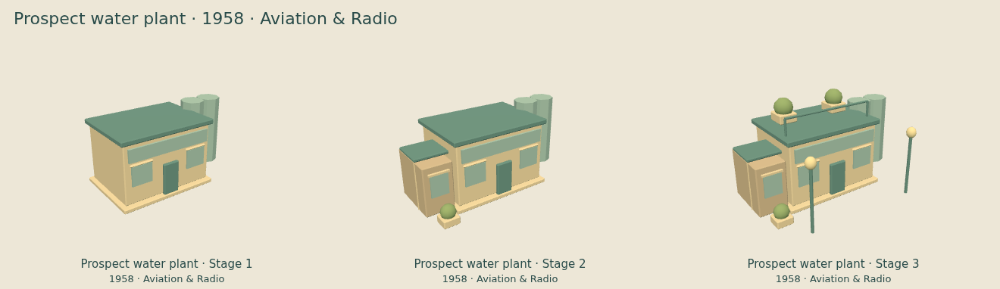

[Stage 1](../images/era-upgrades/aviation/waterPlant/stage-1.png) · [Stage 2](../images/era-upgrades/aviation/waterPlant/stage-2.png) · [Stage 3](../images/era-upgrades/aviation/waterPlant/stage-3.png)

### Willow horse field

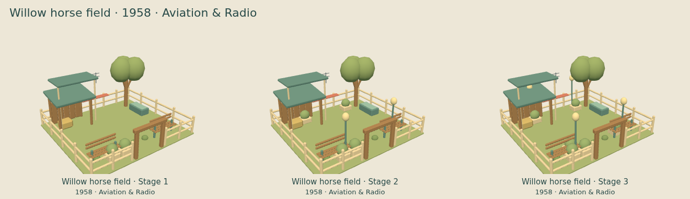

[Stage 1](../images/era-upgrades/aviation/horseField/stage-1.png) · [Stage 2](../images/era-upgrades/aviation/horseField/stage-2.png) · [Stage 3](../images/era-upgrades/aviation/horseField/stage-3.png)

### Prospect public park

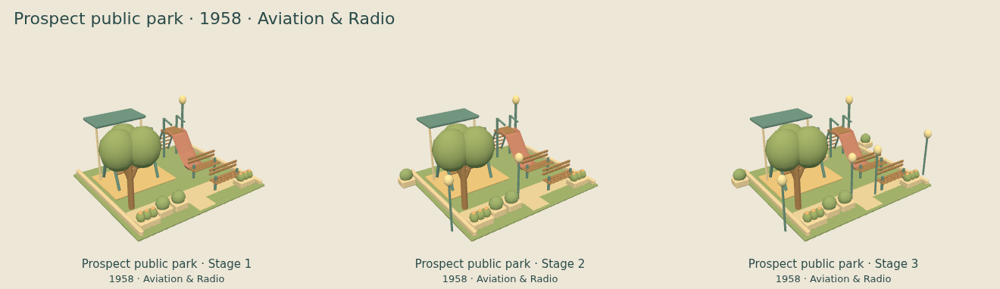

[Stage 1](../images/era-upgrades/aviation/park/stage-1.png) · [Stage 2](../images/era-upgrades/aviation/park/stage-2.png) · [Stage 3](../images/era-upgrades/aviation/park/stage-3.png)

### Willow house

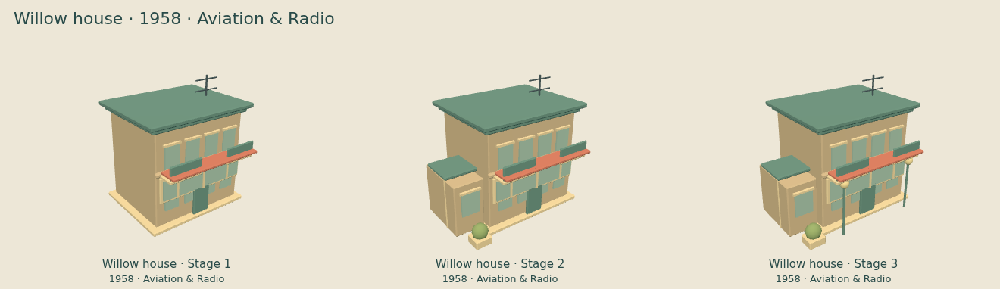

[Stage 1](../images/era-upgrades/aviation/home2/stage-1.png) · [Stage 2](../images/era-upgrades/aviation/home2/stage-2.png) · [Stage 3](../images/era-upgrades/aviation/home2/stage-3.png)

### Sagebrush house

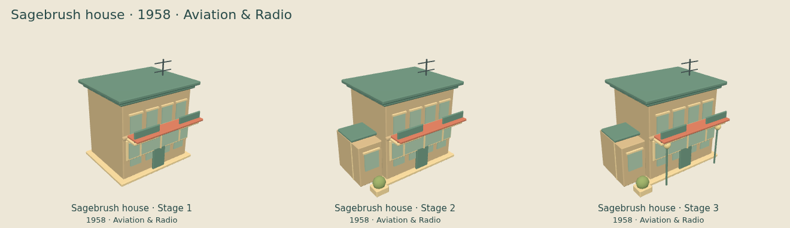

[Stage 1](../images/era-upgrades/aviation/home3/stage-1.png) · [Stage 2](../images/era-upgrades/aviation/home3/stage-2.png) · [Stage 3](../images/era-upgrades/aviation/home3/stage-3.png)

### Cottonwood house

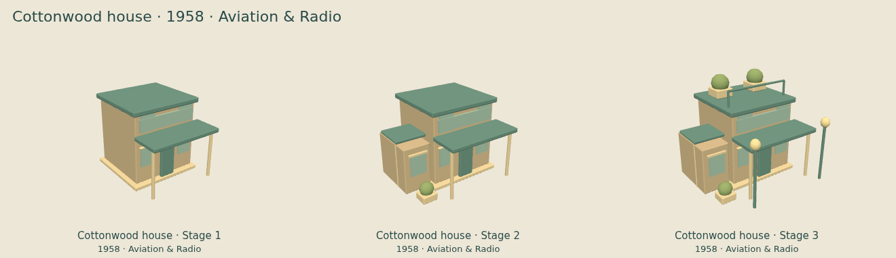

[Stage 1](../images/era-upgrades/aviation/home4/stage-1.png) · [Stage 2](../images/era-upgrades/aviation/home4/stage-2.png) · [Stage 3](../images/era-upgrades/aviation/home4/stage-3.png)

### Prairie well

[Stage 1](../images/era-upgrades/aviation/well2/stage-1.png) · [Stage 2](../images/era-upgrades/aviation/well2/stage-2.png) · [Stage 3](../images/era-upgrades/aviation/well2/stage-3.png)

### Sunrise farm

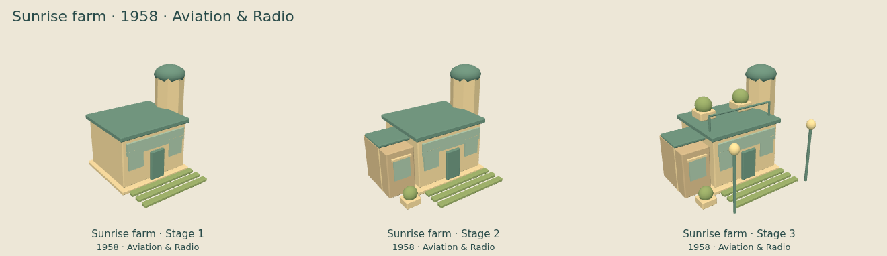

[Stage 1](../images/era-upgrades/aviation/farm2/stage-1.png) · [Stage 2](../images/era-upgrades/aviation/farm2/stage-2.png) · [Stage 3](../images/era-upgrades/aviation/farm2/stage-3.png)

### Meadow farm

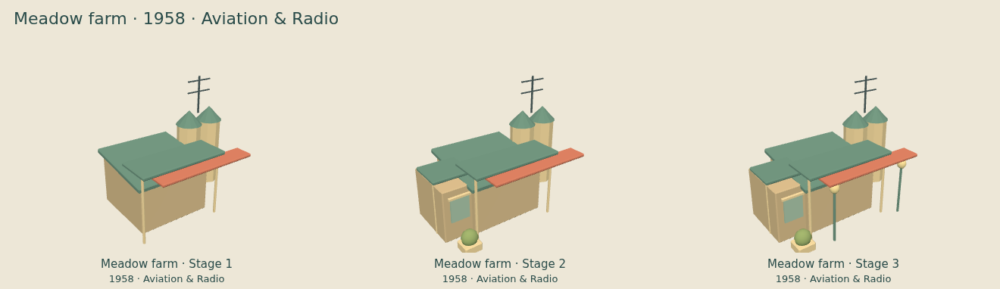

[Stage 1](../images/era-upgrades/aviation/farm3/stage-1.png) · [Stage 2](../images/era-upgrades/aviation/farm3/stage-2.png) · [Stage 3](../images/era-upgrades/aviation/farm3/stage-3.png)

## Mine progression

### Mine surface works

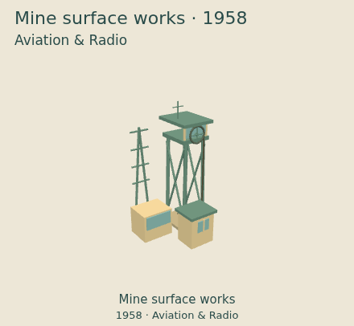

[Era upgrade](../images/era-upgrades/aviation/mine/stage-1.png)
