# 1908 · Industrial / Electric Town

[Back to the era visual guide](Era-Visual-Guide.md)

Brick workshops, steel details, service yards and electrical equipment mark the 1908 industrial town. Final upgrades add usable rooms, workshops and loading facilities instead of repeated clock towers. The power house expands its electrical equipment and the fire station adds a covered engine bay. The mine changes to a metal headframe and a brick power house.

Each comparison reads from left to right, from the first completed stage to the final upgrade. The camera and scale stay fixed within each building row. Click the comparison for full resolution, or open an individual stage below it. The mine has one permanent surface upgrade per era.

These are actual game meshes rendered in a neutral review scene. Name labels sit outside the model so the architecture remains clear. World scenery, traffic, construction scaffolds and unfinished plots are excluded from these building comparisons.

## Building index

**New buildings in this era**

[Prospect power house](#building-powerHouse) · [Prospect fire station](#building-fireStation) · [Lantern row](#building-rowHouses) · [Riverside light mill](#building-mill) · [Willow horse field](#building-horseField)

**Existing buildings upgraded for this era**

[Old town well](#building-well) · [Clover farm](#building-farm) · [Juniper house](#building-home) · [The Golden Hour](#building-saloon) · [Dusty Spur stables](#building-stable) · [Sheriff’s office](#building-sheriff) · [The Frontier Museum](#building-museum) · [Frontier armory](#building-armory) · [Prospect bank](#building-bank) · [Prairie trading post](#building-shop) · [Prospect town square](#building-square) · [Prospect watermill](#building-watermill) · [Fisherman’s Hut](#building-fisherman) · [Prospect blacksmith](#building-blacksmith) · [Prospect schoolhouse](#building-school) · [Doctor’s Office](#building-doctor) · [Prospect bridge](#building-bridge) · [Steamboat landing](#building-riverPort) · [Prospect railway station](#building-railDepot) · [Telegraph & Post Office](#building-post) · [Freight warehouse](#building-warehouse) · [Riverside boarding house](#building-hotel) · [Riverside house](#building-home5) · [East-bank market](#building-market) · [Willow house](#building-home2) · [Sagebrush house](#building-home3) · [Cottonwood house](#building-home4) · [Prairie well](#building-well2) · [Sunrise farm](#building-farm2) · [Meadow farm](#building-farm3)

**Mine progression**

[Mine surface works](#building-mine)

## New buildings in this era

### Prospect power house

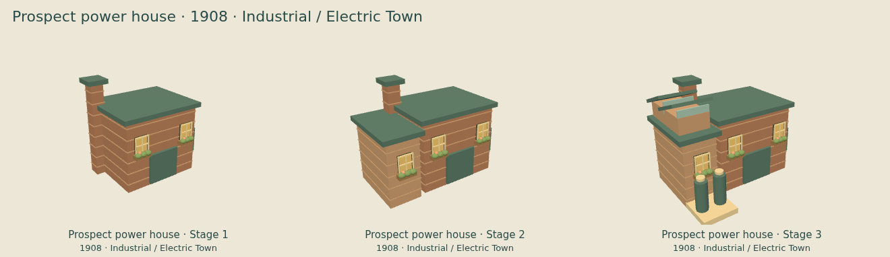

[Stage 1](../images/era-upgrades/industrial/powerHouse/stage-1.png) · [Stage 2](../images/era-upgrades/industrial/powerHouse/stage-2.png) · [Stage 3](../images/era-upgrades/industrial/powerHouse/stage-3.png)

### Prospect fire station

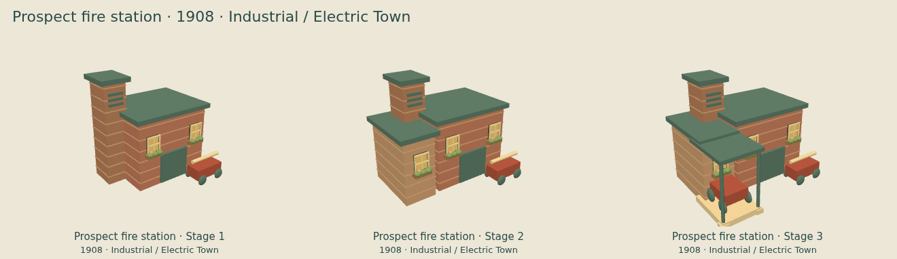

[Stage 1](../images/era-upgrades/industrial/fireStation/stage-1.png) · [Stage 2](../images/era-upgrades/industrial/fireStation/stage-2.png) · [Stage 3](../images/era-upgrades/industrial/fireStation/stage-3.png)

### Lantern row

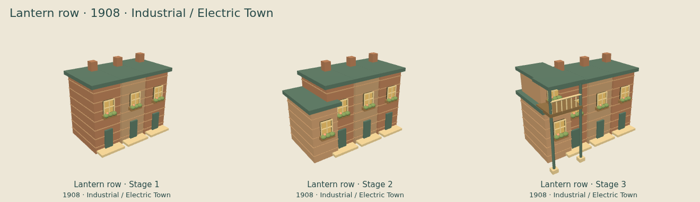

[Stage 1](../images/era-upgrades/industrial/rowHouses/stage-1.png) · [Stage 2](../images/era-upgrades/industrial/rowHouses/stage-2.png) · [Stage 3](../images/era-upgrades/industrial/rowHouses/stage-3.png)

### Riverside light mill

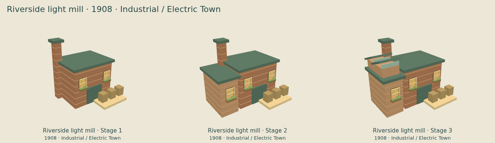

[Stage 1](../images/era-upgrades/industrial/mill/stage-1.png) · [Stage 2](../images/era-upgrades/industrial/mill/stage-2.png) · [Stage 3](../images/era-upgrades/industrial/mill/stage-3.png)

### Willow horse field

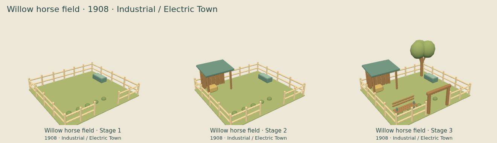

[Stage 1](../images/era-upgrades/industrial/horseField/stage-1.png) · [Stage 2](../images/era-upgrades/industrial/horseField/stage-2.png) · [Stage 3](../images/era-upgrades/industrial/horseField/stage-3.png)

## Existing buildings upgraded for this era

### Old town well

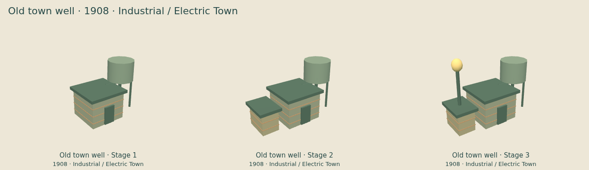

[Stage 1](../images/era-upgrades/industrial/well/stage-1.png) · [Stage 2](../images/era-upgrades/industrial/well/stage-2.png) · [Stage 3](../images/era-upgrades/industrial/well/stage-3.png)

### Clover farm

[Stage 1](../images/era-upgrades/industrial/farm/stage-1.png) · [Stage 2](../images/era-upgrades/industrial/farm/stage-2.png) · [Stage 3](../images/era-upgrades/industrial/farm/stage-3.png)

### Juniper house

[Stage 1](../images/era-upgrades/industrial/home/stage-1.png) · [Stage 2](../images/era-upgrades/industrial/home/stage-2.png) · [Stage 3](../images/era-upgrades/industrial/home/stage-3.png)

### The Golden Hour

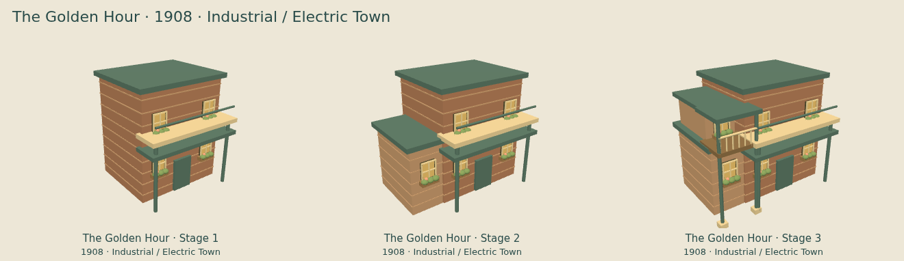

[Stage 1](../images/era-upgrades/industrial/saloon/stage-1.png) · [Stage 2](../images/era-upgrades/industrial/saloon/stage-2.png) · [Stage 3](../images/era-upgrades/industrial/saloon/stage-3.png)

### Dusty Spur stables

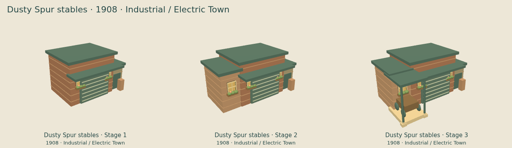

[Stage 1](../images/era-upgrades/industrial/stable/stage-1.png) · [Stage 2](../images/era-upgrades/industrial/stable/stage-2.png) · [Stage 3](../images/era-upgrades/industrial/stable/stage-3.png)

### Sheriff’s office

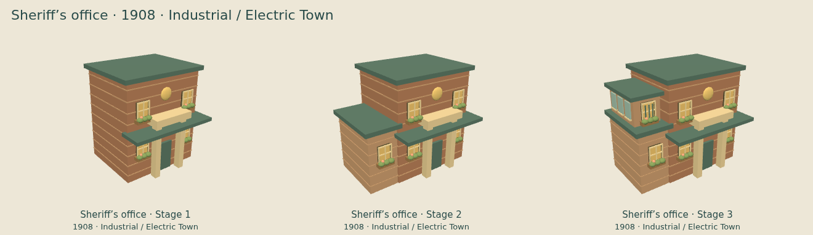

[Stage 1](../images/era-upgrades/industrial/sheriff/stage-1.png) · [Stage 2](../images/era-upgrades/industrial/sheriff/stage-2.png) · [Stage 3](../images/era-upgrades/industrial/sheriff/stage-3.png)

### The Frontier Museum

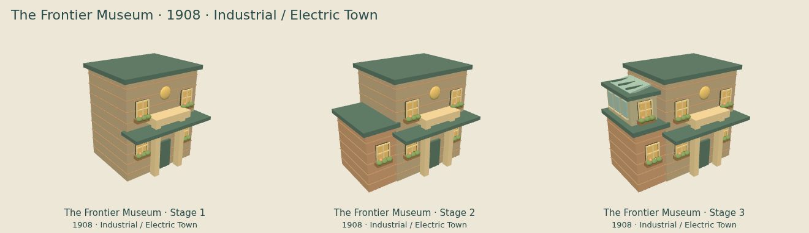

[Stage 1](../images/era-upgrades/industrial/museum/stage-1.png) · [Stage 2](../images/era-upgrades/industrial/museum/stage-2.png) · [Stage 3](../images/era-upgrades/industrial/museum/stage-3.png)

### Frontier armory

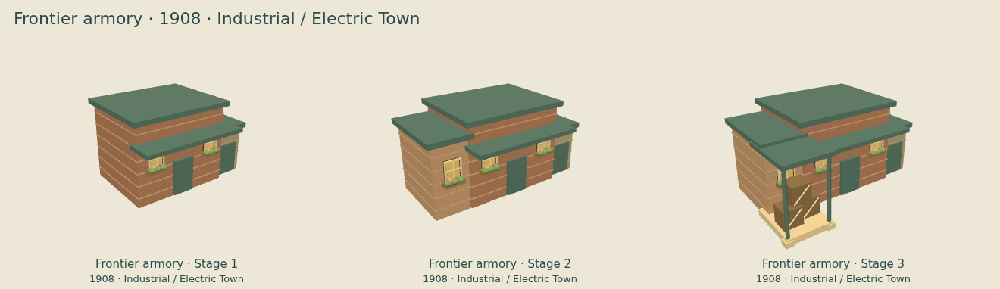

[Stage 1](../images/era-upgrades/industrial/armory/stage-1.png) · [Stage 2](../images/era-upgrades/industrial/armory/stage-2.png) · [Stage 3](../images/era-upgrades/industrial/armory/stage-3.png)

### Prospect bank

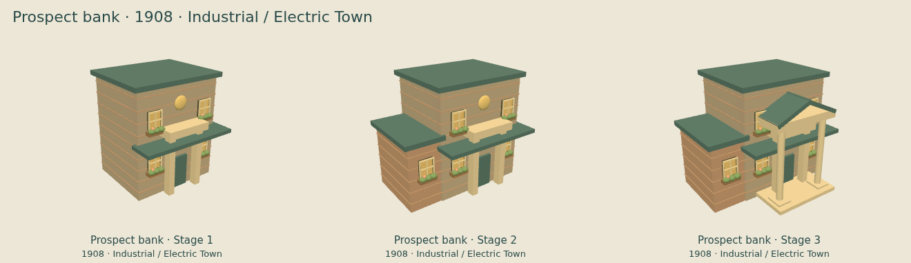

[Stage 1](../images/era-upgrades/industrial/bank/stage-1.png) · [Stage 2](../images/era-upgrades/industrial/bank/stage-2.png) · [Stage 3](../images/era-upgrades/industrial/bank/stage-3.png)

### Prairie trading post

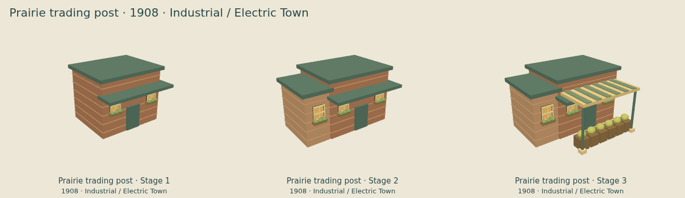

[Stage 1](../images/era-upgrades/industrial/shop/stage-1.png) · [Stage 2](../images/era-upgrades/industrial/shop/stage-2.png) · [Stage 3](../images/era-upgrades/industrial/shop/stage-3.png)

### Prospect town square

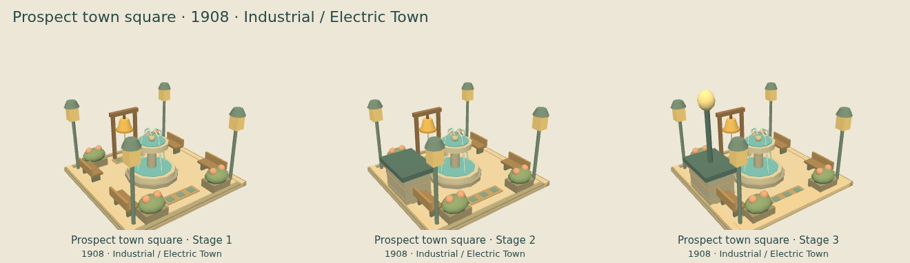

[Stage 1](../images/era-upgrades/industrial/square/stage-1.png) · [Stage 2](../images/era-upgrades/industrial/square/stage-2.png) · [Stage 3](../images/era-upgrades/industrial/square/stage-3.png)

### Prospect watermill

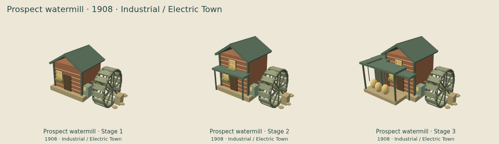

[Stage 1](../images/era-upgrades/industrial/watermill/stage-1.png) · [Stage 2](../images/era-upgrades/industrial/watermill/stage-2.png) · [Stage 3](../images/era-upgrades/industrial/watermill/stage-3.png)

### Fisherman’s Hut

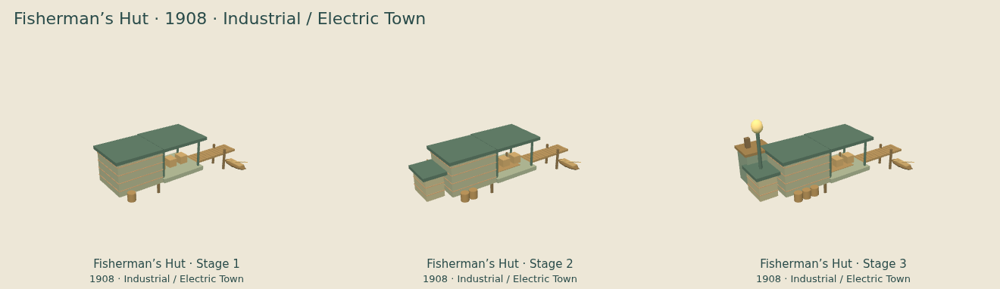

[Stage 1](../images/era-upgrades/industrial/fisherman/stage-1.png) · [Stage 2](../images/era-upgrades/industrial/fisherman/stage-2.png) · [Stage 3](../images/era-upgrades/industrial/fisherman/stage-3.png)

### Prospect blacksmith

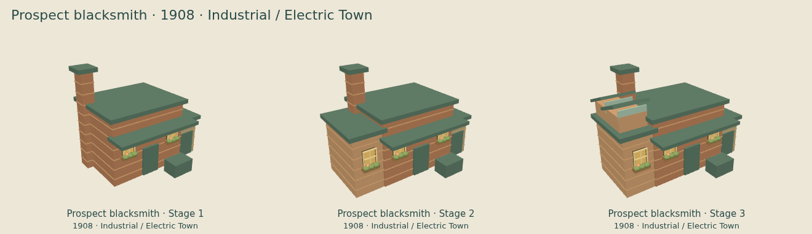

[Stage 1](../images/era-upgrades/industrial/blacksmith/stage-1.png) · [Stage 2](../images/era-upgrades/industrial/blacksmith/stage-2.png) · [Stage 3](../images/era-upgrades/industrial/blacksmith/stage-3.png)

### Prospect schoolhouse

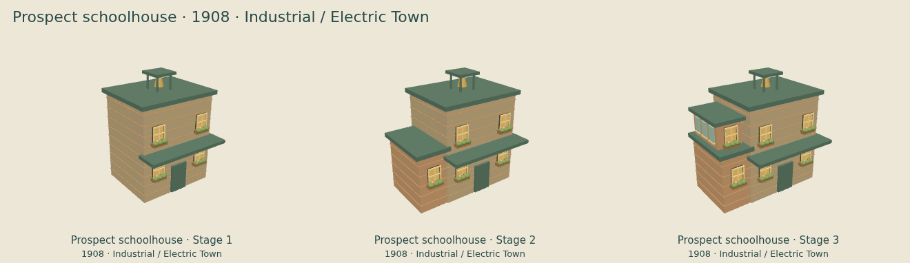

[Stage 1](../images/era-upgrades/industrial/school/stage-1.png) · [Stage 2](../images/era-upgrades/industrial/school/stage-2.png) · [Stage 3](../images/era-upgrades/industrial/school/stage-3.png)

### Doctor’s Office

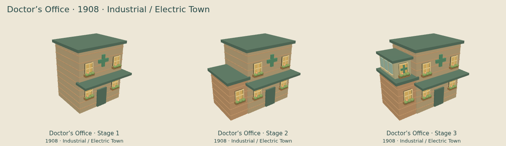

[Stage 1](../images/era-upgrades/industrial/doctor/stage-1.png) · [Stage 2](../images/era-upgrades/industrial/doctor/stage-2.png) · [Stage 3](../images/era-upgrades/industrial/doctor/stage-3.png)

### Prospect bridge

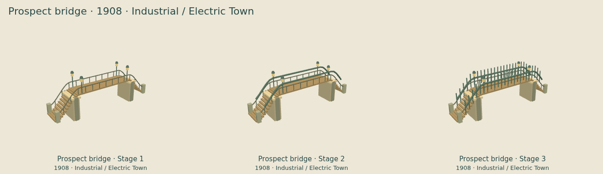

[Stage 1](../images/era-upgrades/industrial/bridge/stage-1.png) · [Stage 2](../images/era-upgrades/industrial/bridge/stage-2.png) · [Stage 3](../images/era-upgrades/industrial/bridge/stage-3.png)

### Steamboat landing

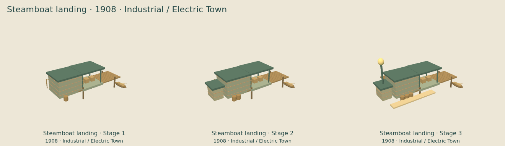

[Stage 1](../images/era-upgrades/industrial/riverPort/stage-1.png) · [Stage 2](../images/era-upgrades/industrial/riverPort/stage-2.png) · [Stage 3](../images/era-upgrades/industrial/riverPort/stage-3.png)

### Prospect railway station

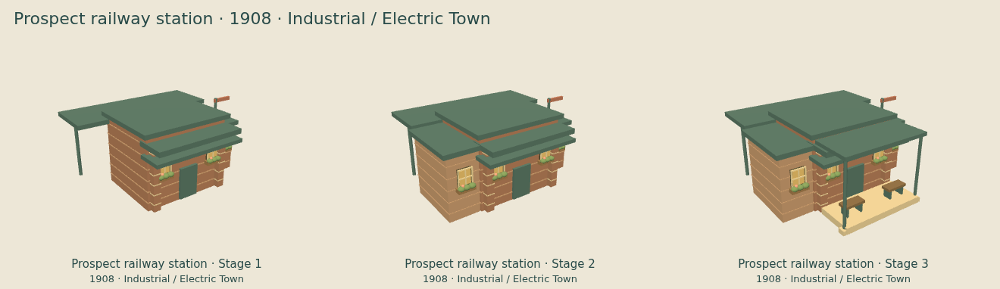

[Stage 1](../images/era-upgrades/industrial/railDepot/stage-1.png) · [Stage 2](../images/era-upgrades/industrial/railDepot/stage-2.png) · [Stage 3](../images/era-upgrades/industrial/railDepot/stage-3.png)

### Telegraph & Post Office

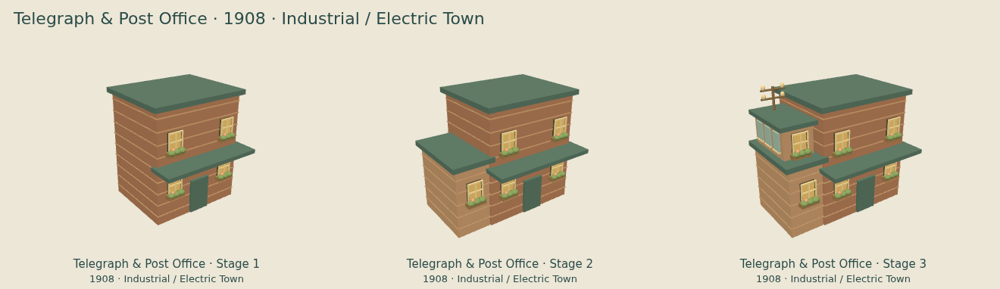

[Stage 1](../images/era-upgrades/industrial/post/stage-1.png) · [Stage 2](../images/era-upgrades/industrial/post/stage-2.png) · [Stage 3](../images/era-upgrades/industrial/post/stage-3.png)

### Freight warehouse

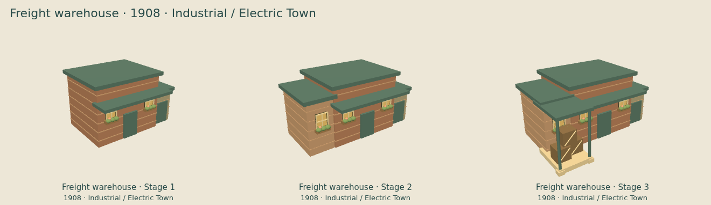

[Stage 1](../images/era-upgrades/industrial/warehouse/stage-1.png) · [Stage 2](../images/era-upgrades/industrial/warehouse/stage-2.png) · [Stage 3](../images/era-upgrades/industrial/warehouse/stage-3.png)

### Riverside boarding house

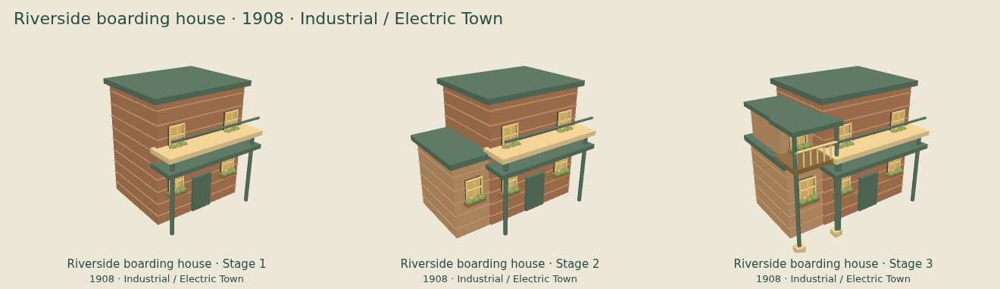

[Stage 1](../images/era-upgrades/industrial/hotel/stage-1.png) · [Stage 2](../images/era-upgrades/industrial/hotel/stage-2.png) · [Stage 3](../images/era-upgrades/industrial/hotel/stage-3.png)

### Riverside house

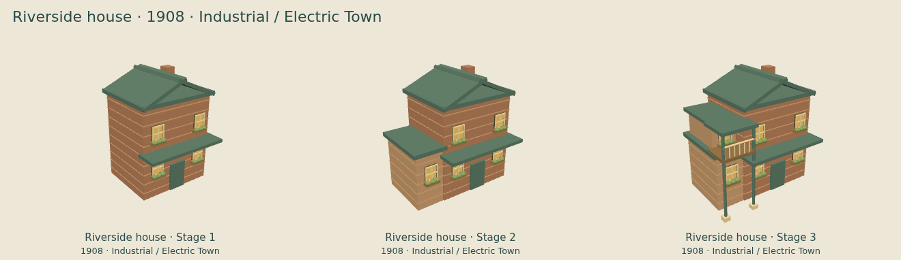

[Stage 1](../images/era-upgrades/industrial/home5/stage-1.png) · [Stage 2](../images/era-upgrades/industrial/home5/stage-2.png) · [Stage 3](../images/era-upgrades/industrial/home5/stage-3.png)

### East-bank market

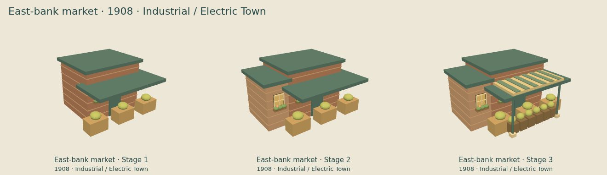

[Stage 1](../images/era-upgrades/industrial/market/stage-1.png) · [Stage 2](../images/era-upgrades/industrial/market/stage-2.png) · [Stage 3](../images/era-upgrades/industrial/market/stage-3.png)

### Willow house

[Stage 1](../images/era-upgrades/industrial/home2/stage-1.png) · [Stage 2](../images/era-upgrades/industrial/home2/stage-2.png) · [Stage 3](../images/era-upgrades/industrial/home2/stage-3.png)

### Sagebrush house

[Stage 1](../images/era-upgrades/industrial/home3/stage-1.png) · [Stage 2](../images/era-upgrades/industrial/home3/stage-2.png) · [Stage 3](../images/era-upgrades/industrial/home3/stage-3.png)

### Cottonwood house

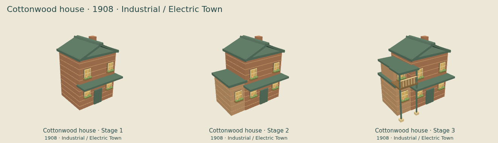

[Stage 1](../images/era-upgrades/industrial/home4/stage-1.png) · [Stage 2](../images/era-upgrades/industrial/home4/stage-2.png) · [Stage 3](../images/era-upgrades/industrial/home4/stage-3.png)

### Prairie well

[Stage 1](../images/era-upgrades/industrial/well2/stage-1.png) · [Stage 2](../images/era-upgrades/industrial/well2/stage-2.png) · [Stage 3](../images/era-upgrades/industrial/well2/stage-3.png)

### Sunrise farm

[Stage 1](../images/era-upgrades/industrial/farm2/stage-1.png) · [Stage 2](../images/era-upgrades/industrial/farm2/stage-2.png) · [Stage 3](../images/era-upgrades/industrial/farm2/stage-3.png)

### Meadow farm

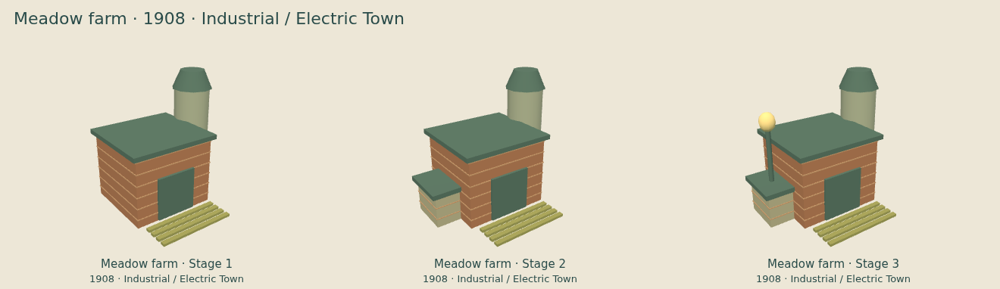

[Stage 1](../images/era-upgrades/industrial/farm3/stage-1.png) · [Stage 2](../images/era-upgrades/industrial/farm3/stage-2.png) · [Stage 3](../images/era-upgrades/industrial/farm3/stage-3.png)

## Mine progression

### Mine surface works

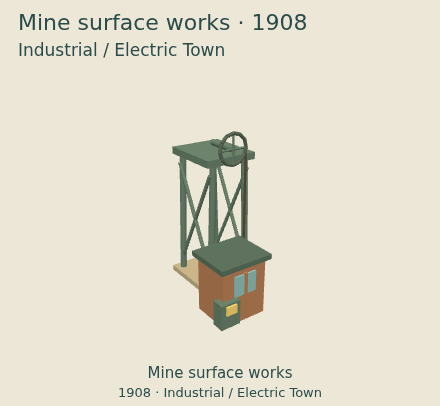

[Era upgrade](../images/era-upgrades/industrial/mine/stage-1.png)
