# 1932 · Motor Age

[Back to the era visual guide](Era-Visual-Guide.md)

The 1932 town uses cream walls, teal canopies, roadside service bays, a bus station and a diner. Gardens soften the growing streets. The well’s larger tank stands on a braced steel frame, with its lid seated on the vessel. The mine control house receives a projecting service canopy.

Each comparison reads from left to right, from the first completed stage to the final upgrade. The camera and scale stay fixed within each building row. Click the comparison for full resolution, or open an individual stage below it. The mine has one permanent surface upgrade per era.

These are actual game meshes rendered in a neutral review scene. Name labels sit outside the model so the architecture remains clear. World scenery, traffic, construction scaffolds and unfinished plots are excluded from these building comparisons.

## Building index

**New buildings in this era**

[Prospect motor garage](#building-garage) · [Valley bus station](#building-busdepot) · [Maple garden court](#building-gardencourt) · [The Sunrise diner](#building-diner) · [Prospect public park](#building-park)

**Existing buildings upgraded for this era**

[Old town well](#building-well) · [Clover farm](#building-farm) · [Juniper house](#building-home) · [The Golden Hour](#building-saloon) · [Dusty Spur stables](#building-stable) · [Sheriff’s office](#building-sheriff) · [The Frontier Museum](#building-museum) · [Frontier armory](#building-armory) · [Prospect bank](#building-bank) · [Prairie trading post](#building-shop) · [Prospect town square](#building-square) · [Prospect watermill](#building-watermill) · [Fisherman’s Hut](#building-fisherman) · [Prospect blacksmith](#building-blacksmith) · [Prospect schoolhouse](#building-school) · [Doctor’s Office](#building-doctor) · [Prospect bridge](#building-bridge) · [Steamboat landing](#building-riverport) · [Prospect railway station](#building-raildepot) · [Telegraph & Post Office](#building-post) · [Freight warehouse](#building-warehouse) · [Riverside boarding house](#building-hotel) · [Riverside house](#building-home5) · [East-bank market](#building-market) · [Prospect power house](#building-powerhouse) · [Prospect fire station](#building-firestation) · [Lantern row](#building-rowhouses) · [Riverside light mill](#building-mill) · [Prospect city hall](#building-cityhall) · [Cedar court apartments](#building-apartments) · [Valley food hall](#building-supermarket) · [Prospect water plant](#building-waterplant) · [Willow horse field](#building-horsefield) · [Willow house](#building-home2) · [Sagebrush house](#building-home3) · [Cottonwood house](#building-home4) · [Prairie well](#building-well2) · [Sunrise farm](#building-farm2) · [Meadow farm](#building-farm3)

**Mine progression**

[Mine surface works](#building-mine)

## New buildings in this era

### Prospect motor garage

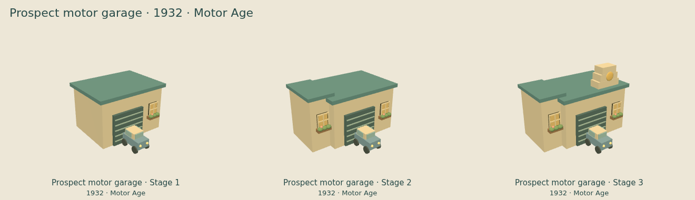

[Stage 1](../images/era-upgrades/motor-age/garage/stage-1.png) · [Stage 2](../images/era-upgrades/motor-age/garage/stage-2.png) · [Stage 3](../images/era-upgrades/motor-age/garage/stage-3.png)

### Valley bus station

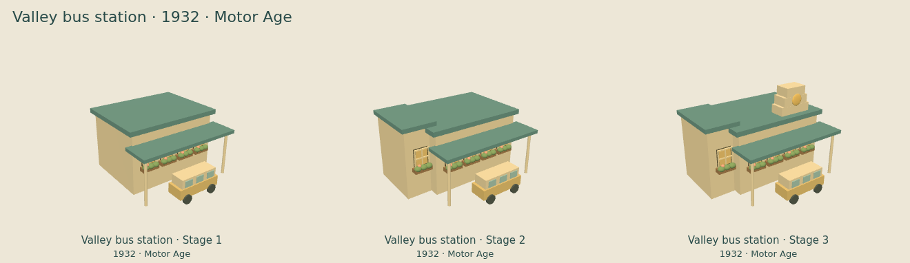

[Stage 1](../images/era-upgrades/motor-age/busDepot/stage-1.png) · [Stage 2](../images/era-upgrades/motor-age/busDepot/stage-2.png) · [Stage 3](../images/era-upgrades/motor-age/busDepot/stage-3.png)

### Maple garden court

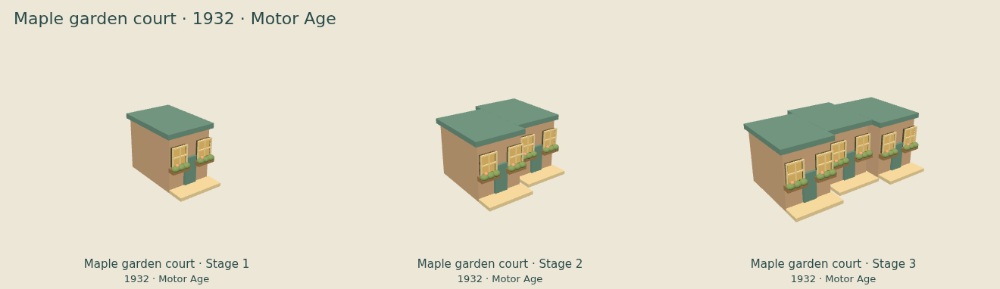

[Stage 1](../images/era-upgrades/motor-age/gardenCourt/stage-1.png) · [Stage 2](../images/era-upgrades/motor-age/gardenCourt/stage-2.png) · [Stage 3](../images/era-upgrades/motor-age/gardenCourt/stage-3.png)

### The Sunrise diner

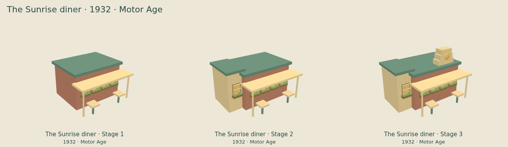

[Stage 1](../images/era-upgrades/motor-age/diner/stage-1.png) · [Stage 2](../images/era-upgrades/motor-age/diner/stage-2.png) · [Stage 3](../images/era-upgrades/motor-age/diner/stage-3.png)

### Prospect public park

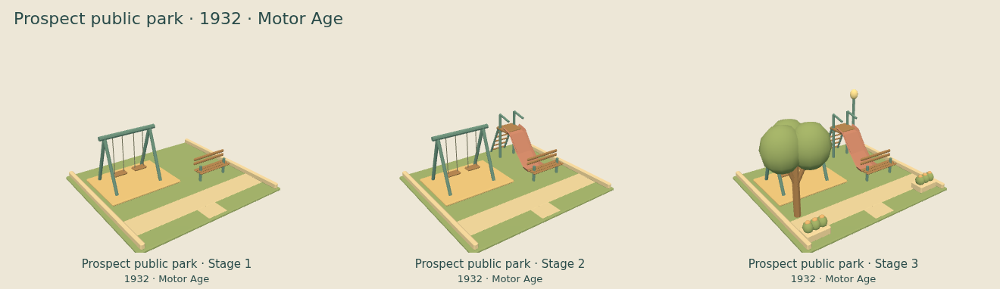

[Stage 1](../images/era-upgrades/motor-age/park/stage-1.png) · [Stage 2](../images/era-upgrades/motor-age/park/stage-2.png) · [Stage 3](../images/era-upgrades/motor-age/park/stage-3.png)

## Existing buildings upgraded for this era

### Old town well

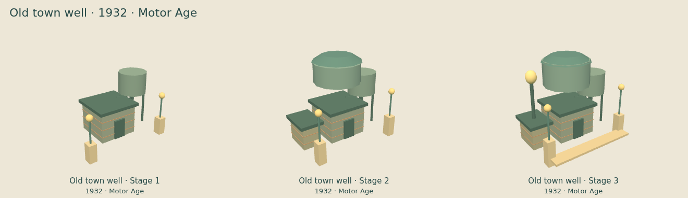

[Stage 1](../images/era-upgrades/motor-age/well/stage-1.png) · [Stage 2](../images/era-upgrades/motor-age/well/stage-2.png) · [Stage 3](../images/era-upgrades/motor-age/well/stage-3.png)

### Clover farm

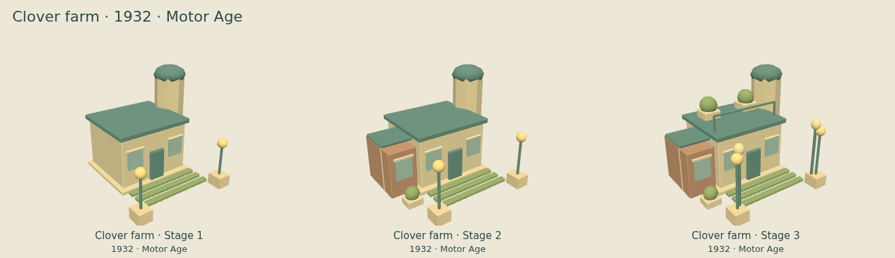

[Stage 1](../images/era-upgrades/motor-age/farm/stage-1.png) · [Stage 2](../images/era-upgrades/motor-age/farm/stage-2.png) · [Stage 3](../images/era-upgrades/motor-age/farm/stage-3.png)

### Juniper house

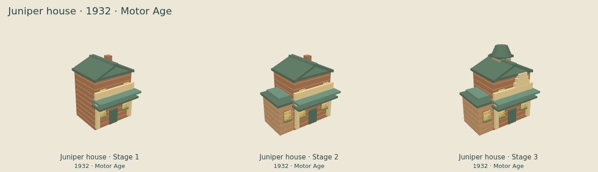

[Stage 1](../images/era-upgrades/motor-age/home/stage-1.png) · [Stage 2](../images/era-upgrades/motor-age/home/stage-2.png) · [Stage 3](../images/era-upgrades/motor-age/home/stage-3.png)

### The Golden Hour

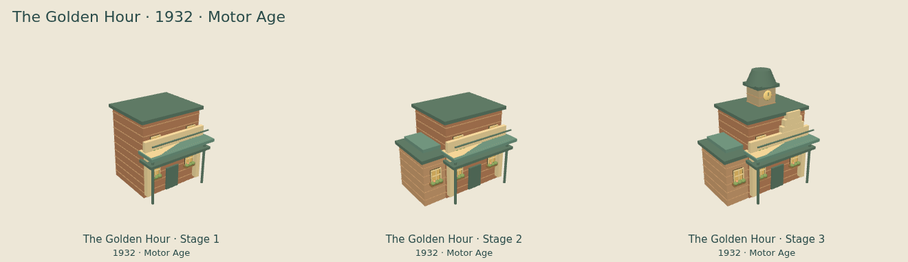

[Stage 1](../images/era-upgrades/motor-age/saloon/stage-1.png) · [Stage 2](../images/era-upgrades/motor-age/saloon/stage-2.png) · [Stage 3](../images/era-upgrades/motor-age/saloon/stage-3.png)

### Dusty Spur stables

[Stage 1](../images/era-upgrades/motor-age/stable/stage-1.png) · [Stage 2](../images/era-upgrades/motor-age/stable/stage-2.png) · [Stage 3](../images/era-upgrades/motor-age/stable/stage-3.png)

### Sheriff’s office

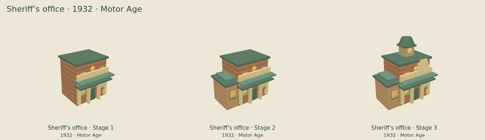

[Stage 1](../images/era-upgrades/motor-age/sheriff/stage-1.png) · [Stage 2](../images/era-upgrades/motor-age/sheriff/stage-2.png) · [Stage 3](../images/era-upgrades/motor-age/sheriff/stage-3.png)

### The Frontier Museum

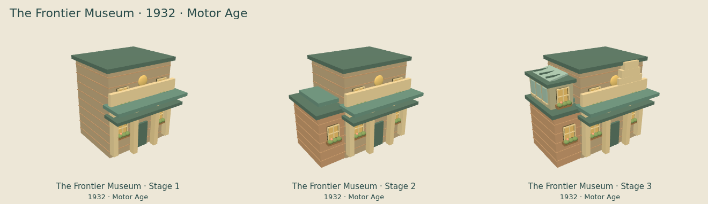

[Stage 1](../images/era-upgrades/motor-age/museum/stage-1.png) · [Stage 2](../images/era-upgrades/motor-age/museum/stage-2.png) · [Stage 3](../images/era-upgrades/motor-age/museum/stage-3.png)

### Frontier armory

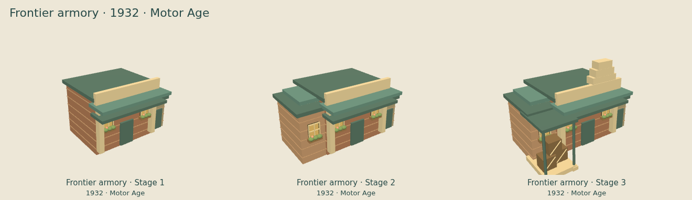

[Stage 1](../images/era-upgrades/motor-age/armory/stage-1.png) · [Stage 2](../images/era-upgrades/motor-age/armory/stage-2.png) · [Stage 3](../images/era-upgrades/motor-age/armory/stage-3.png)

### Prospect bank

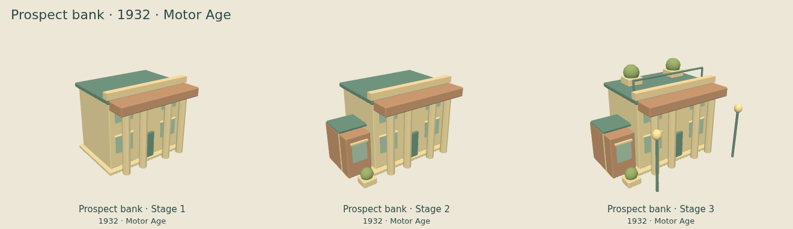

[Stage 1](../images/era-upgrades/motor-age/bank/stage-1.png) · [Stage 2](../images/era-upgrades/motor-age/bank/stage-2.png) · [Stage 3](../images/era-upgrades/motor-age/bank/stage-3.png)

### Prairie trading post

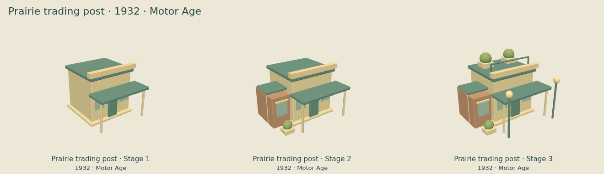

[Stage 1](../images/era-upgrades/motor-age/shop/stage-1.png) · [Stage 2](../images/era-upgrades/motor-age/shop/stage-2.png) · [Stage 3](../images/era-upgrades/motor-age/shop/stage-3.png)

### Prospect town square

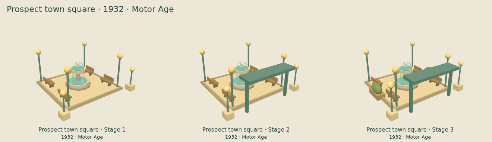

[Stage 1](../images/era-upgrades/motor-age/square/stage-1.png) · [Stage 2](../images/era-upgrades/motor-age/square/stage-2.png) · [Stage 3](../images/era-upgrades/motor-age/square/stage-3.png)

### Prospect watermill

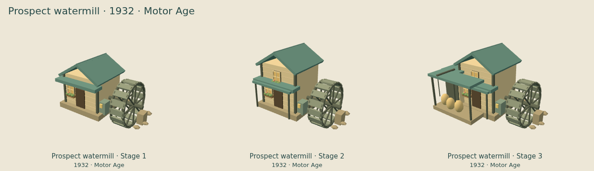

[Stage 1](../images/era-upgrades/motor-age/watermill/stage-1.png) · [Stage 2](../images/era-upgrades/motor-age/watermill/stage-2.png) · [Stage 3](../images/era-upgrades/motor-age/watermill/stage-3.png)

### Fisherman’s Hut

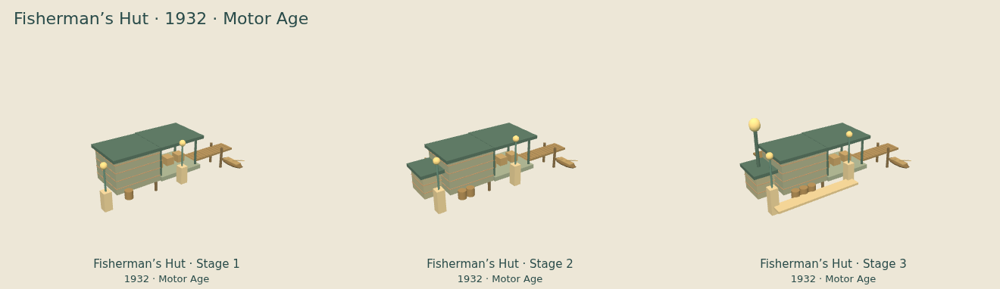

[Stage 1](../images/era-upgrades/motor-age/fisherman/stage-1.png) · [Stage 2](../images/era-upgrades/motor-age/fisherman/stage-2.png) · [Stage 3](../images/era-upgrades/motor-age/fisherman/stage-3.png)

### Prospect blacksmith

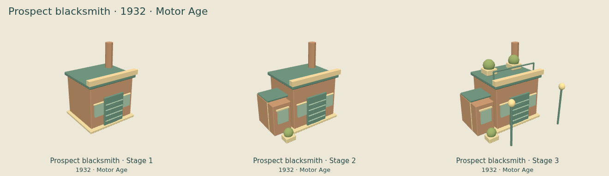

[Stage 1](../images/era-upgrades/motor-age/blacksmith/stage-1.png) · [Stage 2](../images/era-upgrades/motor-age/blacksmith/stage-2.png) · [Stage 3](../images/era-upgrades/motor-age/blacksmith/stage-3.png)

### Prospect schoolhouse

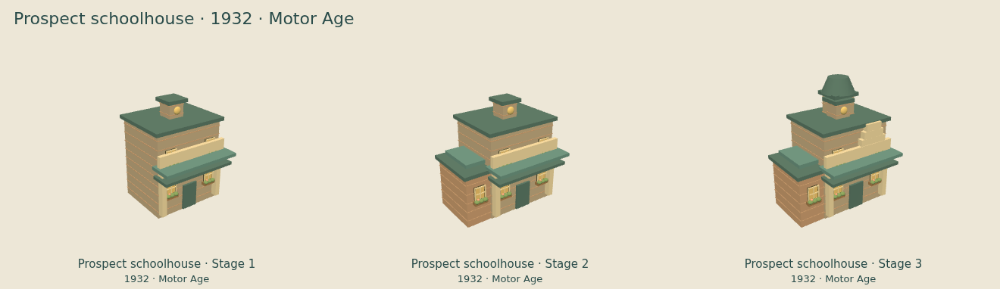

[Stage 1](../images/era-upgrades/motor-age/school/stage-1.png) · [Stage 2](../images/era-upgrades/motor-age/school/stage-2.png) · [Stage 3](../images/era-upgrades/motor-age/school/stage-3.png)

### Doctor’s Office

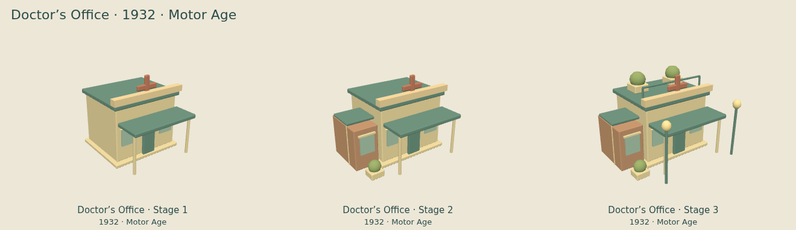

[Stage 1](../images/era-upgrades/motor-age/doctor/stage-1.png) · [Stage 2](../images/era-upgrades/motor-age/doctor/stage-2.png) · [Stage 3](../images/era-upgrades/motor-age/doctor/stage-3.png)

### Prospect bridge

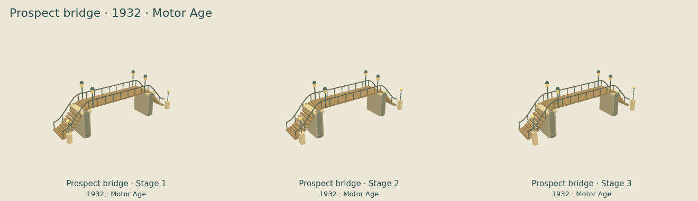

[Stage 1](../images/era-upgrades/motor-age/bridge/stage-1.png) · [Stage 2](../images/era-upgrades/motor-age/bridge/stage-2.png) · [Stage 3](../images/era-upgrades/motor-age/bridge/stage-3.png)

### Steamboat landing

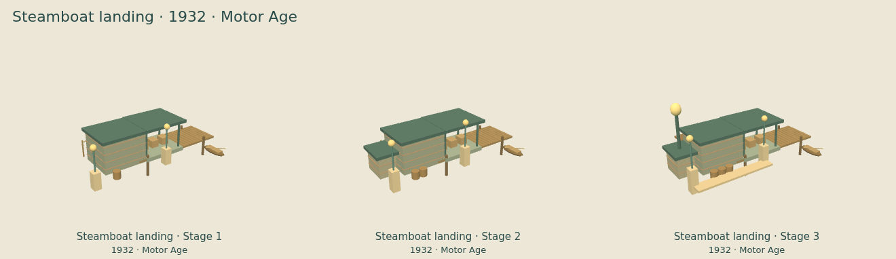

[Stage 1](../images/era-upgrades/motor-age/riverPort/stage-1.png) · [Stage 2](../images/era-upgrades/motor-age/riverPort/stage-2.png) · [Stage 3](../images/era-upgrades/motor-age/riverPort/stage-3.png)

### Prospect railway station

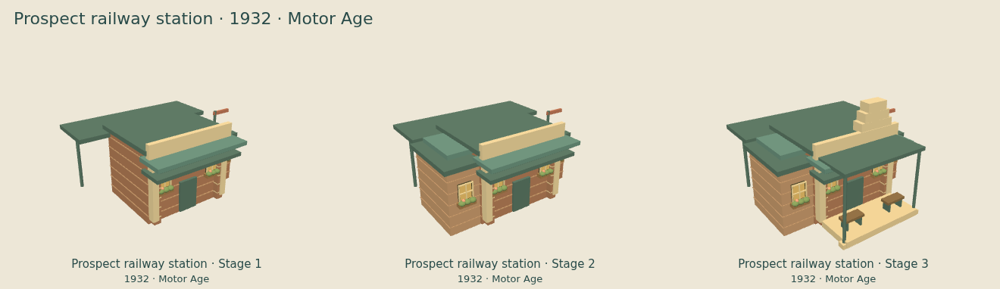

[Stage 1](../images/era-upgrades/motor-age/railDepot/stage-1.png) · [Stage 2](../images/era-upgrades/motor-age/railDepot/stage-2.png) · [Stage 3](../images/era-upgrades/motor-age/railDepot/stage-3.png)

### Telegraph & Post Office

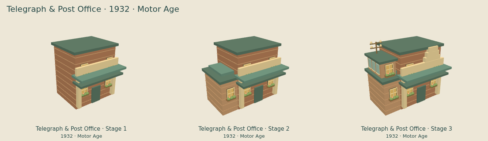

[Stage 1](../images/era-upgrades/motor-age/post/stage-1.png) · [Stage 2](../images/era-upgrades/motor-age/post/stage-2.png) · [Stage 3](../images/era-upgrades/motor-age/post/stage-3.png)

### Freight warehouse

[Stage 1](../images/era-upgrades/motor-age/warehouse/stage-1.png) · [Stage 2](../images/era-upgrades/motor-age/warehouse/stage-2.png) · [Stage 3](../images/era-upgrades/motor-age/warehouse/stage-3.png)

### Riverside boarding house

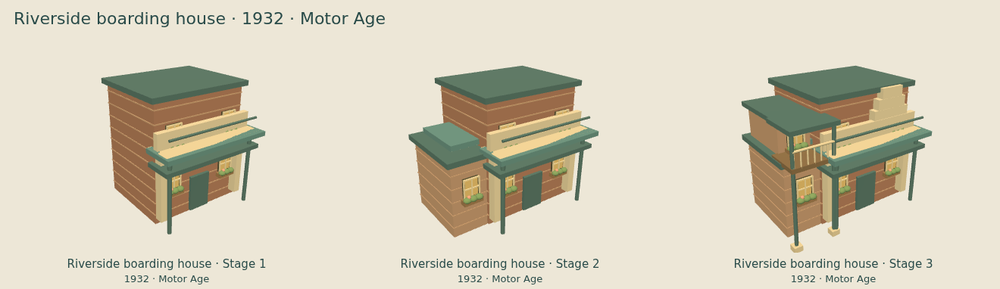

[Stage 1](../images/era-upgrades/motor-age/hotel/stage-1.png) · [Stage 2](../images/era-upgrades/motor-age/hotel/stage-2.png) · [Stage 3](../images/era-upgrades/motor-age/hotel/stage-3.png)

### Riverside house

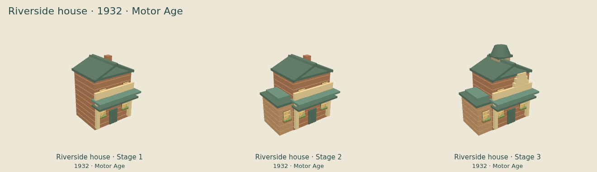

[Stage 1](../images/era-upgrades/motor-age/home5/stage-1.png) · [Stage 2](../images/era-upgrades/motor-age/home5/stage-2.png) · [Stage 3](../images/era-upgrades/motor-age/home5/stage-3.png)

### East-bank market

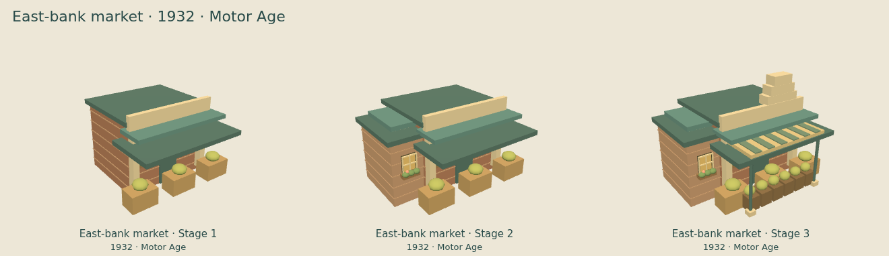

[Stage 1](../images/era-upgrades/motor-age/market/stage-1.png) · [Stage 2](../images/era-upgrades/motor-age/market/stage-2.png) · [Stage 3](../images/era-upgrades/motor-age/market/stage-3.png)

### Prospect power house

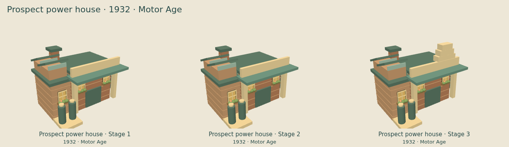

[Stage 1](../images/era-upgrades/motor-age/powerHouse/stage-1.png) · [Stage 2](../images/era-upgrades/motor-age/powerHouse/stage-2.png) · [Stage 3](../images/era-upgrades/motor-age/powerHouse/stage-3.png)

### Prospect fire station

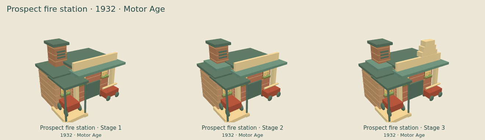

[Stage 1](../images/era-upgrades/motor-age/fireStation/stage-1.png) · [Stage 2](../images/era-upgrades/motor-age/fireStation/stage-2.png) · [Stage 3](../images/era-upgrades/motor-age/fireStation/stage-3.png)

### Lantern row

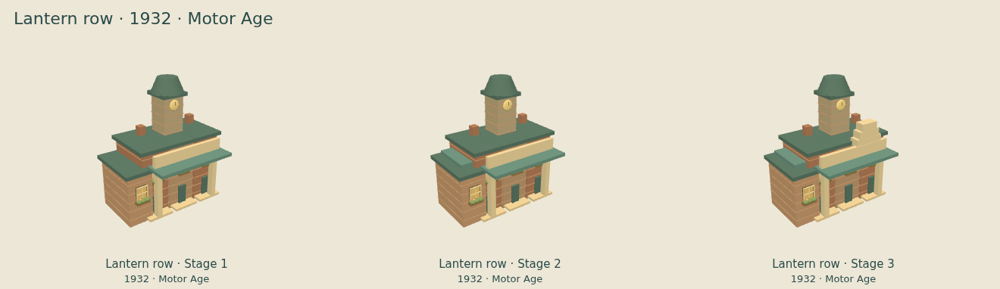

[Stage 1](../images/era-upgrades/motor-age/rowHouses/stage-1.png) · [Stage 2](../images/era-upgrades/motor-age/rowHouses/stage-2.png) · [Stage 3](../images/era-upgrades/motor-age/rowHouses/stage-3.png)

### Riverside light mill

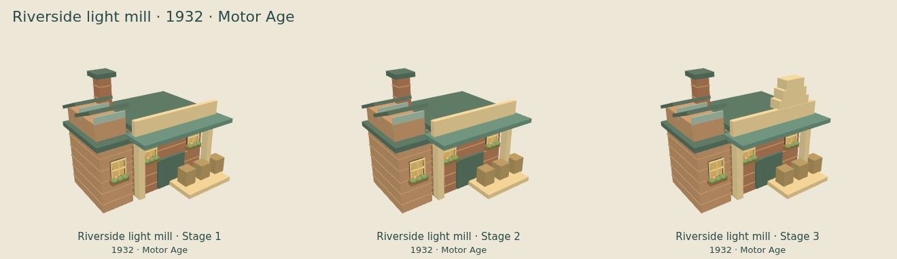

[Stage 1](../images/era-upgrades/motor-age/mill/stage-1.png) · [Stage 2](../images/era-upgrades/motor-age/mill/stage-2.png) · [Stage 3](../images/era-upgrades/motor-age/mill/stage-3.png)

### Prospect city hall

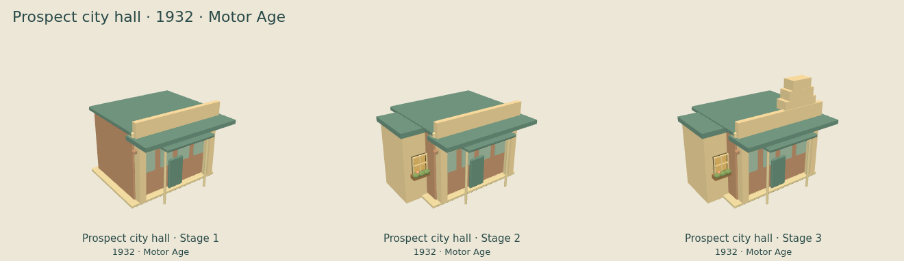

[Stage 1](../images/era-upgrades/motor-age/cityHall/stage-1.png) · [Stage 2](../images/era-upgrades/motor-age/cityHall/stage-2.png) · [Stage 3](../images/era-upgrades/motor-age/cityHall/stage-3.png)

### Cedar court apartments

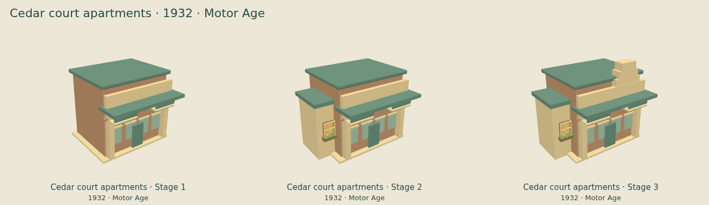

[Stage 1](../images/era-upgrades/motor-age/apartments/stage-1.png) · [Stage 2](../images/era-upgrades/motor-age/apartments/stage-2.png) · [Stage 3](../images/era-upgrades/motor-age/apartments/stage-3.png)

### Valley food hall

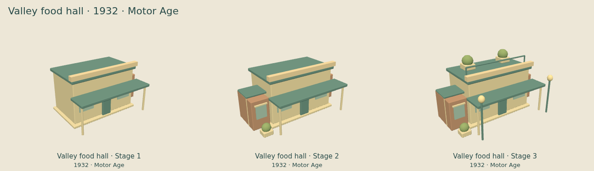

[Stage 1](../images/era-upgrades/motor-age/supermarket/stage-1.png) · [Stage 2](../images/era-upgrades/motor-age/supermarket/stage-2.png) · [Stage 3](../images/era-upgrades/motor-age/supermarket/stage-3.png)

### Prospect water plant

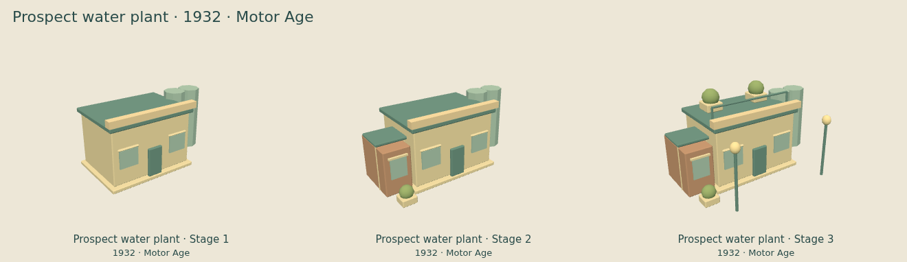

[Stage 1](../images/era-upgrades/motor-age/waterPlant/stage-1.png) · [Stage 2](../images/era-upgrades/motor-age/waterPlant/stage-2.png) · [Stage 3](../images/era-upgrades/motor-age/waterPlant/stage-3.png)

### Willow horse field

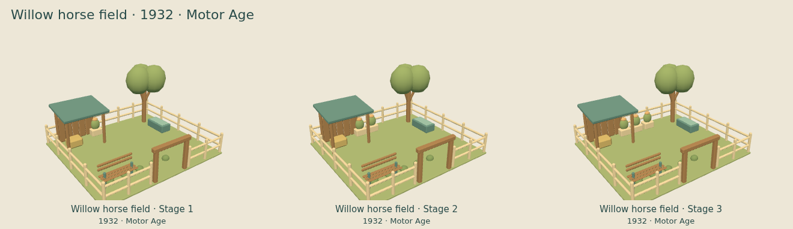

[Stage 1](../images/era-upgrades/motor-age/horseField/stage-1.png) · [Stage 2](../images/era-upgrades/motor-age/horseField/stage-2.png) · [Stage 3](../images/era-upgrades/motor-age/horseField/stage-3.png)

### Willow house

[Stage 1](../images/era-upgrades/motor-age/home2/stage-1.png) · [Stage 2](../images/era-upgrades/motor-age/home2/stage-2.png) · [Stage 3](../images/era-upgrades/motor-age/home2/stage-3.png)

### Sagebrush house

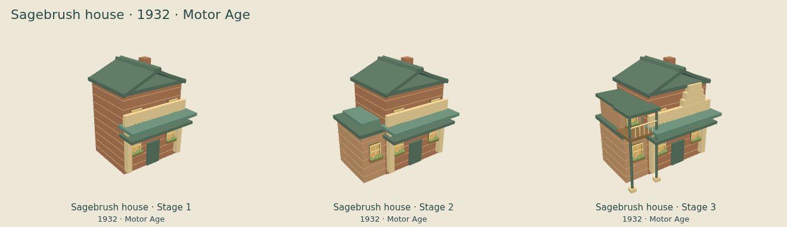

[Stage 1](../images/era-upgrades/motor-age/home3/stage-1.png) · [Stage 2](../images/era-upgrades/motor-age/home3/stage-2.png) · [Stage 3](../images/era-upgrades/motor-age/home3/stage-3.png)

### Cottonwood house

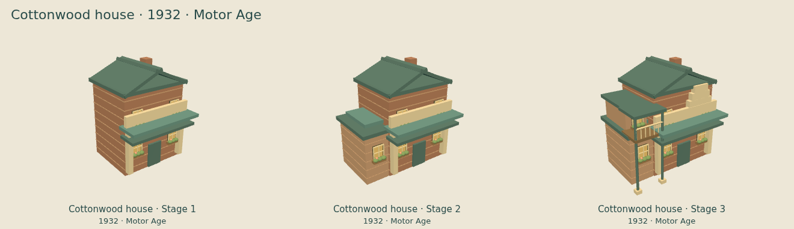

[Stage 1](../images/era-upgrades/motor-age/home4/stage-1.png) · [Stage 2](../images/era-upgrades/motor-age/home4/stage-2.png) · [Stage 3](../images/era-upgrades/motor-age/home4/stage-3.png)

### Prairie well

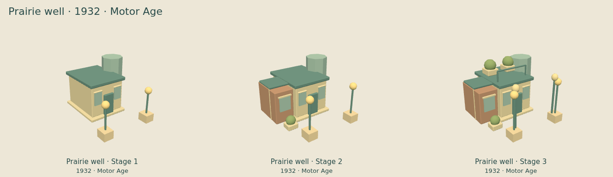

[Stage 1](../images/era-upgrades/motor-age/well2/stage-1.png) · [Stage 2](../images/era-upgrades/motor-age/well2/stage-2.png) · [Stage 3](../images/era-upgrades/motor-age/well2/stage-3.png)

### Sunrise farm

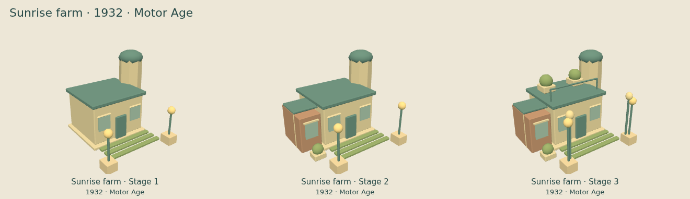

[Stage 1](../images/era-upgrades/motor-age/farm2/stage-1.png) · [Stage 2](../images/era-upgrades/motor-age/farm2/stage-2.png) · [Stage 3](../images/era-upgrades/motor-age/farm2/stage-3.png)

### Meadow farm

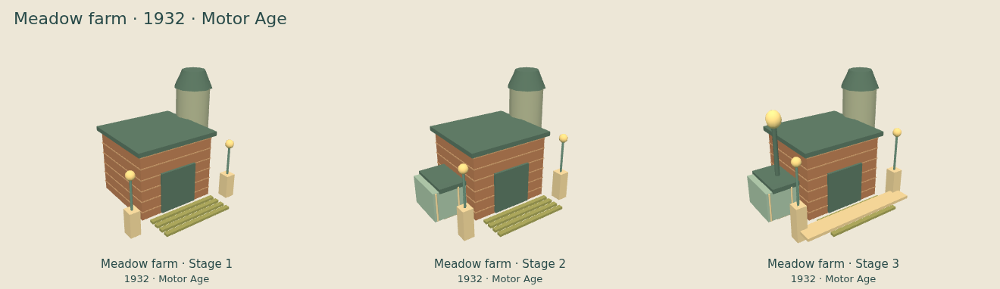

[Stage 1](../images/era-upgrades/motor-age/farm3/stage-1.png) · [Stage 2](../images/era-upgrades/motor-age/farm3/stage-2.png) · [Stage 3](../images/era-upgrades/motor-age/farm3/stage-3.png)

## Mine progression

### Mine surface works

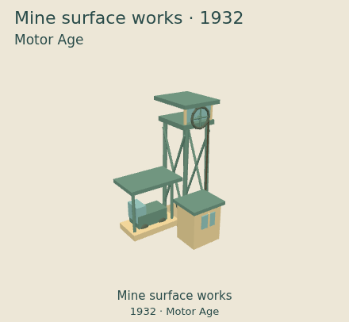

[Era upgrade](../images/era-upgrades/motor-age/mine/stage-1.png)
