# 1920 · Post-war Rebuilding

[Back to the era visual guide](Era-Visual-Guide.md)

This era is 1920: rebuilding after the First World War. Pale masonry, brick courtyard housing, civic pilasters and modest public facilities replace the earlier industrial forms. The mine gains a sheltered winding deck. These are not the later 1950s buildings.

Each comparison reads from left to right, from the first completed stage to the final upgrade. The camera and scale stay fixed within each building row. Click the comparison for full resolution, or open an individual stage below it. The mine has one permanent surface upgrade per era.

These are actual game meshes rendered in a neutral review scene. Name labels sit outside the model so the architecture remains clear. World scenery, traffic, construction scaffolds and unfinished plots are excluded from these building comparisons.

## Buildings

### Old town well

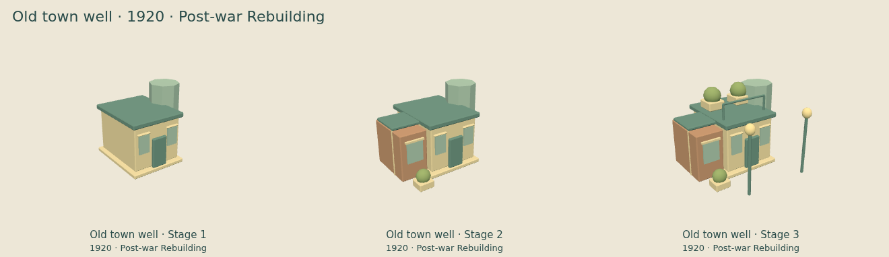

[Stage 1](../images/era-upgrades/post-war/well/stage-1.png) · [Stage 2](../images/era-upgrades/post-war/well/stage-2.png) · [Stage 3](../images/era-upgrades/post-war/well/stage-3.png)

### Clover farm

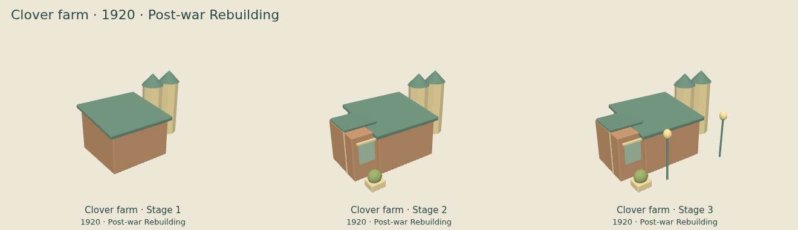

[Stage 1](../images/era-upgrades/post-war/farm/stage-1.png) · [Stage 2](../images/era-upgrades/post-war/farm/stage-2.png) · [Stage 3](../images/era-upgrades/post-war/farm/stage-3.png)

### Juniper house

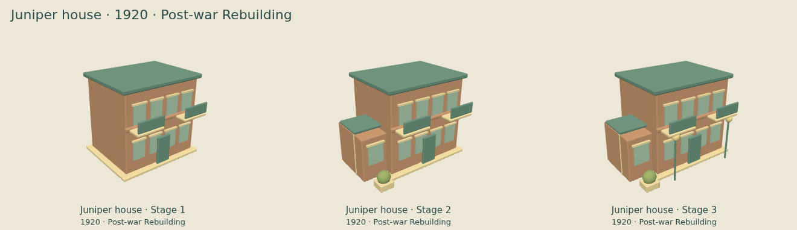

[Stage 1](../images/era-upgrades/post-war/home/stage-1.png) · [Stage 2](../images/era-upgrades/post-war/home/stage-2.png) · [Stage 3](../images/era-upgrades/post-war/home/stage-3.png)

### The Golden Hour

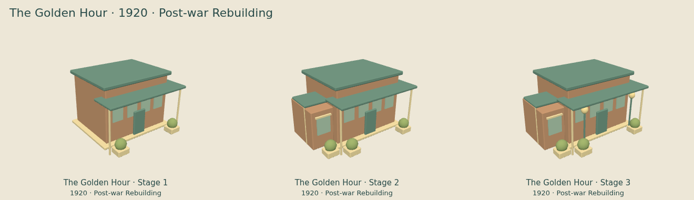

[Stage 1](../images/era-upgrades/post-war/saloon/stage-1.png) · [Stage 2](../images/era-upgrades/post-war/saloon/stage-2.png) · [Stage 3](../images/era-upgrades/post-war/saloon/stage-3.png)

### Dusty Spur stables

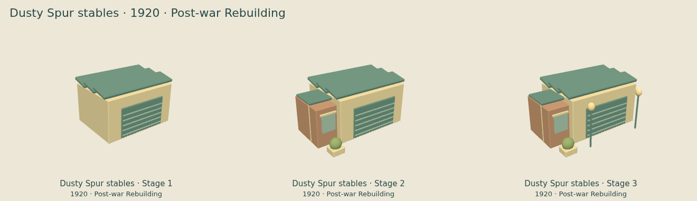

[Stage 1](../images/era-upgrades/post-war/stable/stage-1.png) · [Stage 2](../images/era-upgrades/post-war/stable/stage-2.png) · [Stage 3](../images/era-upgrades/post-war/stable/stage-3.png)

### Sheriff’s office

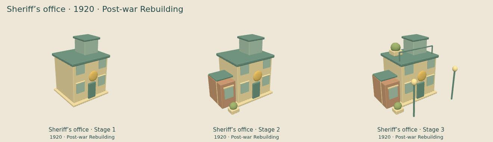

[Stage 1](../images/era-upgrades/post-war/sheriff/stage-1.png) · [Stage 2](../images/era-upgrades/post-war/sheriff/stage-2.png) · [Stage 3](../images/era-upgrades/post-war/sheriff/stage-3.png)

### The Frontier Museum

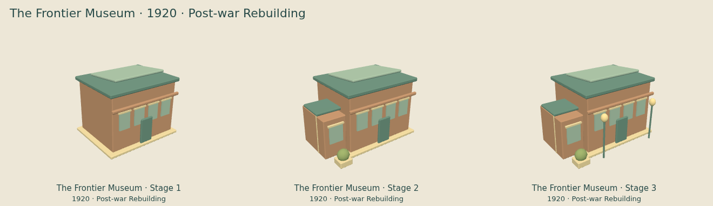

[Stage 1](../images/era-upgrades/post-war/museum/stage-1.png) · [Stage 2](../images/era-upgrades/post-war/museum/stage-2.png) · [Stage 3](../images/era-upgrades/post-war/museum/stage-3.png)

### Frontier armory

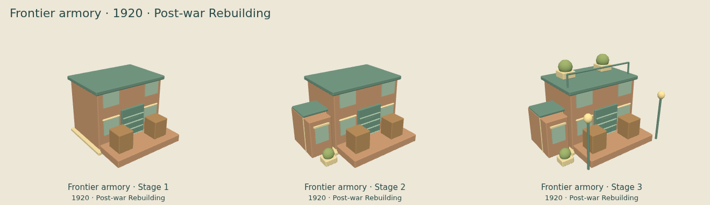

[Stage 1](../images/era-upgrades/post-war/armory/stage-1.png) · [Stage 2](../images/era-upgrades/post-war/armory/stage-2.png) · [Stage 3](../images/era-upgrades/post-war/armory/stage-3.png)

### Prospect bank

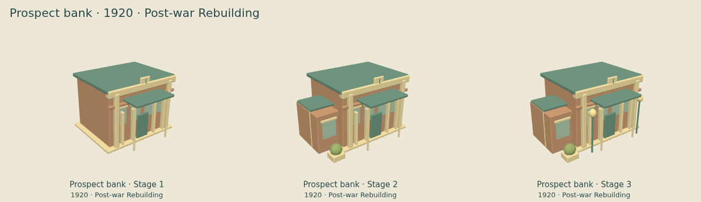

[Stage 1](../images/era-upgrades/post-war/bank/stage-1.png) · [Stage 2](../images/era-upgrades/post-war/bank/stage-2.png) · [Stage 3](../images/era-upgrades/post-war/bank/stage-3.png)

### Prairie trading post

[Stage 1](../images/era-upgrades/post-war/shop/stage-1.png) · [Stage 2](../images/era-upgrades/post-war/shop/stage-2.png) · [Stage 3](../images/era-upgrades/post-war/shop/stage-3.png)

### Prospect town square

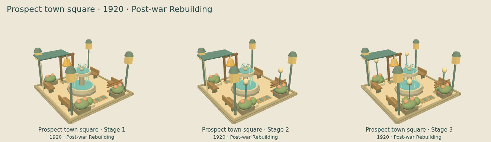

[Stage 1](../images/era-upgrades/post-war/square/stage-1.png) · [Stage 2](../images/era-upgrades/post-war/square/stage-2.png) · [Stage 3](../images/era-upgrades/post-war/square/stage-3.png)

### Prospect watermill

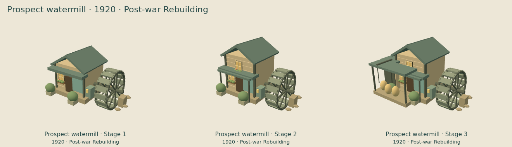

[Stage 1](../images/era-upgrades/post-war/watermill/stage-1.png) · [Stage 2](../images/era-upgrades/post-war/watermill/stage-2.png) · [Stage 3](../images/era-upgrades/post-war/watermill/stage-3.png)

### Fisherman’s Hut

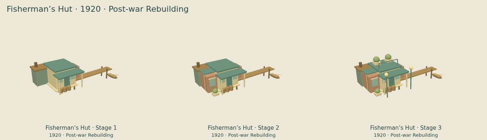

[Stage 1](../images/era-upgrades/post-war/fisherman/stage-1.png) · [Stage 2](../images/era-upgrades/post-war/fisherman/stage-2.png) · [Stage 3](../images/era-upgrades/post-war/fisherman/stage-3.png)

### Prospect blacksmith

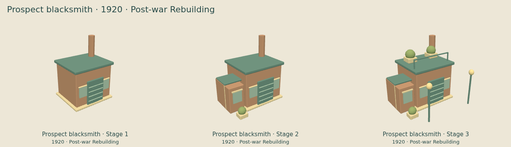

[Stage 1](../images/era-upgrades/post-war/blacksmith/stage-1.png) · [Stage 2](../images/era-upgrades/post-war/blacksmith/stage-2.png) · [Stage 3](../images/era-upgrades/post-war/blacksmith/stage-3.png)

### Prospect schoolhouse

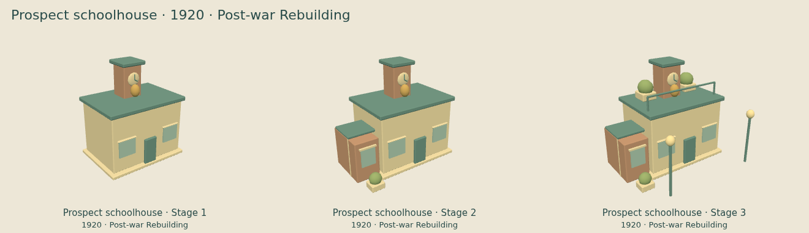

[Stage 1](../images/era-upgrades/post-war/school/stage-1.png) · [Stage 2](../images/era-upgrades/post-war/school/stage-2.png) · [Stage 3](../images/era-upgrades/post-war/school/stage-3.png)

### Doctor’s Office

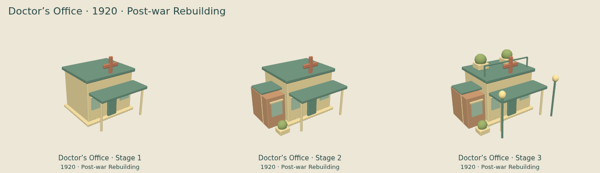

[Stage 1](../images/era-upgrades/post-war/doctor/stage-1.png) · [Stage 2](../images/era-upgrades/post-war/doctor/stage-2.png) · [Stage 3](../images/era-upgrades/post-war/doctor/stage-3.png)

### Prospect bridge

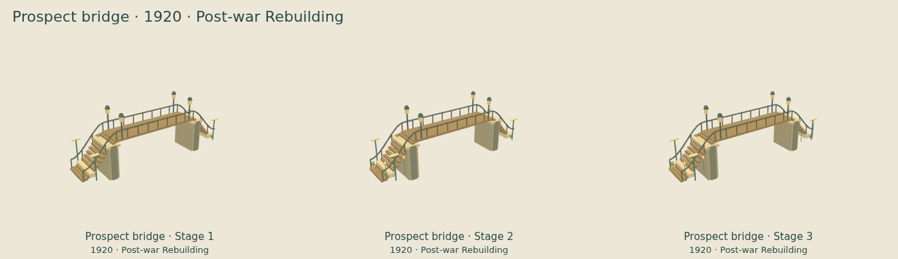

[Stage 1](../images/era-upgrades/post-war/bridge/stage-1.png) · [Stage 2](../images/era-upgrades/post-war/bridge/stage-2.png) · [Stage 3](../images/era-upgrades/post-war/bridge/stage-3.png)

### Steamboat landing

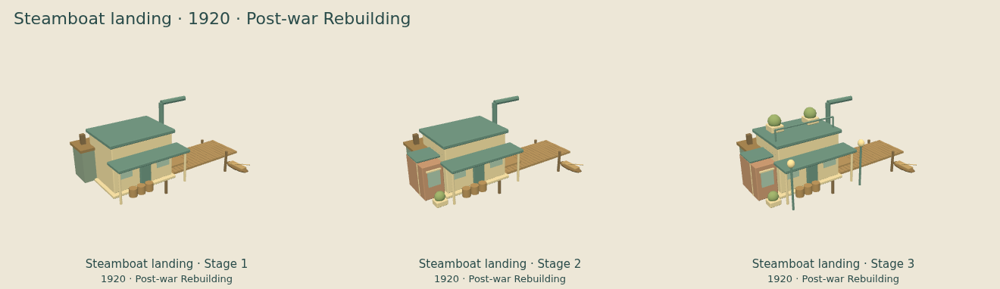

[Stage 1](../images/era-upgrades/post-war/riverPort/stage-1.png) · [Stage 2](../images/era-upgrades/post-war/riverPort/stage-2.png) · [Stage 3](../images/era-upgrades/post-war/riverPort/stage-3.png)

### Prospect railway station

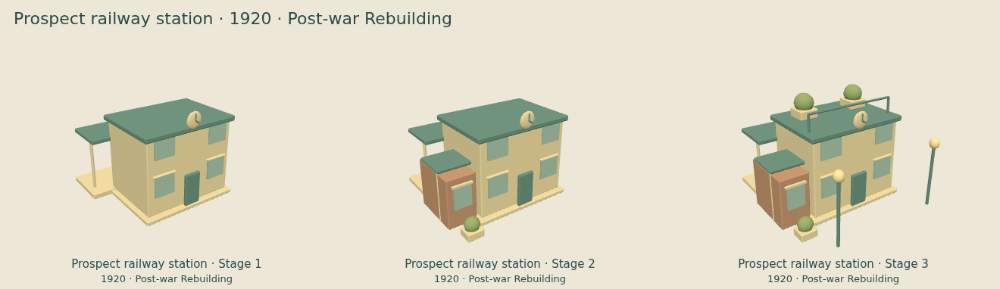

[Stage 1](../images/era-upgrades/post-war/railDepot/stage-1.png) · [Stage 2](../images/era-upgrades/post-war/railDepot/stage-2.png) · [Stage 3](../images/era-upgrades/post-war/railDepot/stage-3.png)

### Telegraph & Post Office

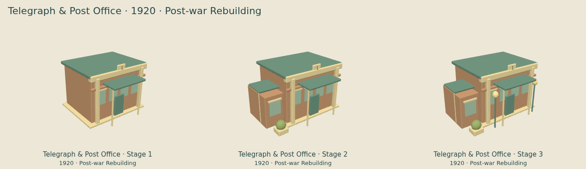

[Stage 1](../images/era-upgrades/post-war/post/stage-1.png) · [Stage 2](../images/era-upgrades/post-war/post/stage-2.png) · [Stage 3](../images/era-upgrades/post-war/post/stage-3.png)

### Freight warehouse

[Stage 1](../images/era-upgrades/post-war/warehouse/stage-1.png) · [Stage 2](../images/era-upgrades/post-war/warehouse/stage-2.png) · [Stage 3](../images/era-upgrades/post-war/warehouse/stage-3.png)

### Riverside boarding house

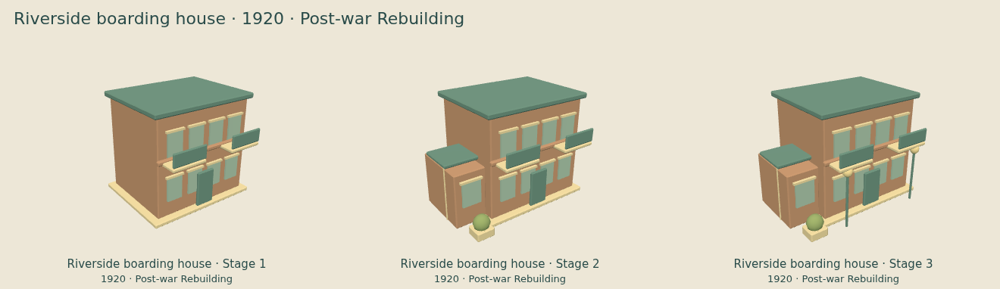

[Stage 1](../images/era-upgrades/post-war/hotel/stage-1.png) · [Stage 2](../images/era-upgrades/post-war/hotel/stage-2.png) · [Stage 3](../images/era-upgrades/post-war/hotel/stage-3.png)

### Riverside house

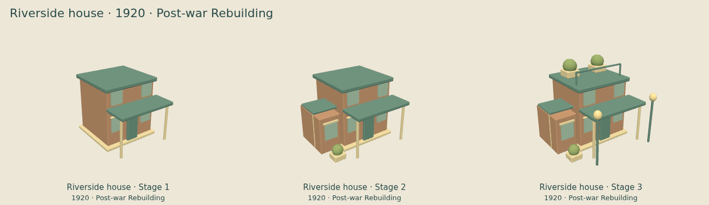

[Stage 1](../images/era-upgrades/post-war/home5/stage-1.png) · [Stage 2](../images/era-upgrades/post-war/home5/stage-2.png) · [Stage 3](../images/era-upgrades/post-war/home5/stage-3.png)

### East-bank market

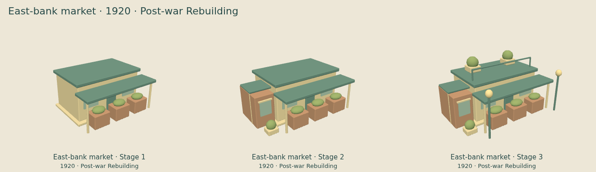

[Stage 1](../images/era-upgrades/post-war/market/stage-1.png) · [Stage 2](../images/era-upgrades/post-war/market/stage-2.png) · [Stage 3](../images/era-upgrades/post-war/market/stage-3.png)

### Prospect power house

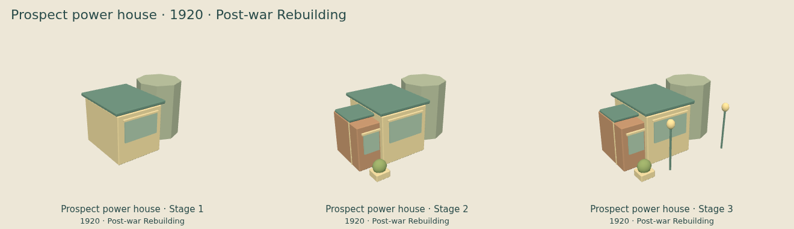

[Stage 1](../images/era-upgrades/post-war/powerHouse/stage-1.png) · [Stage 2](../images/era-upgrades/post-war/powerHouse/stage-2.png) · [Stage 3](../images/era-upgrades/post-war/powerHouse/stage-3.png)

### Prospect fire station

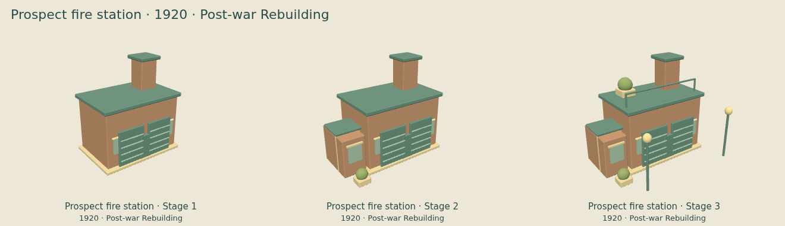

[Stage 1](../images/era-upgrades/post-war/fireStation/stage-1.png) · [Stage 2](../images/era-upgrades/post-war/fireStation/stage-2.png) · [Stage 3](../images/era-upgrades/post-war/fireStation/stage-3.png)

### Lantern row

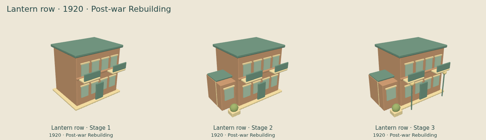

[Stage 1](../images/era-upgrades/post-war/rowHouses/stage-1.png) · [Stage 2](../images/era-upgrades/post-war/rowHouses/stage-2.png) · [Stage 3](../images/era-upgrades/post-war/rowHouses/stage-3.png)

### Riverside light mill

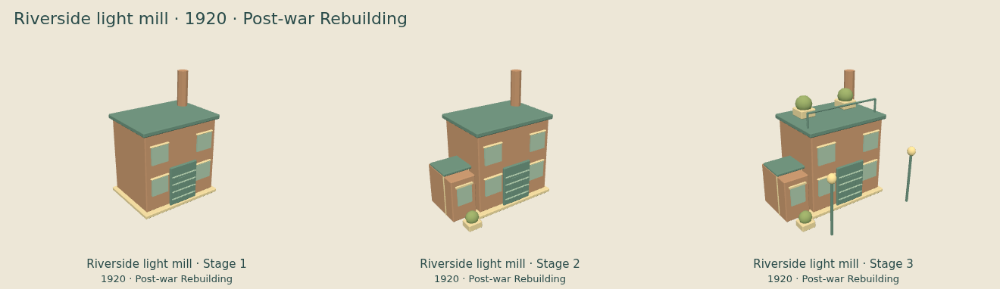

[Stage 1](../images/era-upgrades/post-war/mill/stage-1.png) · [Stage 2](../images/era-upgrades/post-war/mill/stage-2.png) · [Stage 3](../images/era-upgrades/post-war/mill/stage-3.png)

### Prospect city hall

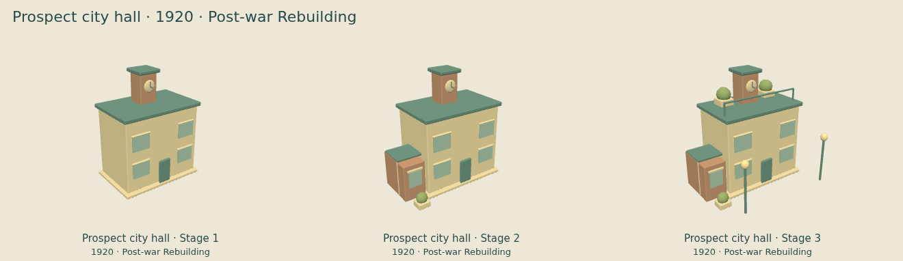

[Stage 1](../images/era-upgrades/post-war/cityHall/stage-1.png) · [Stage 2](../images/era-upgrades/post-war/cityHall/stage-2.png) · [Stage 3](../images/era-upgrades/post-war/cityHall/stage-3.png)

### Cedar court apartments

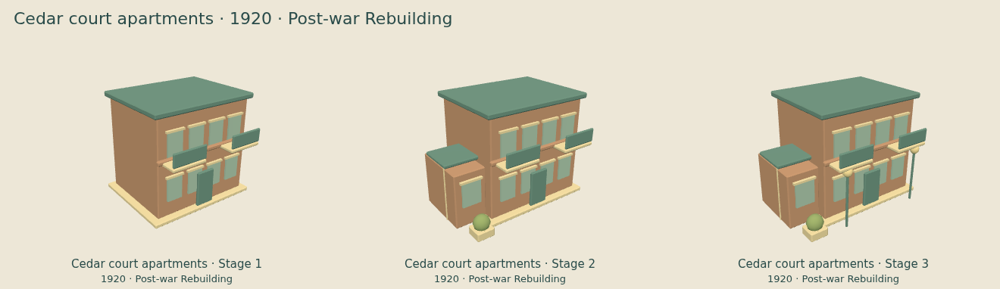

[Stage 1](../images/era-upgrades/post-war/apartments/stage-1.png) · [Stage 2](../images/era-upgrades/post-war/apartments/stage-2.png) · [Stage 3](../images/era-upgrades/post-war/apartments/stage-3.png)

### Valley food hall

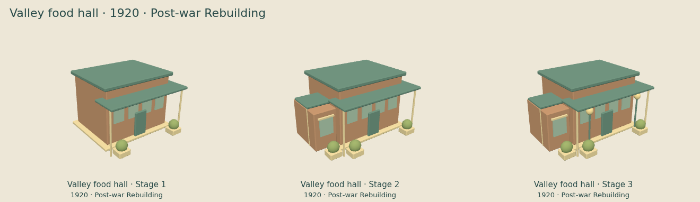

[Stage 1](../images/era-upgrades/post-war/supermarket/stage-1.png) · [Stage 2](../images/era-upgrades/post-war/supermarket/stage-2.png) · [Stage 3](../images/era-upgrades/post-war/supermarket/stage-3.png)

### Prospect water plant

[Stage 1](../images/era-upgrades/post-war/waterPlant/stage-1.png) · [Stage 2](../images/era-upgrades/post-war/waterPlant/stage-2.png) · [Stage 3](../images/era-upgrades/post-war/waterPlant/stage-3.png)

### Willow horse field

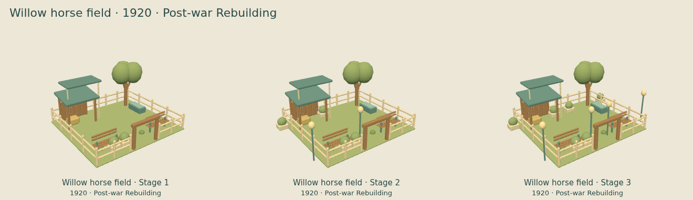

[Stage 1](../images/era-upgrades/post-war/horseField/stage-1.png) · [Stage 2](../images/era-upgrades/post-war/horseField/stage-2.png) · [Stage 3](../images/era-upgrades/post-war/horseField/stage-3.png)

### Willow house

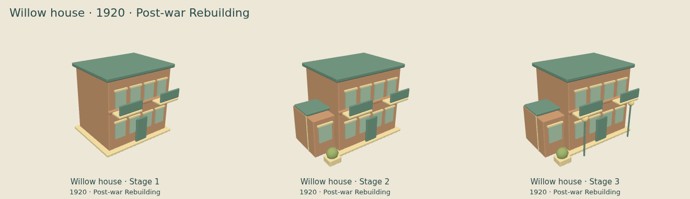

[Stage 1](../images/era-upgrades/post-war/home2/stage-1.png) · [Stage 2](../images/era-upgrades/post-war/home2/stage-2.png) · [Stage 3](../images/era-upgrades/post-war/home2/stage-3.png)

### Sagebrush house

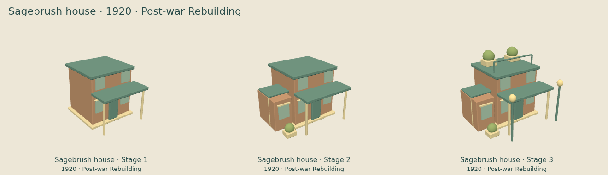

[Stage 1](../images/era-upgrades/post-war/home3/stage-1.png) · [Stage 2](../images/era-upgrades/post-war/home3/stage-2.png) · [Stage 3](../images/era-upgrades/post-war/home3/stage-3.png)

### Cottonwood house

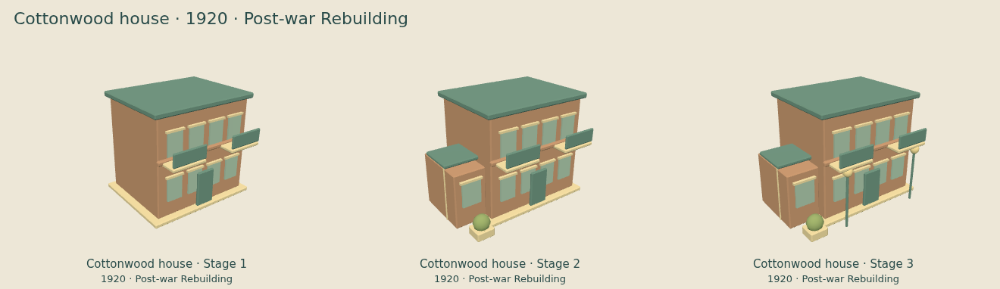

[Stage 1](../images/era-upgrades/post-war/home4/stage-1.png) · [Stage 2](../images/era-upgrades/post-war/home4/stage-2.png) · [Stage 3](../images/era-upgrades/post-war/home4/stage-3.png)

### Prairie well

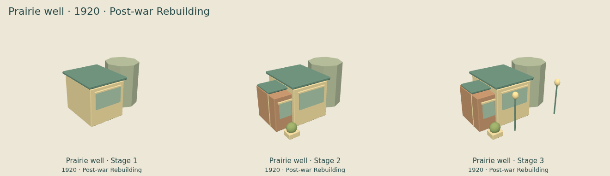

[Stage 1](../images/era-upgrades/post-war/well2/stage-1.png) · [Stage 2](../images/era-upgrades/post-war/well2/stage-2.png) · [Stage 3](../images/era-upgrades/post-war/well2/stage-3.png)

### Sunrise farm

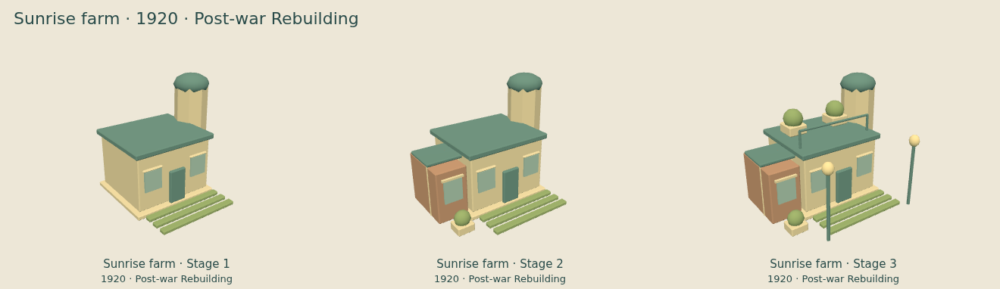

[Stage 1](../images/era-upgrades/post-war/farm2/stage-1.png) · [Stage 2](../images/era-upgrades/post-war/farm2/stage-2.png) · [Stage 3](../images/era-upgrades/post-war/farm2/stage-3.png)

### Meadow farm

[Stage 1](../images/era-upgrades/post-war/farm3/stage-1.png) · [Stage 2](../images/era-upgrades/post-war/farm3/stage-2.png) · [Stage 3](../images/era-upgrades/post-war/farm3/stage-3.png)

### Mine surface works

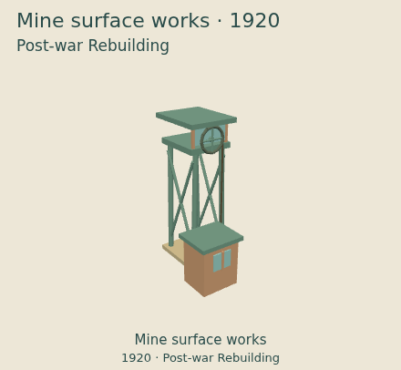

[Era upgrade](../images/era-upgrades/post-war/mine/stage-1.png)
