# 1884 · River & Rail Boom

[Back to the era visual guide](Era-Visual-Guide.md)

Masonry street fronts, slate-colored roofs and cornices give the town a late nineteenth-century appearance. Final upgrades follow each building’s work: verandas, classroom and clinic rooms, glazed exhibition space, workshop rooflights, freight shelters, market awnings and covered station seating. The bridge, railway station, post office and river landing join the settlement. The mine gains a taller timber winding frame and a steam boiler.

Each comparison reads from left to right, from the first completed stage to the final upgrade. The camera and scale stay fixed within each building row. Click the comparison for full resolution, or open an individual stage below it. The mine has one permanent surface upgrade per era.

These are actual game meshes rendered in a neutral review scene. Name labels sit outside the model so the architecture remains clear. World scenery, traffic, construction scaffolds and unfinished plots are excluded from these building comparisons.

## Building index

**New buildings in this era**

[Prospect bridge](#building-bridge) · [Steamboat landing](#building-riverport) · [Prospect railway station](#building-raildepot) · [Telegraph & Post Office](#building-post) · [Freight warehouse](#building-warehouse) · [Riverside boarding house](#building-hotel) · [Riverside house](#building-home5) · [East-bank market](#building-market)

**Existing buildings upgraded for this era**

[Old town well](#building-well) · [Clover farm](#building-farm) · [Juniper house](#building-home) · [The Golden Hour](#building-saloon) · [Dusty Spur stables](#building-stable) · [Sheriff’s office](#building-sheriff) · [The Frontier Museum](#building-museum) · [Frontier armory](#building-armory) · [Prospect bank](#building-bank) · [Prairie trading post](#building-shop) · [Prospect town square](#building-square) · [Prospect watermill](#building-watermill) · [Fisherman’s Hut](#building-fisherman) · [Prospect blacksmith](#building-blacksmith) · [Prospect schoolhouse](#building-school) · [Doctor’s Office](#building-doctor) · [Willow house](#building-home2) · [Sagebrush house](#building-home3) · [Cottonwood house](#building-home4) · [Prairie well](#building-well2) · [Sunrise farm](#building-farm2) · [Meadow farm](#building-farm3)

**Mine progression**

[Mine surface works](#building-mine)

## New buildings in this era

### Prospect bridge

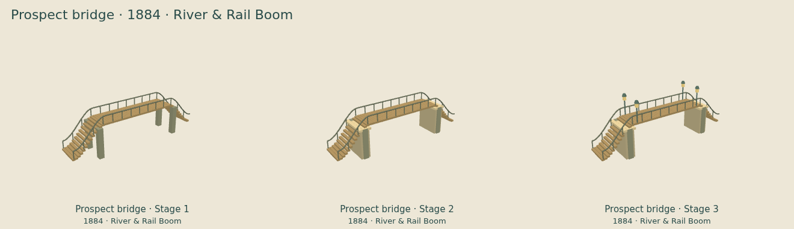

[Stage 1](../images/era-upgrades/river-rail/bridge/stage-1.png) · [Stage 2](../images/era-upgrades/river-rail/bridge/stage-2.png) · [Stage 3](../images/era-upgrades/river-rail/bridge/stage-3.png)

### Steamboat landing

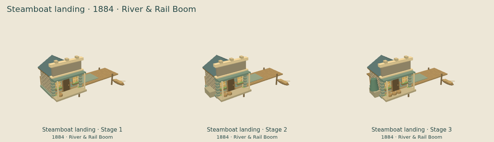

[Stage 1](../images/era-upgrades/river-rail/riverPort/stage-1.png) · [Stage 2](../images/era-upgrades/river-rail/riverPort/stage-2.png) · [Stage 3](../images/era-upgrades/river-rail/riverPort/stage-3.png)

### Prospect railway station

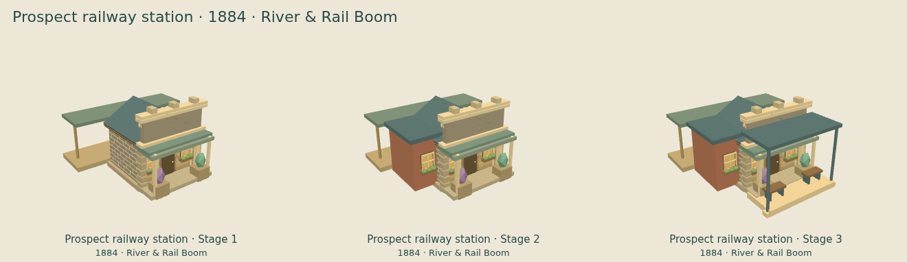

[Stage 1](../images/era-upgrades/river-rail/railDepot/stage-1.png) · [Stage 2](../images/era-upgrades/river-rail/railDepot/stage-2.png) · [Stage 3](../images/era-upgrades/river-rail/railDepot/stage-3.png)

### Telegraph & Post Office

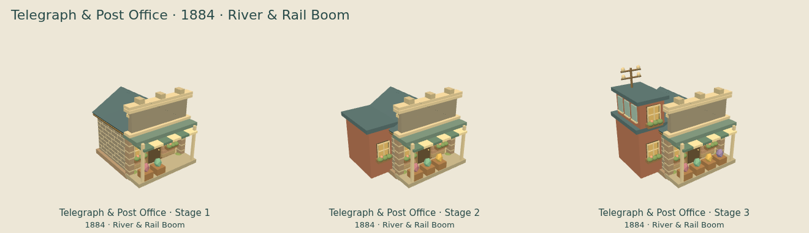

[Stage 1](../images/era-upgrades/river-rail/post/stage-1.png) · [Stage 2](../images/era-upgrades/river-rail/post/stage-2.png) · [Stage 3](../images/era-upgrades/river-rail/post/stage-3.png)

### Freight warehouse

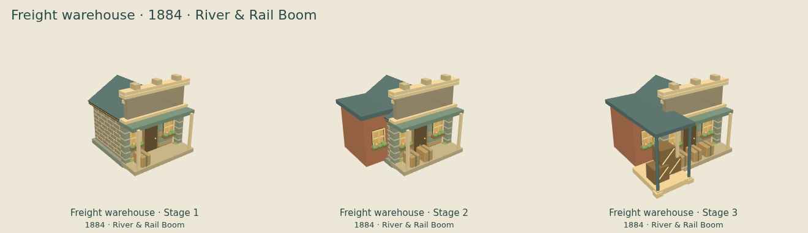

[Stage 1](../images/era-upgrades/river-rail/warehouse/stage-1.png) · [Stage 2](../images/era-upgrades/river-rail/warehouse/stage-2.png) · [Stage 3](../images/era-upgrades/river-rail/warehouse/stage-3.png)

### Riverside boarding house

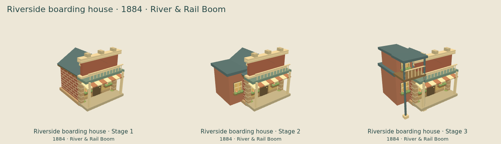

[Stage 1](../images/era-upgrades/river-rail/hotel/stage-1.png) · [Stage 2](../images/era-upgrades/river-rail/hotel/stage-2.png) · [Stage 3](../images/era-upgrades/river-rail/hotel/stage-3.png)

### Riverside house

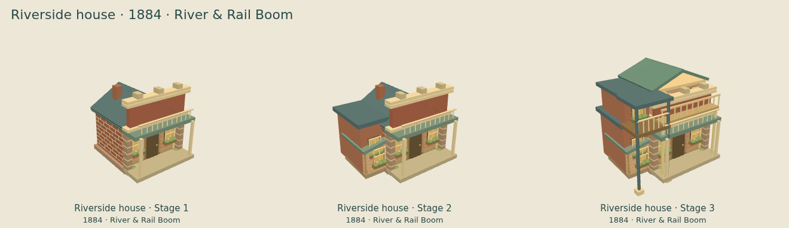

[Stage 1](../images/era-upgrades/river-rail/home5/stage-1.png) · [Stage 2](../images/era-upgrades/river-rail/home5/stage-2.png) · [Stage 3](../images/era-upgrades/river-rail/home5/stage-3.png)

### East-bank market

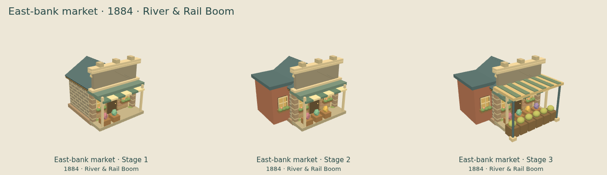

[Stage 1](../images/era-upgrades/river-rail/market/stage-1.png) · [Stage 2](../images/era-upgrades/river-rail/market/stage-2.png) · [Stage 3](../images/era-upgrades/river-rail/market/stage-3.png)

## Existing buildings upgraded for this era

### Old town well

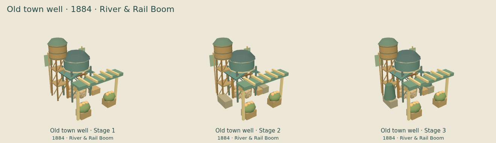

[Stage 1](../images/era-upgrades/river-rail/well/stage-1.png) · [Stage 2](../images/era-upgrades/river-rail/well/stage-2.png) · [Stage 3](../images/era-upgrades/river-rail/well/stage-3.png)

### Clover farm

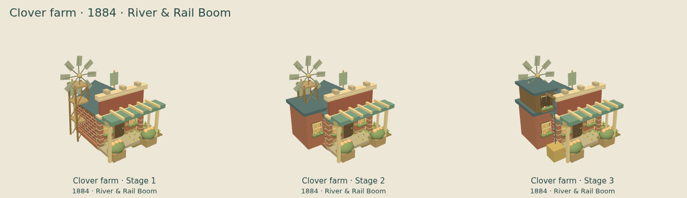

[Stage 1](../images/era-upgrades/river-rail/farm/stage-1.png) · [Stage 2](../images/era-upgrades/river-rail/farm/stage-2.png) · [Stage 3](../images/era-upgrades/river-rail/farm/stage-3.png)

### Juniper house

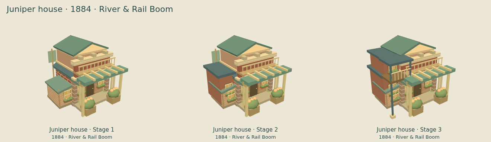

[Stage 1](../images/era-upgrades/river-rail/home/stage-1.png) · [Stage 2](../images/era-upgrades/river-rail/home/stage-2.png) · [Stage 3](../images/era-upgrades/river-rail/home/stage-3.png)

### The Golden Hour

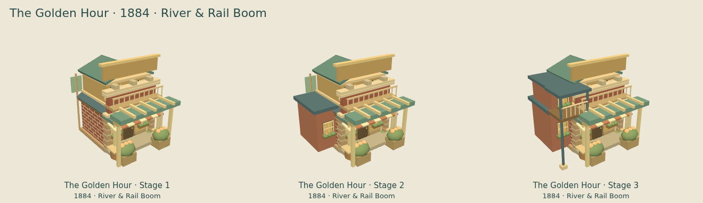

[Stage 1](../images/era-upgrades/river-rail/saloon/stage-1.png) · [Stage 2](../images/era-upgrades/river-rail/saloon/stage-2.png) · [Stage 3](../images/era-upgrades/river-rail/saloon/stage-3.png)

### Dusty Spur stables

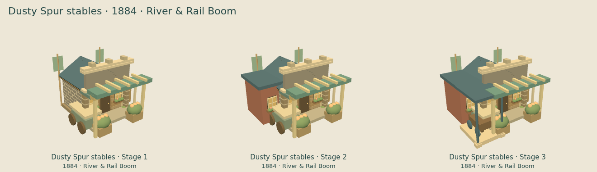

[Stage 1](../images/era-upgrades/river-rail/stable/stage-1.png) · [Stage 2](../images/era-upgrades/river-rail/stable/stage-2.png) · [Stage 3](../images/era-upgrades/river-rail/stable/stage-3.png)

### Sheriff’s office

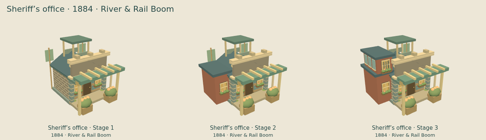

[Stage 1](../images/era-upgrades/river-rail/sheriff/stage-1.png) · [Stage 2](../images/era-upgrades/river-rail/sheriff/stage-2.png) · [Stage 3](../images/era-upgrades/river-rail/sheriff/stage-3.png)

### The Frontier Museum

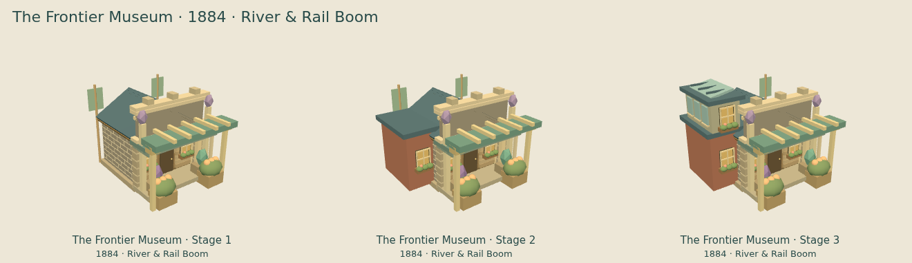

[Stage 1](../images/era-upgrades/river-rail/museum/stage-1.png) · [Stage 2](../images/era-upgrades/river-rail/museum/stage-2.png) · [Stage 3](../images/era-upgrades/river-rail/museum/stage-3.png)

### Frontier armory

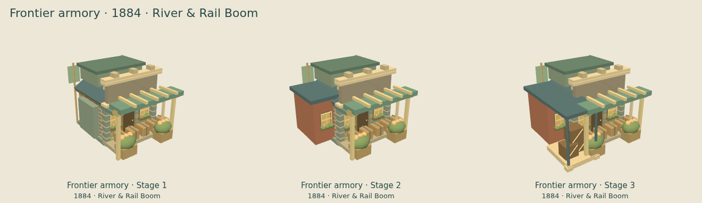

[Stage 1](../images/era-upgrades/river-rail/armory/stage-1.png) · [Stage 2](../images/era-upgrades/river-rail/armory/stage-2.png) · [Stage 3](../images/era-upgrades/river-rail/armory/stage-3.png)

### Prospect bank

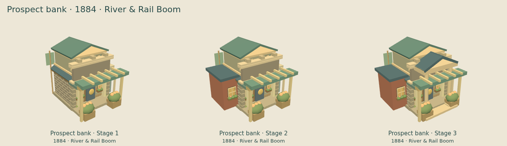

[Stage 1](../images/era-upgrades/river-rail/bank/stage-1.png) · [Stage 2](../images/era-upgrades/river-rail/bank/stage-2.png) · [Stage 3](../images/era-upgrades/river-rail/bank/stage-3.png)

### Prairie trading post

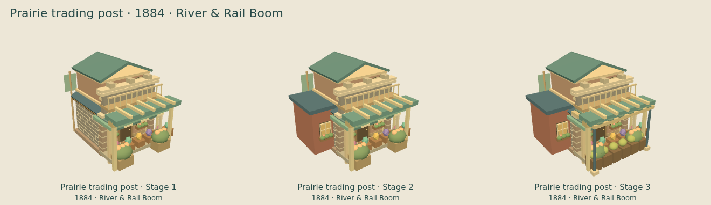

[Stage 1](../images/era-upgrades/river-rail/shop/stage-1.png) · [Stage 2](../images/era-upgrades/river-rail/shop/stage-2.png) · [Stage 3](../images/era-upgrades/river-rail/shop/stage-3.png)

### Prospect town square

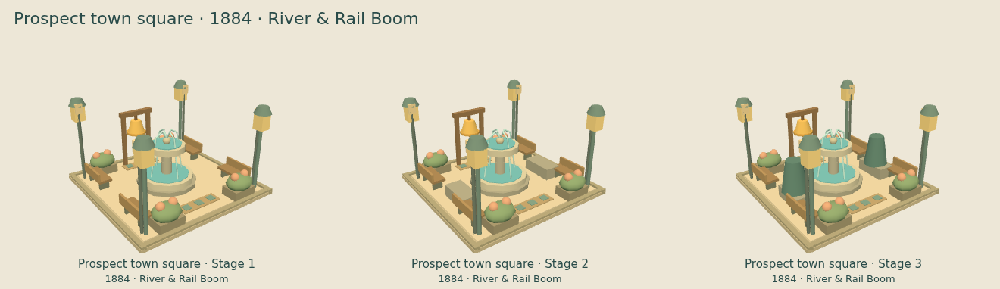

[Stage 1](../images/era-upgrades/river-rail/square/stage-1.png) · [Stage 2](../images/era-upgrades/river-rail/square/stage-2.png) · [Stage 3](../images/era-upgrades/river-rail/square/stage-3.png)

### Prospect watermill

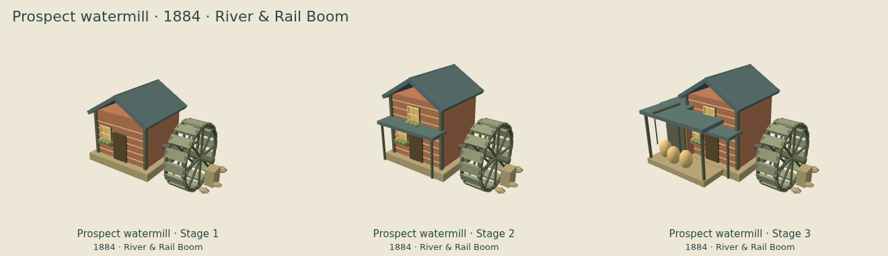

[Stage 1](../images/era-upgrades/river-rail/watermill/stage-1.png) · [Stage 2](../images/era-upgrades/river-rail/watermill/stage-2.png) · [Stage 3](../images/era-upgrades/river-rail/watermill/stage-3.png)

### Fisherman’s Hut

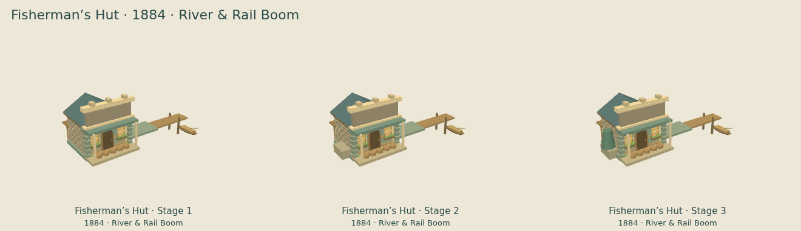

[Stage 1](../images/era-upgrades/river-rail/fisherman/stage-1.png) · [Stage 2](../images/era-upgrades/river-rail/fisherman/stage-2.png) · [Stage 3](../images/era-upgrades/river-rail/fisherman/stage-3.png)

### Prospect blacksmith

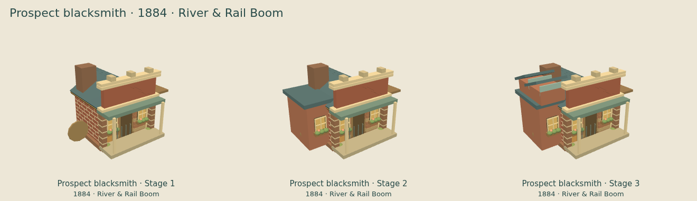

[Stage 1](../images/era-upgrades/river-rail/blacksmith/stage-1.png) · [Stage 2](../images/era-upgrades/river-rail/blacksmith/stage-2.png) · [Stage 3](../images/era-upgrades/river-rail/blacksmith/stage-3.png)

### Prospect schoolhouse

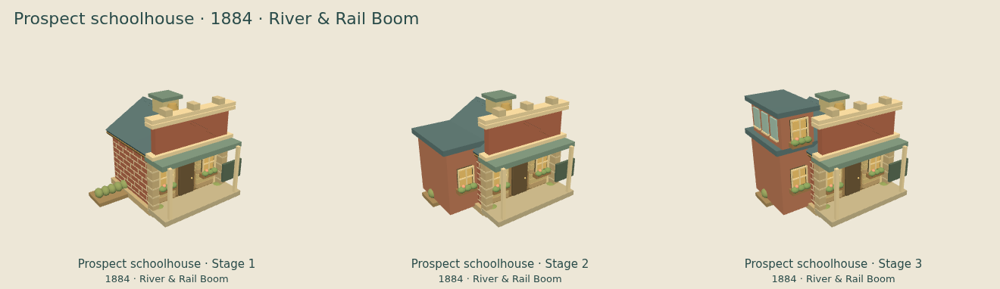

[Stage 1](../images/era-upgrades/river-rail/school/stage-1.png) · [Stage 2](../images/era-upgrades/river-rail/school/stage-2.png) · [Stage 3](../images/era-upgrades/river-rail/school/stage-3.png)

### Doctor’s Office

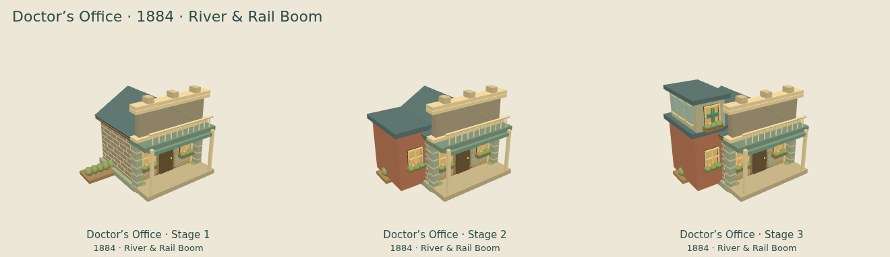

[Stage 1](../images/era-upgrades/river-rail/doctor/stage-1.png) · [Stage 2](../images/era-upgrades/river-rail/doctor/stage-2.png) · [Stage 3](../images/era-upgrades/river-rail/doctor/stage-3.png)

### Willow house

[Stage 1](../images/era-upgrades/river-rail/home2/stage-1.png) · [Stage 2](../images/era-upgrades/river-rail/home2/stage-2.png) · [Stage 3](../images/era-upgrades/river-rail/home2/stage-3.png)

### Sagebrush house

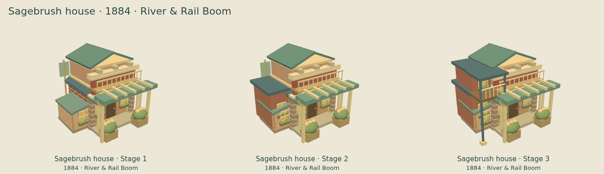

[Stage 1](../images/era-upgrades/river-rail/home3/stage-1.png) · [Stage 2](../images/era-upgrades/river-rail/home3/stage-2.png) · [Stage 3](../images/era-upgrades/river-rail/home3/stage-3.png)

### Cottonwood house

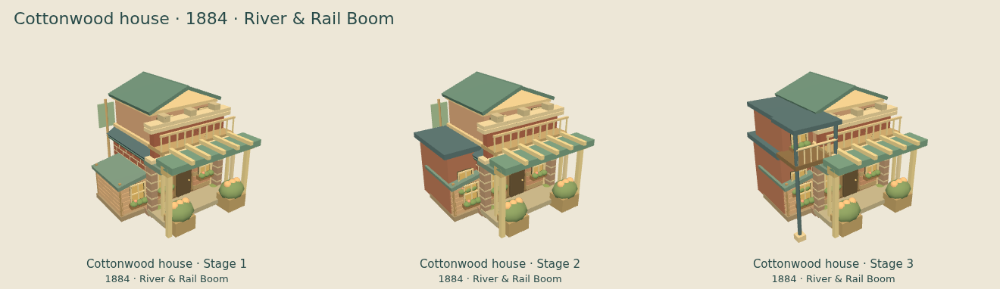

[Stage 1](../images/era-upgrades/river-rail/home4/stage-1.png) · [Stage 2](../images/era-upgrades/river-rail/home4/stage-2.png) · [Stage 3](../images/era-upgrades/river-rail/home4/stage-3.png)

### Prairie well

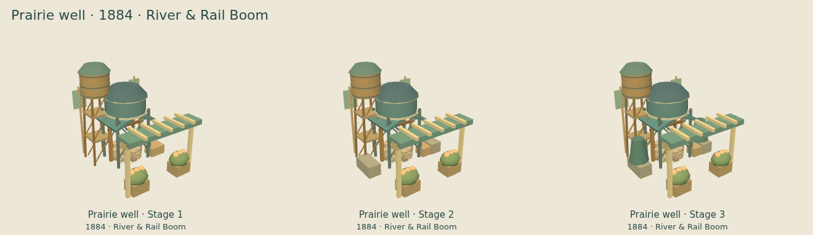

[Stage 1](../images/era-upgrades/river-rail/well2/stage-1.png) · [Stage 2](../images/era-upgrades/river-rail/well2/stage-2.png) · [Stage 3](../images/era-upgrades/river-rail/well2/stage-3.png)

### Sunrise farm

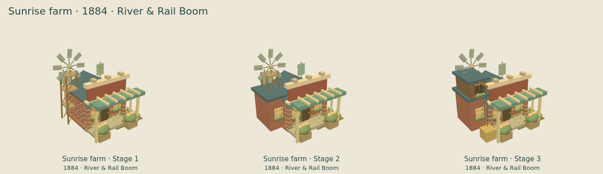

[Stage 1](../images/era-upgrades/river-rail/farm2/stage-1.png) · [Stage 2](../images/era-upgrades/river-rail/farm2/stage-2.png) · [Stage 3](../images/era-upgrades/river-rail/farm2/stage-3.png)

### Meadow farm

[Stage 1](../images/era-upgrades/river-rail/farm3/stage-1.png) · [Stage 2](../images/era-upgrades/river-rail/farm3/stage-2.png) · [Stage 3](../images/era-upgrades/river-rail/farm3/stage-3.png)

## Mine progression

### Mine surface works

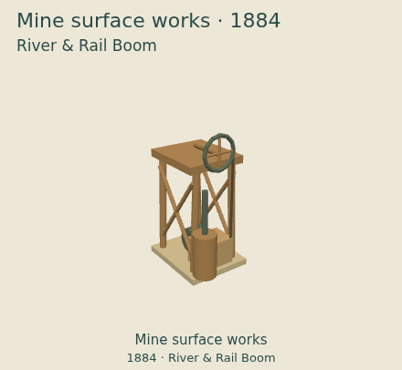

[Era upgrade](../images/era-upgrades/river-rail/mine/stage-1.png)
